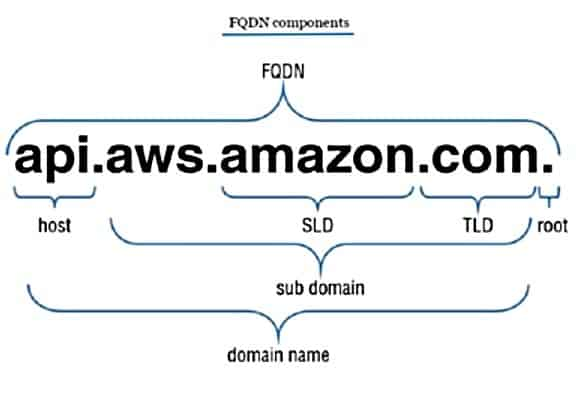
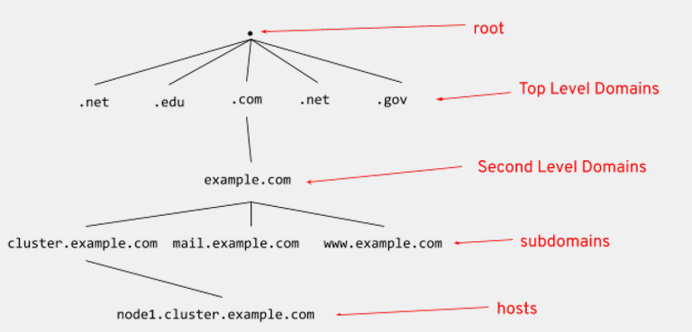
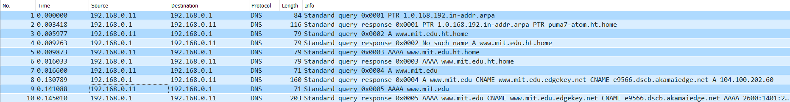
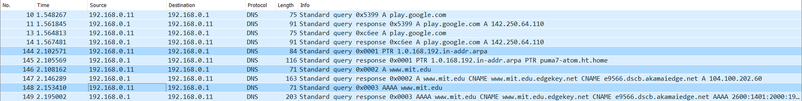

# DNS

([Back to Home](README.md))

## Table of Contents

-   [What is DNS and Why is DNS Needed?](#what-is-dns-and-why-is-dns-needed)
-   [DNS Infrastructure](#dns-infrastructure)
    -   [DNS Zones](#dns-zones)
-   [Common DNS Records](#common-dns-records)
    -   [A Record](#a-record)
    -   [AAAA Record](#aaaa-record)
    -   [CNAME Record](#cname-record)
    -   [ALIAS/ANAME Record](#aliasaname-record)
    -   [NS Record](#ns-record)
    -   [MX Record](#mx-record)
    -   [TXT Record](#txt-record)
    -   [PTR Record](#ptr-record)
    -   [CAA Record](#caa-record)
    -   [SRV Record](#srv-record)
    -   [CERT Record](#cert-record)
    -   [SOA Record](#soa-record)
    -   [RRSIG Record](#rrsig-record)
    -   [DNSKEY Record](#dnskey-record)
    -   [DS Record](#ds-record)
    -   [NSEC Record](#nsec-record)
-   [Period (`.`) After Domain Name in FQDN](#period--after-domain-name-in-fqdn)
-   [(Distributed) Denial of Service](#distributed-denial-of-service)
-   [DNS Cache Poisoning/DNS Spoofing](#dns-cache-poisoningdns-spoofing)
-   [DNSSEC](#dnssec)
-   [Dynamic DNS](#dynamic-dns)
-   [DNS-0x20 Encoding](#dns-0x20-encoding)
-   [Resources](#resources)
-   [To Do](#to-do)

## What is DNS and Why is DNS Needed?

-   DNS stands for 'Domain Name System' or 'Domain Name Server.'
-   All web sites, web apps and other resources on the internet are uniquely identified through IP addresses. For example, `8.8.8.8` is `google.com`'s IP address.
-   Computers work well with numbers, but humans cannot remember the IP addresses of all the resources that they want to visit on the internet and words are easier to remember than a string of numbers (in case of IPv4) or an alphanumeric string (in case of IPv6), so every resource has a unique URL (Eg: `github.com`) that makes it easy to remember the name to get to the intended resource.
-   Now resources can only be contacted by knowing their IP addresses, so there has to be some mapping for domain names to their IP addresses.
-   Here is where the Domain Name System Protocol steps in, wherein the device from which a request is made for a resource first hits a Domain Name Server to get the IP address of the requested resource and uses that IP address to then contact the requested resource to fetch it.
-   The DNS protocol is an [Application Layer](osi-layers.md) protocol that uses port 53 and [mainly uses UDP](https://stackoverflow.com/a/40063445/11958552) as its Transport Layer protocol.

## DNS Infrastructure

An example domain will be used to explain the infrastructure.

Example domain: `foo.bar.harshkapadia.me.`

> FYI:
>
> -   The above domain is an Absolute FQDN and not a Regular FQDN, due to the period (`.`) at the end of the domain.
> -   FQDN = Fully-qualified Domain Name

    
     
    
        <a href="https://cloudinfrastructureservices.co.uk/what-is-dns-hierarchy" rel="noreferrer" target="_blank">FQDN Components Image Source</a>
    

-   Client ([DNS Stub Resolver](https://unix.stackexchange.com/questions/500536/what-are-dns-server-resolver-and-stub-resolver))
    -   One's local machine (laptop, desktop, etc.) that asks the questions to get domain names or IP address answers.
    -   It goes to a DNS Resolver to do the actual grunt work of getting the answer/IP address.
-   DNS (Recursive or Iterative) Resolver (Local DNS Server)
    -   It actually finds the answer/IP address that the client asked for, through an [iterative or recursive process](https://www.slashroot.in/difference-between-iterative-and-recursive-dns-query) and sends the answers back to the client.
    -   It goes to the DNS Root Nameserver if it does not have the answer to the question cached.

    
     
    
        <a href="http://www.eitc.org/research-opportunities/future-internet-and-optical-quantum-communications/the-internet-ecosystem-and-dns/the-domain-name-system-architecture" rel="noreferrer" target="_blank">DNS Hierarchy Image Source</a>
    

-   DNS Root Nameserver
    -   The question (FQDN) is parsed from right to left.
    -   It is the root of the DNS query tree.
    -   It corresponds to the right-most 'period' (`.`) of the FQDN.
    -   Iterative resolution: It will answer with the IP address of the DNS TLD Nameserver with the `.me` answers that the resolver can query to get its answer or be redirected to another DNS Server.
    -   Recursive resolution: It will itself send a request to the DNS TLD Nameserver with the `.me` answers and eventually get back with the answer to the question.
-   DNS Top Level Domain (TLD) Nameserver
    -   TLD types
        -   Generic Top Level Domains (gTLDs): `.com`, `.edu`, `.org`, `.me`, `.xyz`, etc.
        -   Country Code Top Level Domains (ccTLDs): `.in`, `.uk`, etc.
        -   Sponsored Top Level Domains (sTLDs): `.app` (sponsored by Google), `.gov` (sponsored by the General Services Administration), etc.
        -   Reserved Top Level Domains: `.localhost`, `.example`, etc.
        -   Infrastructural Top Level Domains: `.arpa`
    -   In this example case it will be one of the many `.me` DNS TLD Nameservers.
    -   It will search for the IP address of the DNS Authoritative Nameserver for `.harshkapadia`.
    -   Iterative resolution: It will answer with the IP address of the DNS Authoritative Nameserver with the `.harshkapadia` answers that the resolver can query to get its answer or be redirected to another DNS Server.
    -   Recursive resolution: It will itself send a request to the DNS Authoritative Nameserver with the `.harshkapadia` answers and eventually get back with the answer to the question.
-   DNS Authoritative Nameserver
    -   This server is the authority that guarantees that the domain that one wants to contacted is located at a particular server by providing its name/IP address.
    -   If in this example case the domain was only `harshkapadia.me.`, then this would've been the end of the DNS resolution, but in this example case, further resolution is required to resolve `.bar`, so this DNS Authoritative Nameserver for `.harshkapadia` will redirect to the IP address of the DNS Authoritative Nameserver of `.bar`, which will in turn redirect to the DNS Authoritative Nameserver of `foo` to finally get the name/IP address of the server that hosts the requested type of data for `foo.bar.harshkapadia.me.`.

### DNS Zones

-   DNS zones break up the DNS into a clear hierarchy.
-   Includes DNS Zone Files and [SOA Records](#soa-record).
-   [What is a DNS zone?](https://www.cloudflare.com/learning/dns/glossary/dns-zone)
-   [DNS Zones Explained](https://ns1.com/resources/dns-zones-explained)

## Common DNS Records

-   DNS records are used to provide important information about a domain.
-   They are also called 'Resource Records' (RRs) and are stored in DNS Zone Files, which are stored on the domain's Name Server.
-   Almost every record follows the format `Name TTL Class Type Data`.
    Eg: `www 86400 IN A 192.168.1.1`
    -   Name/Host
        -   The host name of the record.
        -   Also called 'hostname.'
        -   Eg values: `@` (blank), a subdomain (`www`, `blog`, `links`, etc.), `*` (wildcard), etc.
        -   Eg usage
            -   If the host value is `www` for the domain `harshkapadia.me`, then the record is pertaining to `www.harshkapadia.me`.
            -   Similarly, if the host value is `@` (blank) for the domain `harshkapadia.me`, then the record is pertaining to `harshkapadia.me`, ie, the base domain itself, so the output will have `@` replaced by `harshkapadia.me.`.
    -   TTL
        -   Time To Live in seconds, unless otherwise mentioned.
        -   Lists the time for which DNS servers should cache the record. An update to the record will thus take time to reflect, as the previous value might be cached.
    -   Class
        -   It defines the protocol family.
        -   `IN` stands for 'Internet' and is used the most.
        -   [More on classes](https://www.agiledns.net/KB/DNS-Resource-Record-Classes)
    -   Type
        -   Type of DNS record.
        -   There are [more than 260 RR types](https://www.iana.org/assignments/dns-parameters/dns-parameters.xhtml#dns-parameters-4) defined by IANA! The most common ones are discussed below.
        -   Eg: [A record](#a-record), [CNAME record](#cname-record), etc.
    -   Data/Value
        -   An IP address to which the record points or any other data that should be contained in the record.

**NOTE**: For the following record sections, the base/apex/root domain is `harshkapadia.me`.

### A Record

-   This is the 'Address Record.'
-   It is used to map a domain name to an IPv4 address.
-   Eg
    -   `www 1800 IN A 185.199.108.153` will point `www.harshkapadia.me` to GitHub Pages' IP address.
    -   Similarly, a value of `@` for the host will have the output as `harshkapadia.me. 1800 IN A 185.199.108.153` and will point the base domain (`harshkapadia.me`) to GitHub Pages' IP address.
        -   NOTE: `@` is a blank host value that implies the record is pertaining to `harshkapadia.me`, the base domain.

### AAAA Record

-   This is an address record as well and behaves like an [A Record](#a-record), but pertains to IPv6 addresses.
-   Eg: `www 86400 IN AAAA 2a01:8840:6::1` points `www.harshkapadia.me` to the IPv6 address.

### CNAME Record

-   'CNAME' stands for 'Canonical Name.'
-   It is used to redirect one domain name to another domain name.
-   One limitation to is that they can only be placed on subdomains (Eg: `blog.harshkapadia.me`), but not the root domain (Eg: `harshkapadia.me`).
-   Eg: `www 1800 IN CNAME harshkapadia.me.` will redirect `www.harshkapadia.me` to `harshkapadia.me`, but `harshkapadia.me. 1800 IN CNAME www.harshkapadia.me.` will **not** redirect `harshkapadia.me` to `www.harshkapadia.me`, as a CNAME Record cannot be placed on a base domain.

### ALIAS/ANAME Record

-   An ALIAS or ANAME Record behaves like a [CNAME Record](#cname-record), but allows redirecting apex (root/base) domains (Eg: `harshkapadia.me`) as well.
-   Eg: `harshkapadia.me. 1800 IN ALIAS www.harshkapadia.me.` will redirect `harshkapadia.me` to `www.harshkapadia.me`.

### NS Record

-   'NS' stands for 'Name Server.'
-   It points the domain or subdomain to a Name Server, which allows the discovering of the IP address of the domain.
-   Eg: `harshkapadia.me. 86400 IN NS ns1.provider.com.`

### MX Record

-   'MX' stands for 'Mail eXchange.'
-   This record points to a Mail Server which should be used for a domain using SMTP (Simple Mail Transfer Protocol).
-   It always points to a domain and not an IP address.
-   If a domain doesn’t have an MX Record, a sending server will attempt to deliver mail to the domain’s A Record instead.
-   An extra number that sets the priority of this record if multiple mail servers are defined is added to the record. Lower numbers have higher priority.
-   Eg: `harshkapadia.me. 86400 IN MX 10 site2.smtp.mx.exch580.serverdata.net.` points the domain `harshkapadia.me` to the Mail Server. This implies that an e-mail to `contact@harshkapadia.me` will hit the Mail Server.
-   [More on e-mail.](e-mail.md)

### TXT Record

-   Allows the addition of textual data up to 255 characters to a domain or subdomain.
-   A common usage is for the verification of ownership of domain, e-mail spam prevention or to check running services.
    -   [e-mail related](e-mail.md): SPF, DMARC, e-mail forwarding rules
-   Eg: `harshkapadia.me. 86400 IN TXT random_string`

### PTR Record

-   'PTR' stands for 'Pointer.'
-   It is also called a 'Reverse DNS Record.'
-   Its functionality is exactly opposite to that of an [A Record](#a-record), wherein it resolves an IP address to a domain name.
-   The IP address has to be defined by the owner of the server hosting the resource.
-   It is used to check whether a server name is associated with the IP address from where a connection was initiated. One application is in e-mail spam verification.
-   Eg: `34.216.184.93.in-addr.arpa. 2100 IN PTR harshkapadia.me.`

### CAA Record

-   'CAA' stands for 'Certificate Authority Authorization.'
-   It is used to specify which Certificate Authorities (CAs) are allowed to issue certificates for a domain.
-   If no CAA Record is present, any CA is allowed to issue a certificate for the domain but if a CAA Record is present, only the CAs listed in the record(s) are allowed to issue certificates for that host.
-   It is also inherited by subdomains, unless overridden.
-   It also provides a means of indicating notification rules in case someone requests a certificate from an unauthorized CA.

### SRV Record

-   'SRV' stands for 'Service.'
-   It is a service location record like the [MX Record](#mx-record), but for other communication protocols like SIP and XMPP.
-   Format: `_Service._Protocol.Name. TTL Class Type Priority Weight Port Target.`
-   'Priority' works just like in the [MX Record](#mx-record) and the 'Weight' is similar to the 'Priority' field and is taken into consideration if the priority of the records is the same.
-   Eg: `_xmpp._tcp.harshkapadia.me. 86400 IN SRV 10 5 5223 server.harshkapadia.me.`

### CERT Record

-   'CERT' stands for 'Certificate.'
-   It is used to store encryption certificates (like PKIX, SPKI, PGP, etc.) and Certificate Revocation Lists (CRLs contain lists of certificates that are no longer valid.) in DNS.
-   It helps in verifying the authenticity of sending and receiving parties in a communication.

### SOA Record

-   'SOA' stands for 'Start Of Authority.'
-   It appears at the beginning of a [DNS Zone File](#dns-zones) and indicates the Authoritative Name Server for the current [DNS zone](#dns-zones), contact details for the Domain Administrator, Domain Serial Number and information on how frequently DNS information for the zone should be refreshed.

### RRSIG Record

-   'RRSIG' stands for '[Resource Record Signature](https://datatracker.ietf.org/doc/html/rfc4034#section-3)'.
-   It is used in [DNSSEC](#dnssec).
-   It contains the signature of a RRset.

### DNSKEY Record

-   'DNSKEY' stands for '[DNS Public Key](https://datatracker.ietf.org/doc/html/rfc4034#section-2)'.
-   It is used in [DNSSEC](#dnssec).
-   It is the RRset of the public ZSK and KSK for a particular [DNS zone](#dns-zones).

### DS Record

-   'DS' stands for '[Delegation Signer](https://datatracker.ietf.org/doc/html/rfc4034#section-5)'.
-   It is used in [DNSSEC](#dnssec).
-   It contains the hash of the public KSK of the child zone.

### NSEC Record

-   'NSEC' stands for '[Next Secure](https://datatracker.ietf.org/doc/html/rfc4034#section-4)'.
-   It is used in [DNSSEC](#dnssec).
-   It helps in authenticating the denial of existence of a particular domain/subdomain and provides existing domains/subdomains.
-   [NSEC3](https://datatracker.ietf.org/doc/html/rfc5155#section-3) is another resource record that can be used for the same proof of non-existence purposes.

## Period (`.`) After Domain Name in FQDN

Example domain: `foo.bar.harshkapadia.me.`

-   The above domain is an Absolute FQDN and not a Regular FQDN, due to the period (`.`) at the end of the domain.
-   FQDN = Fully-qualified Domain Name

In the Absolute FQDN, why is there a period (`.`) after the domain name?

-   [The heading 'Practical differences' in this answer.](https://superuser.com/a/1468139)
-   [Why Does Putting a Dot After the URL Remove Login Information?](https://superuser.com/questions/1467958/why-does-putting-a-dot-after-the-url-remove-login-information)
-   [Should I Append a Dot (.) at the End of my DNS URLs?](https://serverfault.com/questions/803033/should-i-append-a-dot-at-the-end-of-my-dns-urls)
-   An `nslookup` query to the domain `www.mit.edu` (NO period at the end of the FQDN) leads to requests to local suffices first (`www.mit.edu.ht.home` in this case, as seen in packet no. 3 and 5 of the image below) and as it was not found locally (as seen in packet no. 4 and 6 of the image below), finally to the actual `www.mit.edu` domain (as seen in packet no. 146 and 148 of the image below).

    

-   However, an `nslookup` query to the domain `www.mit.edu.` (ADDED period at the end of the FQDN) leads to requests directly to the actual `www.mit.edu` domain (as seen in packet no. 7 and 9 of the image below).

    

## (Distributed) Denial of Service

-   DoS/DDoS
-   [The DDoS That Almost Broke the Internet](https://blog.cloudflare.com/the-ddos-that-almost-broke-the-internet)
-   Chromium search query DNS bug
    -   Not exactly DDoS, but funnily almost that, due to the sheer scale.
    -   [A Major Bug In Google Chrome Is Causing A Massive Load On Global Root DNS Servers](https://www.digitalinformationworld.com/2020/08/a-major-bug-in-google-chrome-is-causing-a-massive-load-on-global-root-dns-servers.html)
    -   [Chromium's impact on root DNS traffic](https://blog.apnic.net/2020/08/21/chromiums-impact-on-root-dns-traffic)
-   Amplification Attacks
    -   [An Amplification Attack is a type of a Reflection Attack in which the response is larger than the request.](https://security.stackexchange.com/a/181123)
    -   [Amplification Hell: Revisiting Network Protocols for DDoS Abuse](https://christian-rossow.de/publications/amplification-ndss2014.pdf)
    -   [Reflections on reflection (attacks)](https://blog.cloudflare.com/reflections-on-reflections)

## DNS Cache Poisoning/DNS Spoofing

-   [What is DNS cache poisoning? (DNS spoofing)](https://www.cloudflare.com/learning/dns/dns-cache-poisoning)
-   [An Illustrated Guide to the Kaminsky DNS Vulnerability](http://unixwiz.net/techtips/iguide-kaminsky-dns-vuln.html)
-   [DNS Nameserver Spoofability Test](https://www.grc.com/dns/dns.htm)
-   [Demonstrating DNS Cache Poisoning](files/bu-cas-cs-558/assignments/dns-heartbleed/dns-cache-poisoning)

## DNSSEC

-   Domain Name System Security Extensions
-   [How DNSSEC Works](https://www.cloudflare.com/dns/dnssec/how-dnssec-works)
-   [The DNSSEC Root Signing Ceremony](https://www.cloudflare.com/dns/dnssec/root-signing-ceremony)
    -   [Root KSK Ceremony 48](https://www.iana.org/dnssec/ceremonies/48)
-   [RFC 4033: DNS Security Introduction and Requirements](https://datatracker.ietf.org/doc/html/rfc4033)
-   [RFC 4034: Resource Records for the DNS Security Extensions](https://datatracker.ietf.org/doc/html/rfc4034)
-   [DNSViz](https://dnsviz.net): A resource for understanding and troubleshooting deployment of the DNS Security Extensions (DNSSEC).

## Dynamic DNS

-   [What Is Dynamic DNS (DDNS), and How Do You Set It Up?](https://www.howtogeek.com/866573/what-is-dynamic-dns-ddns-and-how-do-you-set-it-up)
-   [github.com/HarshKapadia2/dynamic-dns](https://github.com/HarshKapadia2/dynamic-dns)
-   [Managing dynamic IP addresses on Cloudflare](https://developers.cloudflare.com/dns/manage-dns-records/how-to/managing-dynamic-ip-addresses)

## DNS-0x20 Encoding

-   Improves security over and above DNS port and query ID randomization.
-   [Your DNS queries will eventually look like this](https://www.youtube.com/watch?v=OL5mLcJPWVY) (`gOoGLe.cOM`)
-   [If your DNS queries LoOk liKE tHIs, it's not a ransom note, it's a security improvement](https://www.theregister.com/2023/01/19/google_dns_queries)
-   [Increased DNS Forgery Resistance Through 0x20-Bit Encoding](https://astrolavos.gatech.edu/articles/increased_dns_resistance.pdf)
-   [Use of Bit 0x20 in DNS Labels to Improve Transaction Identity](https://datatracker.ietf.org/doc/html/draft-vixie-dnsext-dns0x20-00) (RFC)

## Resources

-   [Mess with DNS](https://messwithdns.net)
-   [What is DNS? How DNS Works.](https://www.cloudflare.com/learning/dns/what-is-dns)
-   [DNS Server Types](https://www.cloudflare.com/learning/dns/dns-server-types)
-   [Difference Between Iterative and Recursive DNS Queries](https://www.slashroot.in/difference-between-iterative-and-recursive-dns-query)
-   [What is a Top-level Domain? (+ Types of TLDs)](https://www.cloudflare.com/learning/dns/top-level-domain)
-   [DNS Records Explained.](https://ns1.com/resources/dns-records-explained)
-   [DNS Records: A Beginner’s Guide.](https://www.godaddy.com/garage/dns-records-a-beginners-guide)
-   [DNS: Types of DNS Records, DNS Servers and DNS Query Types](https://ns1.com/resources/dns-types-records-servers-and-queries)
-   [ALIAS Records](https://support.dnsimple.com/articles/alias-record)
-   [How ALIAS Records Work.](https://support.dnsimple.com/articles/alias-record/#how-alias-records-work)
-   [What is an MX Record? What is the Correct Syntax for MX Records? What is Priority?](https://kb.intermedia.net/Article/903)
-   [What is a DNS TXT Record?](https://www.cloudflare.com/learning/dns/dns-records/dns-txt-record)
-   [CAA Records](https://support.dnsimple.com/articles/caa-record)
-   [What is a DNS SRV Record?](https://www.cloudflare.com/learning/dns/dns-records/dns-srv-record)
-   [Do DHCP and DNS Servers Communicate? (With Wireshark)](https://www.youtube.com/watch?v=FYcO4ZshG8Q)
-   Google introduced the TLDs `.zip`, `.mov`, `.foo` and more.
    -   [The Dangers of Google’s `.zip` TLD](https://medium.com/@bobbyrsec/the-dangers-of-googles-zip-tld-5e1e675e59a5)
    -   [New TLDs: Not Bad, Actually](https://textslashplain.com/2023/05/13/new-tlds-not-bad-actually)

## To Do

-   BIND (Berkeley Internet Name Domain)
    -   [https://ns1.com/resources/bind-dns-pros-cons-and-alternatives](https://ns1.com/resources/bind-dns-pros-cons-and-alternatives)
    -   [http://jdebp.info./FGA/bind-big-picture.html](http://jdebp.info./FGA/bind-big-picture.html)
-   Anycast
-   `.in-addr.arpa`
    -   Check the `nslookup` Wireshark images in the [`Period (.) After Domain Name in FQDN` section](#period--after-domain-name-in-fqdn) for usage.
    -   Reverse DNS (rDNS): [https://phoenixnap.com/kb/reverse-dns-lookup](https://phoenixnap.com/kb/reverse-dns-lookup)
    -   [https://www.reddit.com/r/pfBlockerNG/comments/p9txzs/comment/ha0iigg](https://www.reddit.com/r/pfBlockerNG/comments/p9txzs/comment/ha0iigg)
