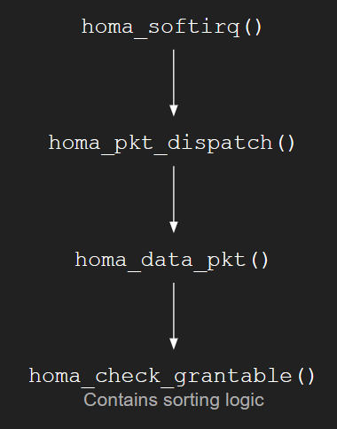
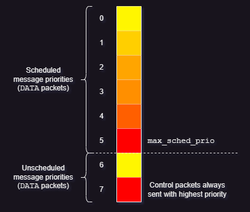
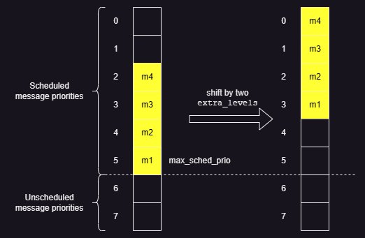
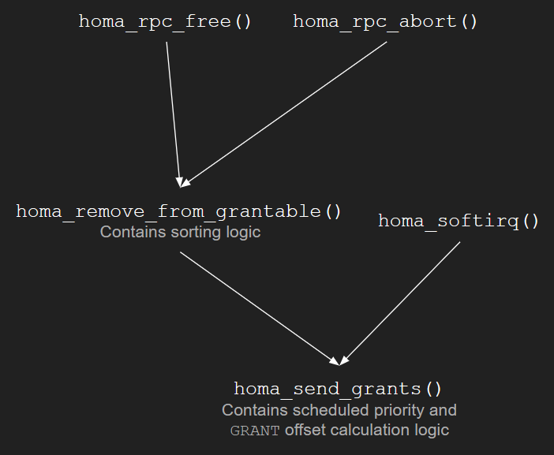

# Homa

([Back to Home](README.md))

## Table of Contents

-   [Introduction](#introduction)
-   [Data Center Environment](#data-center-environment)
    -   [Topology](#topology)
    -   [Traffic Properties](#traffic-properties)
    -   [Traffic Control Challenges](#traffic-control-challenges)
    -   [Network Requirements](#network-requirements)
    -   [Protocol Requirements](#protocol-requirements)
-   [Message vs Packet](#message-vs-packet)
-   [Problems with TCP](#problems-with-tcp)
    -   [Stream Orientation](#stream-orientation)
    -   [Connection Orientation](#connection-orientation)
    -   [Fair Scheduling](#fair-scheduling)
    -   [Sender-Driven Congestion Control](#sender-driven-congestion-control)
    -   [In-Order Packet Delivery](#in-order-packet-delivery)
-   [Sender vs Receiver](#sender-vs-receiver)
-   [Packet Types](#packet-types)
-   [Features](#features)
    -   [Message Orientation](#message-orientation)
    -   [Connectionless Protocol](#connectionless-protocol)
    -   [Shortest Remaining Processing Time (SRPT)](#srpt)
    -   [Receiver-Driven Congestion Control](#receiver-driven-congestion-control)
    -   [Out-of-Order Packet Tolerance](#out-of-order-packet-tolerance)
    -   [No Per-Packet Acknowledgements](#no-per-packet-acknowledgements)
    -   [At-Least-Once Semantics](#at-least-once-semantics)
-   [Design Principles](#design-principles)
-   [Linux Internals](#linux-internals)
-   [Streaming vs Messages](#streaming-vs-messages)
    -   [The Problem with TCP Streaming](#the-problem-with-tcp-streaming)
    -   [How Messages Help](#how-messages-help)
-   [API](#api)
-   [Message Sequence Scenarios](#message-sequence-scenarios)
-   [Algorithms](#algorithms)
    -   [Sorting Peers and RPCs](#sorting-rpcs-and-peers)
    -   [Calculating Scheduled Priorities](#calculating-scheduled-priorities)
    -   [Calculating Unscheduled Priorities](#calculating-unscheduled-priorities)
    -   [Calculating `rtt_bytes`](#calculating-rtt_bytes)
    -   [Calculating `GRANT` Offset](#calculating-grant-offset)
    -   [Calculating Unscheduled Bytes Offset](#calculating-unscheduled-bytes-offset)
-   [Resources](#resources)

## Introduction

-   The [Transmission Control Protocol (TCP)](tcp.md) is the most widely used transport protocol on the internet. It is well-designed, but just like any other protocol, it has its own issues. It is not suitable for every environment and faces [problems in a Data Center environment](#problems-with-tcp).
-   **Homa** is transport protocol designed for the Data Centers. It aims to replace TCP as the transport protocol in Data Centers and claims to fix all of TCP's problems for the Data Center. It is not API-compatible with TCP.
-   Homa reduces the 'Data Center tax' that TCP introduces with its connection maintenance and processing overheads.
-   The primary goal of Homa is to provide the lowest possible latency for short messages at high network load.
    -   The focus is on reducing **tail message latency** (P99 [99th percentile] latency) for short messages, i.e., the latency of short messages at high network load, as it is the most important performance metric for Data Center applications.

## Data Center Environment

### Topology

<p align="center">
    
</p>

-   Data Center -> Clusters -> Racks (with a Top of Rack [ToR] switch) -> Machines
-   There are multiple structures in which connections can be made between each of the components above, but the usual structure is as he above point.
-   Common topologies
    -   Fat-Tree
    -   Leaf-Spine (or Spine-and-Leaf)
    -   VL2
    -   JellyFish
    -   DCell
    -   BCube
    -   Xpander

### Traffic Properties

-   It is difficult to generalise all Data Center traffic into one certain type, because it is highly dependent on how applications are designed and built.
-   Depending on the application, there can be thousands of flow arrivals per second.
-   Flows are unpredictable in types, sizes and burst periods.
    -   Burstiness can be in terms of traffic in a flow or the number of flows.
-   Connections can be long-lived as well and need not always be transmitting.
-   Rough types
    -   Interactive flows/latency-sensitive flows
    -   Throughput-sensitive flows
    -   Deadline-bound flows
-   Usually, short flows require low latencies and long flows require high throughput.

### Traffic Control Challenges

-   Unpredictable traffic matrix
    -   Application dependent
    -   Most flows are short with just a few packets, but most bytes are delivered by long flows.
    -   High flow arrival rates with majority being short flows.
-   Mix of various flow types/sizes
    -   Application dependent
    -   Interactive flows (User-initiated queries like web searches) are time-sensitive, latency-sensitive and high priority flows.
    -   Throughput-sensitive flows (like MapReduce parallel data computing jobs) are not delay-sensitive, but need consistent bandwidth.\
    -   Deadline-bound flows with soft or hard deadlines can be both Interactive or Throughput-sensitive flows.
-   Traffic burstiness
    -   Traffic burstiness causes increased packet losses, increased buffer occupancy, increased queuing delay, decreased throughput, increased flow completion times
    -   [TCP Slow Start](tcp.md#slow-start-ss) with large window sizes can cause bursty traffic as well.
-   Packer re-ordering
    -   At the receiver: Increases latency, Increases CPU utlization and reduces the server's link utilization
    -   Features such as [Fast Retransmit](tcp.md#fast-retransmit) might mistake re-ordering for loss.
-   Performance Isolation
    -   Control has to be developed on multiple layers and on multiple hardware components to prevent misuse and privacy, while keeping Service Level Agreements (SLAs) in mind.
-   The Incast problem
    -   Multiple senders sending to one machine causes bottleneck issues.
-   The Outcast problem
    -   TCP Outcast is when a port that has many flows and a few flows coming in from different ports, gives priority to the port with many flows, causing Port Blackout for the port with fewer flows. Port Blackout is essentially packets of the fewer flows being dropped, which affects them due to the TCP timeouts it causes.

### Network Requirements

A Data Center environment should have:

-   Very high bandwidth/capacity/link utilization
    -   Depends on topology and traffic control measures.
    -   Aids in having more tenants on the same infrastructure.
-   Very low latency
-   Very small flow completion times
    -   Mainly affected by queuing and packet losses.
-   Very low deadline miss rate/lateness
-   High fairness
    -   Applies to shared resources like link bandwidth and buffer space. (Maybe even to CPU cycles and memory.)
    -   SLAs should always be met.
    -   Prevents misuse and starvation.
-   High energy efficiency

### Protocol Requirements

Some of the important features a **Data Center transport protocol** should have:

-   Reliable delivery
    -   Data should be delivered regardless of failures.
-   Low latency
    -   Data should be delivered as fast as possible.
    -   Tail latency should be good.
    -   Packet processing overheads should be low.
-   High throughput
    -   Both data throughput (amount of data sent) and message throughput (no. of messages sent) should be high.
-   Congestion control
    -   Refers to packet buildup in core and edge buffers.
    -   Congestion needs to be kept at a minimum to ensure low latency.
-   Efficient Load Balancing
    -   Trying to load balance Data Center workloads causes additional overheads to manage cache and the connections, and also causes hot spots where workload is not properly distributed.
    -   Load Balancing overheads are a major reason for tail latency.
-   Network Interface Card/Controller (NIC) offload
    -   The protocol cannot be a pure software implementation, because that's too slow. It should make use of inherent NIC features, for which better NICs are needed as well.

## Message vs Packet

-   Message
    -   A logically sensible data unit that makes sense in its entirety and can be processed.
-   Packet
    -   A split of a message (a chunk) that obviously doesn't make logical sense individually, but can be combined with other packets to form a message.
    -   They usually have offsets, sequence numbers, or some other mechanism to help order packets in a logical sequence.

## Problems with TCP

The following features of TCP cause it problems **in the Data Center**:

### Stream Orientation

-   TCP is a stream-oriented protocol. It blindly sends how much ever data that [the layer above it in the network stack](osi-layers.md) gives it, without having any knowledge of a logical chunk of data.
-   Please refer to [the 'Streaming vs Messages' section](#streaming-vs-messages).

### Connection Orientation

-   TCP is a connection-oriented protocol. There is a three-way handshake that takes place to establish a connection between a client and a server.
-   Connections are not the best inside the Data Center, because each application might have hundreds or thousands of them and that causes overheads in space and time.
    -   Techniques such as [Delayed ACKs](https://medium.com/@gonzalo.cloud/what-is-delayed-ack-and-how-can-it-be-a-bottleneck-in-your-network-77a7ecf7bb0b) have to be used to reduce packet overheads.
-   Keeping aside packet buffer space and application level state, 2000 bytes of state data has to be maintained for every TCP socket.
-   Connection setup takes up one Round Trip Time (RTT).

### Fair scheduling

-   TCP uses Fair Scheduling to do bandwidth sharing between various connections.
-   Under high loads, short messages have a very bad RTT as compared to long messages, due to [TCP Head of Line Blocking (HoLB)](tcp.md#tcp-head-of-line-blocking).
-   Under high load, all streams share bandwidth, which collectively slows down everyone.

### Sender-Driven Congestion Control

-   In TCP, the sender tries to avoid congestion.
-   Congestion is usually detected when there is buffer occupancy, which implies that there will be some packet queuing, which further implies increased latency and HoLB.
-   TCP does not make use of priority queues in modern switches, which implies that all messages are treated equally, which causes problems for short messages behind long message queues. (HoLB)
-   It causes a latency vs throughput dilemma, where less latency implies buffers being under-utilized, which in-turn reduces the throughput for long messages, and high throughput implies always having data in buffers ready to go, but the queuing causes delays for short messages, increasing the latency.
-   Please refer to [the 'Streaming vs Messages' section](#streaming-vs-messages).

### In-Order Packet Delivery

-   In comparison to Homa, TCP has a lower out-of-order packet tolerance and prefers that packets are sent in-order and on the sane link (Flow-consistent Routing).
-   Asymmetries in packet delivery in a Data Center environment due to Packet Spraying (sending packets across multiple connections) can cause packet reordering beyond TCP's tolerance threshold and cause unnecessary retransmissions.
-   If Packet Spraying is not used and Flow-consistent Routing is used, which fixes links for particular TCP flows, it can cause hot spots for the duration of the connection on particular links if multiple flows get hashed through the same links.
-   Linux performs Load Balancing at the software level by routing packets through multiple cores for processing and to maintain the order or delivery, all packets have to pass through the same sequence of cores, which can lead to core hot spots as well, if multiple flows get hashed to the same cores. This also increases the tail latency of TCP.

## Sender vs Receiver

-   Client to server communication:
    -   Sender: Client
    -   Receiver: Server
-   Server to client communication:
    -   Sender: Server
    -   Receiver: Client

> A peer can be a sender or a receiver and can have multiple RPCs.

## Packet Types

> NOTE:
>
> -   [Message vs Packet](#message-vs-packet)
> -   [Sender vs Receiver](#sender-vs-receiver)
> -   Source: [`protocol.md` file](https://github.com/PlatformLab/HomaModule/blob/master/protocol.md#packet-types) and [`homa_impl.h` file](https://github.com/PlatformLab/HomaModule/blob/master/homa_impl.h)

Homa's packet types:

### `DATA`

-   `DATA(rpc_id, data, offset, self_prio, m_len)`
-   Sent by the sender or receiver.
-   Contains a contiguous range of bytes within a message, defined by an offset.
-   Also indicates the total message length.
-   It has the ability to acknowledge (`ACK`) one RPC, so future RPCs can be used to acknowledge one RPC, thus not requiring an explicit `ACK` packet to be sent.

### `GRANT`

-   `GRANT(rpc_id, offset, exp_prio)`
-   Sent by the receiver.
-   Indicates that the sender may now transmit all bytes in the message up to a given offset.
-   Also specifies the priority level to use for the `DATA` packets.
-   [When are `GRANT` packets sent?](#offset-and-scheduled-priority-calculation-timing)

### `RESEND`

-   `RESEND(rpc_id, offset, len, exp_prio)`
-   Sent by the sender or receiver.
-   Indicates that the sender should re-transmit a given range of bytes within a message.
-   Includes priority that should be used for the retransmitted packets.
-   To prevent unnecessary bandwidth usage, Homa only issues one outstanding `RESEND` packet to a given peer at a time. (One peer can have multiple RPCs.) Homa rotates the `RESEND`s among the RPCs to that peer.
-   If enough timeouts occur (i.e., enough `RESEND` packets are sent), Homa concludes that a peer has crashed, aborts all RPCs for that peer and discards all the state associated with those RPCs.

### `UNKNOWN`

-   `UNKNOWN(rpc_id)`
-   Sent by the sender or receiver.
-   Indicates that the RPC for which a packet was received is unknown to it.

### `BUSY`

-   `BUSY(rpc_id)`
-   Sent from sender to receiver.
-   Indicates that a response to `RESEND` will be delayed.
    -   The sender might be busy transmitting higher priority messages or another RPC operation is still being executed.
-   Used to prevent timeouts.
    -   It can be thought of as a 'keep-alive' indicator, as it keeps the communication alive and prevents the RPC from being aborted due to lack of data receipt.

### `CUTOFFS`

-   `CUTOFFS(rpc_id, exp_unsched_prio)`
-   Sent by the receiver.
-   Indicates priority cutoff values that the sender should use for unscheduled packets.
-   [When are `CUTOFFS` packets sent?](#unscheduled-priority-setting-and-transmission-timing)

### `ACK`

-   `ACK(rpc_id)`
-   Sent by the sender.
-   Explicitly acknowledges that receipt of a response message to **one or more RPCs**.
    -   Aids the receiver to discard state for completed RPCs.

### `NEED_ACK`

-   `NEED_ACK(rpc_id)`
-   Sent by the receiver.
-   Indicates an explicit requirement for an acknowledgement (`ACK` packet) for the response of a particular RPC.

### `FREEZE`

-   Only for performance measurements, testing and debugging.

### `BOGUS`

-   Only for unit testing.

## Features

<p align="center">
    
</p>

Homa's features:

### Message Orientation

-   Homa is a Message-oriented protocol, that implements [Remote Procedure Calls (RPCs)](http.md#rest-vs-rpc) rather than streams.
-   Please refer to the [Message vs Packet](#message-vs-packet) and the [Streaming vs Messages](#streaming-vs-messages) sections.
-   Homa exposes discrete messages to transport, letting multiple threads read from a single socket without worrying about getting a message from a different connection (as in the TCP world, especially with HTTP/2 multiplexing multiple streams on one TCP connection, causing HoLB).

### Connectionless Protocol

-   Homa uses RPCs and so it doesn't require explicit connection establishment between the sender and receiver, and vice versa. This reduces connection setup overhead.
-   An application can use a single socket to manage any number of concurrent RPCs with any number of peers.
-   Each RPC is handled independently and there are no message ordering guarantees between concurrent RPCs.
-   Homa ensures reliable connections (errors are sent after unrecoverable network or host failures).
-   It is a connectionless protocol, but not a stateless protocol.
-   State maintained by Homa
    -   State for sockets, RPCs and peers are kept (200 bytes per host vs TCP's 2000 bytes per connection [not including data buffer space]).
    -   One way to think of Homa is that it maintains short-lived and lightweight connections for each RPC.
    -   Each RPC is handled independently and Flow Control, Retry and Congestion Control are implemented per RPC state.

### SRPT

-   Homa uses Shortest Remaining Processing Time (SRPT) Scheduling rather than [TCP's Fair Scheduling](#fair-scheduling).
-   Homa uses SRPT Scheduling (a type of Run-to-Completion Scheduling) to queue messages to send and receive. It is best if both, the receiver and the sender, use SRPT, as it prevents short messages from starving behind long messages in queues on both ends.
-   Homa makes use of priority queues in modern switches and queues shorter messages through the priority queues, so that they don't get starved by long messages. This helps reduce the 'latency vs bandwidth' optimization problem.
    -   Priority is divided into two groups, the highest levels are for unscheduled packets and the lower levels are for scheduled packets. In each group, the highest priorities are for the shorter messages.
        -   All packet types other than `DATA` packets have the highest priorities.
    -   The receiver assigns priorities dynamically (depending on the flows that it has) and can change them at any time it wishes. It communicates them through `GRANT` packets for scheduled packets and through `CUTOFFS` packets for unscheduled packets.
    -   The receiver assigning priorities makes sense because it knows all the flows that want to send data to it and its current network load and buffer occupancy.
    -   Reducing queuing is the key to reducing latency.
        -   Homa not only limits queue buildup in switches, but also in the Network Interface Controller (NIC), so that HoLB does not take place.
            -   To prevent queue build up in the NIC, it uses a queue and a 'Pacer Thread' that essentially keeps an approximate of the time in which the NIC queue will be empty and sends packets to the NIC from its queue based on that estimate while maintaining the original SRPT order.
    -   Homa intentionally does 'controlled overcommitment', i.e., it allows a little buffering (for longer messages), to keep link utilization high (thus optimizing for throughput, while keeping latency low through SRPT and priority queues).
        -   The controlled overcommitment helps in keeping up capacity utilization in cases where senders aren't sending messages in a timely fashion.
-   Homa also allocates 5-10% of the bandwidth to the oldest message (which will be the longest one), so that the longest message also doesn't completely starve. Both, the granting mechanism and the Pacer Thread take this into consideration.

### Receiver-Driven Congestion Control

-   A receiver is usually in a better position to signal and drive congestion rather than the sender, because the receiver knows how much buffer capacity it has left and the number of RPCs that it has. So, it is better to let the receiver signal whether messages can be sent or not.
-   A sender can send a few unscheduled packets to receive some replies from the receiver to test the waters, but packets after that will be scheduled and can be sent only if the receiver sends a _grant_ for those messages.
    -   The message size is mentioned in the initial unscheduled blindly sent (to reduce latency) packets, which further helps the receiver to make a decision on scheduling those messages and also allows it to give priority to shorter messages.
        -   Yes, this might cause some buffering if there are too many senders that send unscheduled packets, but that minimum buffering is unavoidable. The scheduling of further messages through the _grant_ mechanism ensures reduced buffer occupancy.
    -   A `GRANT` packet is sent after a decided amount of data (defaulted at 10,000 bytes), if the receiver decides that it can accept more data and it contains an offset for the number of outstanding bytes of the message size that it wants from the sender and also the priority that the sender should send the packet with. So Homa can vary priorities dynamically based on the load it has on the receiver.
        -   Homa does not send a `GRANT` packet for every `DATA` packet, as that causes a lot of overheads and Homa uses [TCP Segmentation Offload (TSO)](tcp.md#tcp-segmentation-offload), which implies that the sender transmits packets in groups, so every packet does not need to have a `GRANT` packet.
            -   The 'RTT bytes' that the `GRANT` packet sends might be split into multiple packets depending on the Maximum Transmission Unit (MTU) value.
    -   The sender should transmit 'RTT bytes' (including software delays on both ends) and by the time RTT bytes are sent, it should receive an indication from the receiver whether to keep sending or not, thus reducing transmission latency in case an immediate grant is received.
-   As the receiver knows the load it has and expects from the received messages, it can prioritise messages (using a small number of priority queues) and the bandwidth they can have.
    -   Knowing the message sizes, they can predict the bandwidth required and take the decision of granting and priority on those basis.
    -   This helps the receiver implement SRPT Scheduling, as they have the priority in their control.

### Out-of-Order Packet Tolerance

-   Homa has a high tolerate for out-of-order packets.
-   Homa can tolerate Out-of-Order packets, so Packet Spraying works, which aids load balancing over multiple links, avoiding network traffic hot spot creation.
    -   Homa does not follow TCP's Flow Consistent Routing.

### No Per-Packet Acknowledgements

-   Homa does not send out explicit acknowledgements for every packet, thus reducing almost half the packets that have to be sent per message. This reduces transmission overheads and conserves bandwidth.
-   As mentioned in the 'Homa Features' sub-point 'Receiver-driven Congestion Control' above, a `GRANT` packet is not sent for every `DATA` packet, but for a bunch of packets, so `GRANT` packets are not acknowledgement packets for every packet that was sent.
    -   Although not explicitly mentioned anywhere, they can be considered as SACK (Selective Acknowledgement) packets in my opinion.
-   If any packet is missing, the receiver will send a `RESEND` packet requesting for the information.
-   The sender has to send an explicit `ACK` packet on completely receiving a RPC response message from the receiver for a RPC request message, so that the receiver can discard the RPC state.
    -   If an `ACK` packet is not sent by the sender, the receiver can explicitly ask for one using the `NEED_ACK` packet.
    -   If the sender has not received the entire response message, it can send a `RESEND` packet to the receiver.

### At-Least-Once Semantics

-   [At-least-once semantics](https://www.lightbend.com/blog/how-akka-works-at-least-once-message-delivery#:~:text=Message%20Delivery%20Semantics)
-   In case of failures or losses, Homa does have mechanisms to ensure retransmission (Eg: The `RESEND` packet or fresh retries after deadlines), so packets are sent at least once, but can be sent more times to ensure delivery.

## Design Principles

Homa's Design Principles:

-   Transmitting short messages blindly
-   Using in-network priorities
-   Allocating priorities dynamically at receivers in conjunction with receiver-driven rate control
-   Controlled over-commitment of receiver downlinks

## Linux Internals

How Homa works in Linux:

<p align="center">
    
</p>

-   Transmit (top): [`homa_send()`](#homa-api) -> copy packets -> [TSO](tcp.md#tcp-segmentation-offload)/GSO -> Homa, IP layer -> NIC (and its driver)
-   Receive (bottom): NIC ([RSS](<https://networking.harshkapadia.me/linux#:~:text=Scaling%20in%20the%20Linux%20Networking%20Stack%20(RSS%2C%20RPS%2C%20RFS%2C%20etc.)>)) -> Interrupt -> [NAPI](linux.md#napi) (GRO, SoftIRQ core choosing) -> SoftIRQ (network stack traversal) -> copy packets -> `homa_recv()`
-   Research paper explanation: [Packet flow and batching (4.1)](https://networking.harshkapadia.me/files/homa/research-papers/a-linux-kernel-implementation-of-the-homa-transport-protocol.pdf#page=5) from [A Linux Kernel Implementation of the Homa Transport Protocol](files/homa/research-papers/a-linux-kernel-implementation-of-the-homa-transport-protocol.pdf) ([USENIX](https://www.usenix.org/conference/atc21/presentation/ousterhout))
-   Review article: [A Linux Kernel Implementation of the Homa Transport Protocol, Part II](https://www.micahlerner.com/2021/08/29/a-linux-kernel-implementation-of-the-homa-transport-protocol.html)

## Streaming vs Messages

> NOTE: [Message vs Packet](#message-vs-packet)

### The Problem with TCP Streaming

-   TCP is not aware of the message size. It is only aware of the length of the current packet.
-   TCP will break up (segment) whatever it receives from the application above it in the OSI stack into packets of 'Maximum Segment Size (MSS) bytes' and send it across. (Streaming)
    -   It might also wait for MSS to be fulfilled before sending (like in [Nagle's Algorithm](https://en.wikipedia.org/wiki/Nagle's_algorithm)), but that is a setting that can be toggled.
-   This streaming behaviour obviously adds buffering and packet ordering at the receiver, but more importantly the receiver has no knowledge of when it can start processing something or how much data it is going to receive. The sender is thus responsible to not overwhelm the receiver (Flow Control) and the network (Congestion Control).
-   TCP streaming causes Load Balancing difficulties, because the path of sending data is usually consistent (Flow-consistent routing) and multiple flows on the same paths can cause congestion (hot spots) and HoLB.
-   Causes an increase in tail latency due to HoLB, where short messages get delayed behind long messages on the same stream.
    -   Using multiple TCP connections to the same host to counter HoLB causes a connection explosion, with too much state to be maintained per connection and too much work to send, receive and manage all the connections on the receiver and sender.

### How Messages Help

-   The sender transmits the **message size** to the receiver during the initial unscheduled transmission, so the receiver can calculate the exact bandwidth required for the entire communication and decide grants and priorities.
-   Buffering and packet ordering at the receiver will still exist here, but now the receiver is cognizant of how much data it can expect to receive and can make decisions based on bandwidth requirements, its current load, its buffer occupancy, observed RTT, etc.
    -   This helps `GRANT` packets from the receiver to the sender to specify an offset of outstanding 'RTT bytes' of the message to transmit to the receiver to ensure as far as possible, no interruptions in transmitting, which improves bandwidth utilization.
        -   Specifying this also helps with buffer occupancy predictions and checks, because the receiver knows how much a particular RPC was allowed to send in a particular packet.
    -   This puts the power of Congestion and Flow Control in the hands of the receiver, which makes more sense, because it is the entity that has the best knowledge of its state, rather than the sender having to make guesses based on parameters like 'packet loss' and 'duplicate acknowledgements', that are not the most accurate indicators of congestion.
-   Removing streaming also gets rid of the [TCP Head of Line Blocking (HoLB)](tcp.md#tcp-head-of-line-blocking) problem.
    -   In the HTTP world, QUIC (the transport protocol for HTTP/3) solves this by having multiple independent streams, unlike TCP in HTTP/2, which was multiplexing multiple streams over a single TCP stream/connection (thus causing HoLB).
        -   HoLB: Multiple messages multiplexed over a single TCP connection (as in HTTP/2) implies that even if only one packet at the start of the [Congestion Window (CWND)](tcp.md#important-terms) needs to be retransmitted, all the packets after it will be buffered at the receiver and not be handed to their respective streams up the networking stack even if the individual packets that might be belonging to different streams are complete.
            -   This is also where the scare of reading packets from a different stream from one connection pops up in TCP.
        -   The point here can be that Homa is doing away with streaming altogether and just using messages, so not only is HoLB solved, but so are [the other issues with streaming](#the-problem-with-tcp-streaming).

## API

> NOTE:
>
> -   These are the functions that implement the Homa API visible to applications. They are intended to be a part of the user-level run-time library.
> -   Source: [`homa_api.c` file](https://github.com/PlatformLab/HomaModule/blob/master/homa_api.c)

Homa's API:

-   `homa_send()`
    -   Send a request message to initiate a RPC.
    -   `homa_sendv()`
        -   Same as `homa_send()`, except that the request message can be divided among multiple disjoint chunks of memory.
-   `homa_reply()`
    -   Send a response message for a RPC previously received.
    -   `homa_replyv()`
        -   Similar to `homa_reply()`, except the response message can be divided among several chunks of memory.
-   `homa_abort()`
    -   Terminate the execution of a RPC.
    -   `homa_abortp()`
        -   Same as `homa_abort()`, but just receives all parameters in one `struct` instead of separately/individually.

## Message Sequence Scenarios

> NOTE: [Sender vs Receiver](#sender-vs-receiver)

Homa's Message Sequence Scenarios:

<p align="center">
    
</p>

-   The image above showcases a normal Homa RPC communication.
-   Both, a RPC Request and a RPC Response are shown.
-   Priority levels: `P0` (lowest) to `P7` (highest)
-   It is important to note that `GRANT` packets are for 'RTT bytes' to keep link utilization at 100%, but `DATA` packets are of the size of the [Maximum Transmission Unit (MTU)](tcp.md#important-terms). So each `GRANT` packet might generate multiple `DATA` packets.

<p align="center">
	<br />
	<br />
    
</p>

-   A RPC Request is shown in the image above.
-   The sender crashes after sending two of its three granted `DATA` packets. The first granted (scheduled) `DATA` packet is lost as well, which causes a timeout on the receiver, causing it to send a `RESEND` packet for the missing data.
-   After multiple `RESEND` packets not receiving responses, the receiver determines that the sender is non-responsive and discards all of the state related to that RPC ID.
-   On coming back online, the sender looks at its previous state and tries to resume by sending the last granted `DATA` packet that it had not sent, but the receiver sends an `UNKNOWN` packet, as it has already discarded all information related to that RPC ID.
-   The sender has to re-start the communication with the receiver.

<p align="center">
	<br />
	<br />
    
</p>

-   A RPC Request is shown in the image above.
-   Here, a `DATA` packet is lost and the `RESEND` packet for that missing data is lost as well, but the next `RESEND` packet makes it to the sender.
-   The sender can either immediately respond with the missing data in a `DATA` packet or if it is busy transmitting other higher priority packets, then it can send a `BUSY` packet to the receiver to prevent a timeout (like a 'keep-alive' indicator) and can send the `DATA` packet once it is free.

<p align="center">
	<br />
	<br />
    
</p>

-   A RPC Request is shown in the image above.
-   This scenario needs to be confirmed properly, but this is most likely how it happens.
-   If the blindly sent unscheduled `DATA` packets don't reach the receiver due to loss, overload, congestion or other reasons, then the sender times out waiting for a response from the receiver.
-   On timing out, the sender sends a `RESEND` packet to the receiver, asking for a response.
-   If the `RESEND` packet reaches the receiver, then it will respond with an `UNKNOWN` packet, because it never got the initial packets and was never aware of the RPC.
-   The sender has to re-start the communication with the receiver.

## Algorithms

Some of the algorithms that Homa implements for

-   [Sorting Peers and RPCs](#sorting-rpcs-and-peers)
-   [Calculating Scheduled Priorities](#calculating-scheduled-priorities)
-   [Calculating Unscheduled Priorities](#calculating-unscheduled-priorities)
-   [Calculating `rtt_bytes`](#calculating-rtt_bytes)
-   [Calculating `GRANT` Offset](#calculating-grant-offset)
-   [Calculating Unscheduled Bytes Offset](#calculating-unscheduled-bytes-offset)

> All details as seen in [commit `9c9a1ff` of the Homa Linux kernel module](https://github.com/PlatformLab/HomaModule/tree/9c9a1ff3cbd018810f9fc11ca404c5d20ed10c3b) (31st March 2023).

### Sorting RPCs and Peers

-   Constituents

    -   Peers (`P`)
        -   There can be multiple peers (hosts) transmitting (sending (`S`)) to the same receiver (`R`).
        -   Each such peer can be sent `GRANT` packets to send more data.
    -   `RPC`s: Every peer can have multiple RPCs transmitting to the same receiver.

    Example:

    ```
    P1(RPC1, RPC2) -> R1
    P2(RPC3) -> R1
    P3(RPC4, RPC5, RPC6) -> R1

    or

    S(P1(RPC1, RPC2), P2(RPC3), P3(RPC4, RPC5, RPC6)) -> R1
    ```

-   A Homa receiver maintains a list of peers (`grantable_peers`) that are sending it data and every peer in `grantable_peers` maintains a list of RPCs (`grantable_rpcs`) that are sending data to that receiver.
-   The `grantable_rpcs` list is sorted based on the number of bytes still to be received (`bytes_remaining`). The RPC with the least `bytes_remaining` is at the head (start) of the list.
    -   If `bytes_remaining` are equal, then the time (`birth`) at which the RPC was added to the `grantable_rpcs` list is used to break the tie. The older RPC will be nearer to the head (start) of the list.
-   The `grantable_peers` list is also sorted based on the `bytes_remaining` parameter of the first RPC in each peer's `grantable_rpcs` list. The peer with the least `bytes_remaining` in the first RPC of its `grantable_rpcs` list is at the head of the `grantable_peers` list.
    -   To break a `bytes_remaining` tie, the same `birth` factor as mentioned in the sub-point above is responsible.
-   RPCs per peer are ordered first and then peers are ordered.
-   [When are RPCs and peers sorted?](#rpc-and-peer-sorting-timing)

#### Algorithm

```c
/* - The overall Homa state maintains one sorted grantable peer list (`homa_state->grantable_peers`).
 * - Every peer in that list maintains a sorted grantable RPC list (`peer->grantable_rpcs`).
 * - The algorithm below first sorts a RPC in its peer's `grantable_rpcs` list and then due to that change, sorts that peer in the `grantable_peers` list.
 * - Logic derived from https://github.com/PlatformLab/HomaModule/blob/9c9a1ff3cbd018810f9fc11ca404c5d20ed10c3b/homa_incoming.c#L819-L933
 */

position_rpc(homa_state, rpc_to_check) {
	peer_to_check = rpc_to_check->peer;

	while(rpc in peer_to_check->grantable_rpcs) {
		if(rpc->bytes_remaining > rpc_to_check->bytes_remaining) { // RPC with fewest bytes wins.
			// Add `rpc_to_check` before `rpc`.

			// Due to above change, `peer_to_check` might have to be re-positioned in `homa_state->grantable_peers`.
			position_peer(homa_state, peer_to_check);
			break;
		}
		else if(rpc->bytes_remaining == rpc_to_check->bytes_remaining) {
			if(rpc->birth > rpc_to_check->birth) { // Tie breaker: Oldest RPC wins.
				// Add `rpc_to_check` before `rpc`.

				// Due to above change, `peer_to_check` might have to be re-positioned in `homa_state->grantable_peers`.
				position_peer(homa_state, peer_to_check);
				break;
			}
		}
	}
}

position_peer(homa_state, peer_to_check) {
	first_rpc_in_peer_to_check = get_list_head(peer_to_check);

	while(peer in homa_state->grantable_peers) {
		first_rpc_in_peer = get_list_head(peer);

		if(first_rpc_in_peer->bytes_remaining > first_rpc_in_peer_to_check->bytes_remaining) { // Peer having first RPC with fewest bytes wins.
			// Add `peer_to_check` before `peer`.

			break;
		}
		else if(first_rpc_in_peer->bytes_remaining == first_rpc_in_peer_to_check->bytes_remaining) {
			if(first_rpc_in_peer->birth > first_rpc_in_peer_to_check->birth) { // Tie breaker: Peer with oldest first RPC wins.
				// Add `peer_to_check` before `peer`.

				break;
			}
		}
	}
}
```

#### RPC and Peer Sorting Timing

<p align="center">
    
</p>

-   The sorting of RPCs and peers happens in [the `homa_check_grantable` function](https://github.com/PlatformLab/HomaModule/blob/9c9a1ff3cbd018810f9fc11ca404c5d20ed10c3b/homa_incoming.c#L819-L933).
-   The `homa_check_grantable` function is called by [the `homa_data_pkt` function](https://github.com/PlatformLab/HomaModule/blob/9c9a1ff3cbd018810f9fc11ca404c5d20ed10c3b/homa_incoming.c#L486-L572) (which handles incoming `DATA` packets), if the incoming message had scheduled bytes in it.
-   The `homa_data_pkt` function is called by [the `homa_pkt_dispatch` function](https://github.com/PlatformLab/HomaModule/blob/9c9a1ff3cbd018810f9fc11ca404c5d20ed10c3b/homa_incoming.c#L325-L484) that handles all incoming packets.
-   The `homa_pkt_dispatch` function is called by [the `homa_softirq` function](https://github.com/PlatformLab/HomaModule/blob/9c9a1ff3cbd018810f9fc11ca404c5d20ed10c3b/homa_plumbing.c#L1201-L1365) that handles incoming packets at the SoftIRQ level in the Linux Kernel. (SoftIRQ: [1](https://blog.packagecloud.io/illustrated-guide-monitoring-tuning-linux-networking-stack-receiving-data#:~:text=Devices%20have%20many,processing%20incoming%20packets.) and [2](https://blog.packagecloud.io/monitoring-tuning-linux-networking-stack-receiving-data/#softirqs:~:text=What%20is%20a,from%20the%20device.))

### Calculating Scheduled Priorities

-   A Homa receiver sends `GRANT` packets to senders to give them permission to send `DATA` packets to it. Those `GRANT` packets have a `priority` field in them, which the sender has to add to the `DATA` packets they send.
    -   The first RPC in the `grantable_rpcs` list in every peer is granted and it is given its own scheduled data priority after calculations.

<p align="center">
    
</p>

-   Homa's default priority range is from `0` to `7` (eight levels) ([Source](https://github.com/PlatformLab/HomaModule/blob/9c9a1ff3cbd018810f9fc11ca404c5d20ed10c3b/homa_impl.h#L172-L177)). Level `0` has the lowest priority while level `7` has the highest priority.
    -   The levels are manually split in two parts (by `max_sched_prio`), the former for scheduled packets and the latter for unscheduled packets.
        -   The former part that is for scheduled packets always has the lower priorities of the entire range.
        -   The latter part (highest priorities in the entire range) is always kept for the unscheduled packets, as they always have the highest priority.
        -   Example (as seen in picture above): If priority levels are from `0` (lowest) to `7` (highest) and `max_sched_prio` is `5`, then scheduled packets can have priorities between `0` and `5` (both inclusive), while unscheduled packets can have priorities `6` and `7`.
        -   [The `max_sched_prio` parameter is set using the `unsched_cutoffs` array.](#calculating-unscheduled-priorities)
    -   In each half of the range, Homa tries to assign the lowest possible priority to each RPC, so that newer messages with higher priorities can be accommodated easily to implement SRPT properly.
-   [When are offsets and scheduled priorities calculated?](#offset-and-scheduled-priority-calculation-timing)

#### Algorithm

```c
// Logic derived from https://github.com/PlatformLab/HomaModule/blob/9c9a1ff3cbd018810f9fc11ca404c5d20ed10c3b/homa_incoming.c#L935-L1119

set_scheduled_data_priority(homa_state) {
	rank = 0; // Just a counter variable.
	max_grants = 10; // Hard coded value for maximum grants that can be issued in one function call.
	max_scheduled_priority = homa_state->max_sched_prio; // Fixed integer value set using the `unsched_cutoffs` array.
	num_grantable_peers = homa_state->num_grantable_peers; // No. of peers in `homa_state->grantable_peers` list.

	while(peer in homa_state->grantable_peers) {
		rank++;

		priority = max_scheduled_priority - (rank - 1); // Calculates the max. priority possible.

		/* `extra_levels` is calculated to try to later adjust priority to lowest possible value for SRPT.
		 * It helps in pushing priorities as low as possible, so that newer higher priority messages can be accommodated easily.
		 */
		total_levels = max_scheduled_priority + 1;
		extra_levels = total_levels - num_grantable_peers;

		if (extra_levels >= 0) { // `extra_levels` < 0 implies congestion or too much overcommitment.
			priority = priority - extra_levels; // Adjust priority to lowest possible value for SRPT.
		}
		if (priority < 0) {
			priority = 0;
		}

		// Assign `priority` to `GRANT` packet.

		if(rank == max_grants) {
			break;
		}
	}
}
```

#### Examples

-   Using the two situations presented in two points below, we can understand how `final_priority` for every message is assigned in Homa using the `priority` and `extra_levels` formulae.

-   `No. of messages to granted` = `No. of priority levels` (i.e., `6 = 6`)

    ```c
    max_scheduled_priority = 5 // i.e., 0 to 5, which is six levels
    num_grantable_peers = 6
    rank = 0

    // For 1st msg
    rank = rank + 1
    	= 0 + 1
    	= 1
    priority = max_scheduled_priority - (rank - 1)
    		= 5 - (1 - 1)
    		= 5
    extra_levels = (max_scheduled_priority + 1) - num_grantable_peers
    			= (5 + 1) - 6
    			= 0
    final_priority = priority - extra_levels
    		= 5 - 0
    		= 5

    // For 2nd msg
    rank = 1 + 1 = 2
    priority = 5 - (2 - 1) = 4
    extra_levels = (5 + 1) - 6 = 0
    final_priority = 4 - 0 = 4

    // For 3rd msg
    final_priority = (5 - (3 - 1)) - ((5 + 1) - 6) = 3 - 0 = 3

    // Similarly, for 4th, 5th and 6th (final) messages, priorities will be 2, 1 and 0 respectively.
    ```

-   `No. of messages to granted` < `No. of priority levels` (i.e., `4 < 6`)

    ```c
    max_scheduled_priority = 5 // i.e., 0 to 5, which is six levels
    num_grantable_peers = 4
    rank = 0

    // For 1st msg
    rank = rank + 1
    	= 0 + 1
    	= 1
    priority = max_scheduled_priority - (rank - 1)
    		= 5 - (1 - 1)
    		= 5
    extra_levels = (max_scheduled_priority + 1) - num_grantable_peers
    			= (5 + 1) - 4
    			= 2
    final_priority = priority - extra_levels
    		= 5 - 2
    		= 3

    // For 2nd msg
    rank = 1 + 1 = 2
    priority = 5 - (2 - 1) = 4
    extra_levels = (5 + 1) - 4 = 2
    final_priority = 4 - 2 = 2

    // For 3rd msg
    final_priority = (5 - (3 - 1)) - ((5 + 1) - 4) = 3 - 2 = 1

    // For 4th (final) message
    final_priority = (5 - (4 - 1)) - ((5 + 1) - 4) = 2 - 2 = 0
    ```

    <p align="center">
    
    </p>

-   From the two situations above, it can be understood that Homa always pushes messages to the lowest possible priorities (using the `extra_levels` parameter) to be able to easily accommodate higher priority messages.

-   When `No. of messages to granted` > `No. of priority levels`, then some messages will accumulate at the lowest priority level (`0`). This can be a sign of congestion and/or too much overcommitment.

### Calculating Unscheduled Priorities

-   `unsched_cutoffs` is an array of message length values. The length of the array is eight by default.
-   Each position in the array defines the largest message length that can be used for that priority level.
    -   The 0th position of the `unsched_cutoffs` array has the lowest priority while the last position in has the highest priority.
    -   Message length values should increase the end of the array to the start of the array.
    -   This is to implement SRPT, i.e., messages with fewer bytes left get higher priorities.
-   A [value of `HOMA_MAX_MESSAGE_LENGTH`](https://github.com/PlatformLab/HomaModule/blob/9c9a1ff3cbd018810f9fc11ca404c5d20ed10c3b/homa.h#L39-L43) at any position will indicate the lowest priority for unscheduled priorities. All positions below this will be used for scheduled packets.
    -   [This array is also used to set the `max_sched_prio` variable](https://github.com/PlatformLab/HomaModule/blob/9c9a1ff3cbd018810f9fc11ca404c5d20ed10c3b/homa_utils.c#L1584-L1620), as its value will be the array position before the position that has the `HOMA_MAX_MESSAGE_LENGTH` value.
    -   Example: For eight priority levels (`0` to `7`), if `unsched_cutoffs[6] = HOMA_MAX_MESSAGE_LENGTH`, then `max_sched_prio = 5`, the scheduled packet priority range is from `0` to `5` (both inclusive) and unscheduled packet priorities are `6` and `7`.
-   Instead of being a dynamically changing array, this is a statically assigned array in the configuration, at least till [commit `9c9a1ff` of the Homa Linux kernel module](https://github.com/PlatformLab/HomaModule/tree/9c9a1ff3cbd018810f9fc11ca404c5d20ed10c3b).
-   [When and how is the unscheduled priority used and set?](#unscheduled-priority-setting-and-transmission-timing)

#### Unscheduled Priority Setting and Transmission Timing

-   Alternate title: '`CUTOFFS` Packet Transmission Timing'

##### Initializations

-   Homa initializes priority-based values for the overall Homa state (`homa_state`)

    -   Incoming `DATA` packet `cutoff_version` is checked with `homa_state->cutoff_version`.

    ```c
    /* - `HOMA_MAX_PRIORITIES = 8` is a hard coded value.
     * - `HOMA_MAX_MESSAGE_LENGTH = 1000000` is a hard coded value.
     * - Code below as seen in https://github.com/PlatformLab/HomaModule/blob/9c9a1ff3cbd018810f9fc11ca404c5d20ed10c3b/homa_utils.c#L104-L119
     */

    homa_state->num_priorities = HOMA_MAX_PRIORITIES; // = 8

    homa_state->max_sched_prio = HOMA_MAX_PRIORITIES - 5; // = 3 (So levels 0 to 3 for scheduled data while levels 4 to 7 for unscheduled data.)

    // Rationale behind choosing/guessing these values is not clear
    homa_state->unsched_cutoffs[HOMA_MAX_PRIORITIES-1] = 200; // Level 7 can receive (unscheduled) msgs with <= 200 remaining bytes.
    homa_state->unsched_cutoffs[HOMA_MAX_PRIORITIES-2] = 2800; // Level 6 can receive (unscheduled) msgs with <= 2,800 remaining bytes.
    homa_state->unsched_cutoffs[HOMA_MAX_PRIORITIES-3] = 15000; // Level 5 can receive (unscheduled) msgs with <= 15,000 remaining bytes.
    homa_state->unsched_cutoffs[HOMA_MAX_PRIORITIES-4] = HOMA_MAX_MESSAGE_LENGTH;  // Level 4 can receive (unscheduled) msgs with <= 1,000,000 (max acceptable) remaining bytes.

    homa_state->cutoff_version = 1;
    ```

    <p align="center">
    
    </p>

-   Homa initializes priority-based values for every peer whenever it is created

    -   Outgoing `DATA` packet `cutoff_version` is added from `peer->cutoff_version`.

    ```c
    /* - `HOMA_MAX_PRIORITIES = 8` is a hard coded value.
     * - Code below as seen in https://github.com/PlatformLab/HomaModule/blob/9c9a1ff3cbd018810f9fc11ca404c5d20ed10c3b/homa_peertab.c#L156-L159
     */

    peer->unsched_cutoffs[HOMA_MAX_PRIORITIES-1] = 0; // Level 7 can receive no msg data.
    peer->unsched_cutoffs[HOMA_MAX_PRIORITIES-2] = INT_MAX; // Level 6 will receive all msgs.

    peer->cutoff_version = 0; // Value `0` implies that no `CUTOFFS` packet has ever been received from the host.

    peer->last_update_jiffies = 0; // Last `CUTOFFS` packet time
    ```

##### Sender

-   When scheduled or unscheduled `DATA` packets need to be sent, the sender assigns priority from the peer data that it has.

    -   If `CUTOFFS` packets haven't been received for a peer, the defaults for a peer are used as shown above, which might trigger the receiver into sending a `CUTOFFS` packet due to the `cutoff_version` mismatch.
        -   There is a `cutoff_version` mismatch, as the sender initializes the `cutoff_version` with `0` (as shown above), while the receiver initializes the `cutoff_version` with `1` (as shown above).

    ```c
    // As seen in https://github.com/PlatformLab/HomaModule/blob/9c9a1ff3cbd018810f9fc11ca404c5d20ed10c3b/homa_outgoing.c#L425-L430

    if(rpc->bytes_to_be_sent_offset < rpc->unscheduled_bytes_offset) {
    	priority = get_unscheduled_priority(rpc->total_msg_length);
    }
    else {
    	priority = rpc->scheduled_priority;
    }
    ```

-   When control packets (packets other than `DATA` packets) need to be sent, the sender assigns the highest priority to them.

    ```c
    // As seen in https://github.com/PlatformLab/HomaModule/blob/9c9a1ff3cbd018810f9fc11ca404c5d20ed10c3b/homa_outgoing.c#L314

    priority = homa_state->total_num_of_priorities - 1;
    ```

##### Receiver

-   On receiving a `DATA` packet, the receiver checks the `cutoff_version` in the packet for a mismatch with its own `cutoff_version` (which is the latest, because the receiver drives the sending behaviour of the sender). If the receiver does find a mismatch and if a `CUTOFFS` packet has not been sent for a sufficient amount of time, an updated `CUTOFFS` packet is sent.

    ```c
    // As seen in https://github.com/PlatformLab/HomaModule/blob/9c9a1ff3cbd018810f9fc11ca404c5d20ed10c3b/homa_incoming.c#L546-L567

    if(incoming_pkt_data_header->cutoff_version != homa_state->cutoff_version) {
    	// Implies that the sender has a stale (old) `CUTOFFS` packet.

    	/* Time check (below) in place to not send a `CUTOFFS` packet for every single stale packet, in case a lot of them arrive together.
    	 * It helps to pace out the sending of `CUTOFFS` packets.
    	 */
    	if(time_now != peer->last_cutoffs_packet_send_time) {
    		// Send updated `homa_state->unsched_cutoffs` array and `homa_state->cutoff_version` in a `CUTOFFS` packet to peer.

    		// Update time when last `CUTOFFS` packet was sent.
    	}
    }
    ```

### Calculating `rtt_bytes`

-   Round-Trip Time (RTT) is the time from when sending a request started to when the receipt of a response for that request completed.
-   `rtt_bytes` is the number of bytes of data that can be sent in the time one round-trip takes. Theoretically, if a client keeps sending `rtt_bytes` of data, there will be no breaks in transmitting data, which means that link utilization will be 100% and that is the most efficient use of the link's capacity. ([More info](https://github.com/PlatformLab/HomaModule/blob/9c9a1ff3cbd018810f9fc11ca404c5d20ed10c3b/protocol.md?plain=1#L50-L66))
-   Instead of being a dynamically changing value, this is a statically assigned configuration value, at least till [commit `9c9a1ff` of the Homa Linux kernel module](https://github.com/PlatformLab/HomaModule/tree/9c9a1ff3cbd018810f9fc11ca404c5d20ed10c3b).
-   As mentioned in [`9c9a1ff`/protocol.md](https://github.com/PlatformLab/HomaModule/blob/9c9a1ff3cbd018810f9fc11ca404c5d20ed10c3b/protocol.md?plain=1#L68-L72):
    > Note: in networks with nonuniform round-trip times (e.g. most datacenter fabrics), `rtt_bytes` should be calculated on a peer-to-peer basis to reflect the round-trip times between that pair of machines. This feature is not currently implemented: Homa uses a single value of `rtt_bytes` for all peers.

### Calculating `GRANT` Offset

-   The most important parts of a `GRANT` packet in Homa are the `priority` and `offset` values.
-   The offset is a value that is smaller than or equal to the length of message to be received. (`offset` <= `total_length`)
-   The offset value indicates to a sender that the server is permitting sending all data upto a particular byte of the total message length.

    Example: If total_length = 100 and offset = 20, this implies that the server is granting permission to send the first 20 bytes of the 100 byte message.

-   The optimal amount of data that should be granted is `rtt_bytes`, as that keeps link utilization at 100%. (More info: [Calculating `rtt_bytes`](#calculating-rtt_bytes))
-   [When are offsets and scheduled priorities calculated?](#offset-and-scheduled-priority-calculation-timing)

#### Algorithm

```c
// Logic derived from https://github.com/PlatformLab/HomaModule/blob/9c9a1ff3cbd018810f9fc11ca404c5d20ed10c3b/homa_incoming.c#L935-L1119

set_data_offset(homa_state) {
	counter = 0;
	max_grants = 10; // Hard coded value for maximum grants that can be issued in one function call.
	total_bytes_available_to_grant = homa_state->max_incoming - homa_state->total_incoming;

	if(total_bytes_available_to_grant <= 0) {
		return;
	}

	while(peer in homa_state->grantable_peers) {
		counter++;

		first_rpc_in_peer = get_list_head(peer);
		rpc_bytes_received = first_rpc_in_peer->total_msg_length - first_rpc_in_peer->msg_bytes_remaining;
		offset = rpc_bytes_received + homa_state->rtt_bytes; // Ensures optimal link utilization

		if(offset > first_rpc_in_peer->total_msg_length) {
			offset = first_rpc_in_peer->total_msg_length;
		}

		increment = offset - first_rpc_in_peer->total_incoming_bytes;

		if (increment <= 0) {
			continue; // No need to grant same amount of data as already expected.
		}
		if (total_bytes_available_to_grant <= 0) {
			break;
		}
		if (increment > total_bytes_available_to_grant) {
			increment = total_bytes_available_to_grant;
			offset = first_rpc_in_peer->total_incoming_bytes + increment;
		}

		first_rpc_in_peer->total_incoming_bytes = offset;
		total_bytes_available_to_grant = total_bytes_available_to_grant - increment;

		// Assign `offset` to `GRANT` packet.

		if(counter == max_grants) {
			break;
		}
	}
}

/* homa_state->max_incoming = homa_state->max_overcommit * homa_state->rtt_bytes;
 * `max_overcommit` is the maximum number of messages to which Homa will send grants at any given point in time.
 * As seen in https://github.com/PlatformLab/HomaModule/blob/9c9a1ff3cbd018810f9fc11ca404c5d20ed10c3b/homa_incoming.c#L1815
 */
```

#### Offset and Scheduled Priority Calculation Timing

<p align="center">
    
</p>

-   Alternate title: '`GRANT` Packet Transmission Timing'
-   Offsets and scheduled priorities are sent in `GRANT` packets that are created and sent from [the `homa_send_grants` function](https://github.com/PlatformLab/HomaModule/blob/9c9a1ff3cbd018810f9fc11ca404c5d20ed10c3b/homa_incoming.c#L935-L1119).
-   A `priority` and `offset` value to be sent in each `GRANT` packet is calculated for every packet in that same function and added to the packets, just before sending each of those `GRANT` packets.

The `homa_send_grants` function is called by

-   [The `homa_softirq` function](https://github.com/PlatformLab/HomaModule/blob/9c9a1ff3cbd018810f9fc11ca404c5d20ed10c3b/homa_plumbing.c#L1201-L1365) that handles incoming packets at the SoftIRQ level in the Linux Kernel. (SoftIRQ: [1](https://blog.packagecloud.io/illustrated-guide-monitoring-tuning-linux-networking-stack-receiving-data#:~:text=Devices%20have%20many,processing%20incoming%20packets.) and [2](https://blog.packagecloud.io/monitoring-tuning-linux-networking-stack-receiving-data/#softirqs:~:text=What%20is%20a,from%20the%20device.))
-   [The `homa_remove_from_grantable` function](https://github.com/PlatformLab/HomaModule/blob/9c9a1ff3cbd018810f9fc11ca404c5d20ed10c3b/homa_incoming.c#L1238-L1267) that removes a RPC from its peer.
    -   This function internally leads to shifting the peer's position if required, so new `GRANT` packets might have to be sent, which is why the `homa_send_grants` function is called.
    -   This function is itself called when a RPC is aborted (`homa_rpc_abort()`) or needs to be freed (`homa_rpc_free()`).

### Calculating Unscheduled Bytes Offset

-   Every message in Homa is split into unscheduled and scheduled bytes on the sender.
-   The sender sends all unscheduled bytes of a message blindly to the receiver, i.e., it does not wait for the receiver's `GRANT` packets to send unscheduled bytes of data.
-   Scheduled bytes are sent only if the receiver sends `GRANT` packets for a certain amount of that scheduled data.
-   The split between the two is not even and a certain formula (mentioned in the algorithm below) is used to decide the unscheduled bytes offset.
-   It is important to note that Homa calculates an _offset_ for the unscheduled bytes to be sent, so all bytes from the first byte of the message up to the byte indicated by the offset are sent blindly using [unscheduled priorities](#calculating-unscheduled-priorities).
    -   Example: If a message is 100 bytes long and the calculated unscheduled bytes offset is `20`, then the sender will blindly send the first 20 bytes of the message to the receiver.
-   The logic/rationale used to arrive to the formula that calculates that unscheduled bytes offset is not clear to me.
-   [When is the unscheduled bytes offset calculated for a message?](#unscheduled-bytes-offset-calculation-timing)

#### Algorithm

```c
// Logic derived from https://github.com/PlatformLab/HomaModule/blob/9c9a1ff3cbd018810f9fc11ca404c5d20ed10c3b/homa_outgoing.c#L42-L244

set_unscheduled_byte_offset(rpc) {
	/* Network stack layers: Ethernet(IP(Homa(rpc_msg_data_bytes)))
	 * `mss` = Maximum Segment Size (Max. payload of a Homa `DATA` packet.)
	 * `mtu` = Maximum Transmission Unit (Max. payload of an Ethernet Frame.)
	 * `data_header_length` = Length of the header of a Homa `DATA` packet
	 */
	mss = mtu - ip_header_length - data_header_length;

	if(rpc->total_msg_length <= mss) {
		// Message fits in a single packet, so no need for Generic Segmentation Offload (GSO).
		rpc->unscheduled_bytes = rpc->total_msg_length;
	}
	else {
		gso_pkt_data = pkts_per_gso * mss;

		rpc->unscheduled_bytes = rpc->rtt_bytes + gso_pkt_data - 1; // Not clear about the rationale behind this formula.

		// Rounding down to a quantized number of packets.
		extra_bytes = rpc->unscheduled_bytes % gso_pkt_data;
		rpc->unscheduled_bytes = rpc->unscheduled_bytes - extra_bytes;

		if (rpc->unscheduled_bytes > rpc->total_msg_length) {
			rpc->unscheduled_bytes = rpc->total_msg_length;
		}
	}
}
```

#### Unscheduled Bytes Offset Calculation Timing

-   The unscheduled bytes offset is calculated in [the `homa_message_out_init` function](https://github.com/PlatformLab/HomaModule/blob/9c9a1ff3cbd018810f9fc11ca404c5d20ed10c3b/homa_outgoing.c#L42-L244), which initializes information for sending a message for a RPC (either request or response) and (possibly) begins transmitting the message, among other things.
-   The `homa_message_out_init` function is called by [the `homa_sendmsg` function](https://github.com/PlatformLab/HomaModule/blob/9c9a1ff3cbd018810f9fc11ca404c5d20ed10c3b/homa_plumbing.c#L841-L961), which sends a request or response message.
    -   What is weird is that the `homa_sendmsg` function is not called by any other function and it is not a part of the [Homa API](#api) as well to be a function that is directly called by a library. (Maybe it is called directly by a library, but I don't know that and neither is it mentioned anywhere.)

## Resources

-   [Directed Study application](files/homa/directed-study-application.pdf)
-   Presentations
    -   Homa 1 ([PDF](files/homa/presentations/homa-1.pdf), [Google Slides](https://docs.google.com/presentation/d/1uryO-L3TkBjBTeEFQAh6cAy9x4VJwpEGIUIOZRuAf5E/edit?usp=sharing))
    -   Homa 2 ([PDF](files/homa/presentations/homa-2.pdf), [Google Slides](https://docs.google.com/presentation/d/1NLEzvXmMS3w5n46XY8d2teHnPXZjphkSq9ZwmYnbkj8/edit?usp=sharing))
    -   Homa 3([PDF](files/homa/presentations/homa-3.pdf), [Google Slides](https://docs.google.com/presentation/d/1kB7c8sRgYKVSuHNlrXui9zBhnMgzKAmiNcXMd3vAq8k/edit?usp=sharing))
-   Research papers
    -   [It's Time to Replace TCP in the Datacenter (v2)](files/homa/research-papers/its-time-to-replace-tcp-in-the-datacenter-v2.pdf) ([arXiv](https://arxiv.org/abs/2210.00714v2))
    -   [Homa: A Receiver-Driven Low-Latency Transport Protocol Using Network Priorities (Complete Version)](files/homa/research-papers/homa-a-receiver-driven-low-latency-transport-protocol-using-network-priorities-complete-version.pdf) ([arXiv](https://arxiv.org/abs/1803.09615))
    -   [A Linux Kernel Implementation of the Homa Transport Protocol](files/homa/research-papers/a-linux-kernel-implementation-of-the-homa-transport-protocol.pdf) ([USENIX](https://www.usenix.org/conference/atc21/presentation/ousterhout))
    -   [Datacenter Traffic Control: Understanding Techniques and Tradeoffs](files/homa/research-papers/data-center-traffic-control-understanding-techniques-and-tradeoffs.pdf) ([IEEE Xplore](https://ieeexplore.ieee.org/abstract/document/8207422))
-   [The Homa Linux kernel module source](https://github.com/PlatformLab/HomaModule)
    -   [Homa Protocol Synopsis](https://github.com/PlatformLab/HomaModule/blob/master/protocol.md)
-   Videos
    -   [Discussing the Homa paper - Replacing TCP for the Datacenter](https://www.youtube.com/watch?v=nEFOni_87Yw)
    -   [USENIX ATC '21 - A Linux Kernel Implementation of the Homa Transport Protocol](https://www.youtube.com/watch?v=qu5WDcZRveo)
    -   [Netdev 0x16 - Keynote: It's Time to Replace TCP in the Datacenter](https://www.youtube.com/watch?v=o2HBHckrdQc)
-   Articles
    -   [Homa: A Receiver-Driven Low-Latency Transport Protocol Using Network Priorities, Part I](https://www.micahlerner.com/2021/08/15/a-linux-kernel-implementation-of-the-homa-transport-protocol.html)
    -   [A Linux Kernel Implementation of the Homa Transport Protocol, Part II](https://www.micahlerner.com/2021/08/29/a-linux-kernel-implementation-of-the-homa-transport-protocol.html)
-   [Transmission Control Protocol (TCP)](tcp.md)
-   [Remote Procedure Calls (RPCs)](http.md#rest-vs-rpc)
-   [Incast](https://www2.eecs.berkeley.edu/Pubs/TechRpts/2012/EECS-2012-40.pdf)
-   Data Plane Development Kit (DPDK)
    -   [What is DPDK?](https://www.packetcoders.io/what-is-dpdk)
    -   [dpdk.org](https://www.dpdk.org)
-   [Linux networking specifics](linux.md)
