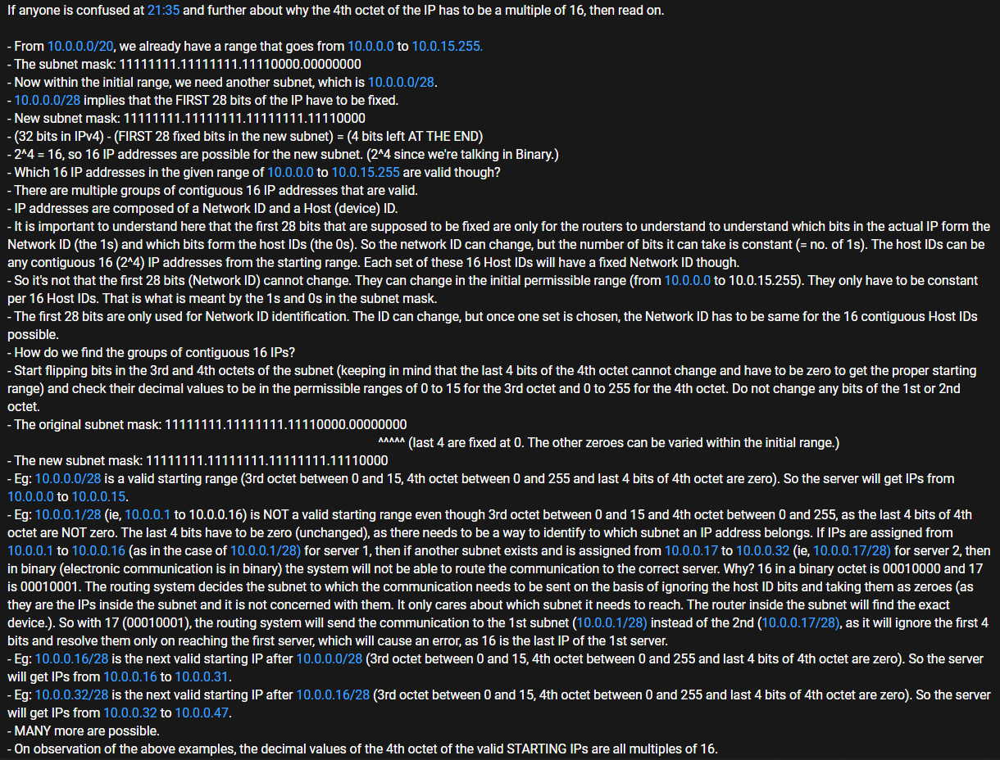

# Internet Protocol (IP)

-   [Classes of IP addresses](https://study-ccna.com/classes-of-ip-addresses)
-   [Private IP addresses](https://study-ccna.com/private-ip-addresses-explained)
    -   Private IP address ranges:
        -   For class A: `10.0.0.0/8` (`10.0.0.0` to `10.255.255.255`)
        -   For class B: `172.16.0.0/12` (`172.16.0.0` to `172.31.255.255`)
        -   For class C: `192.168.0.0/16` (`192.168.0.0` to `192.168.255.255`)
-   [IPv4, CIDR, NAT and VPC subnets](https://www.youtube.com/watch?v=z07HTSzzp3o)

    

    
    

-   [Classless inter-domain routing (CIDR)](https://study-ccna.com/cidr-classless-inter-domain-routing)
-   Imp terms: Subnet mask, network ID, host ID, broadcast ID, `0.0.0.0/0`, `::/0`, gateway, router
-   [Understanding CIDR Ranges and dividing networks](https://www.youtube.com/watch?v=MmA0-978fSk)
-   [IP Subnetting from CIDR Notations](https://www.youtube.com/watch?v=POPoAjWFkGg)
-   [GENI/Cloudlab: Designing Subnets](https://witestlab.poly.edu/blog/designing-subnets)
-   Summary: [How IP Addresses work](https://www.youtube.com/watch?v=ANZJkxiOSRg)
-   [Do DHCP and DNS Servers Communicate? (With Wireshark)](https://www.youtube.com/watch?v=FYcO4ZshG8Q)
-   [IPSec](./ipsec.md)
