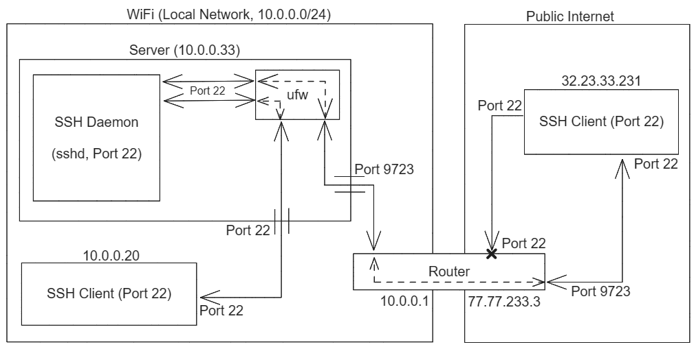

# Turning a Laptop into a Server

The journey of converting a laptop to a publicly available server.

## Table of Contents

-   [Laptop Preparation](#laptop-preparation)
    -   [Battery Life](#battery-life)
    -   [Dual Boot](#dual-boot)
    -   [Headless Operation](#headless-operation)
-   [SSH Setup](#ssh-setup)
    -   [Installation](#installation)
    -   [Security](#security)
-   [Network Setup](#network-setup)
    -   [Local Network Setup](#local-network-setup)
    -   [Remote Network Setup](#remote-network-setup)
        -   [Dynamic DNS](#dynamic-dns)
        -   [Port Forwarding](#port-forwarding)
        -   [Uncomplicated Firewall](#uncomplicated-firewall)
        -   [Accessing the Server](#accessing-the-server)
-   [Conclusion](#conclusion)

## Laptop Preparation

The laptop is a four and a half year old [Lenovo IdeaPad 330S](<https://www.lenovo.com/us/en/p/laptops/ideapad/ideapad-300/ideapad-330s-(15_intel)/88ip30s0988>) running Windows 11 Home.

### Battery Life

As the laptop is to be treated as a server, it will have to be kept on at all times, which means that it will be plugged in to power at all times. Keeping a laptop charging at 100% battery for extended periods of time is not good for a laptop's battery life.

The relatively old laptop being used as a server is a Lenovo IdeaPad 330S. Fortunately, it's built-in Lenovo software had an option in the Power menu to toggle an option called 'Conservation Mode', which charges the battery only up to 60%. This ensures that the battery life will be longer than what it would've been if it was charging at 100%.

### Dual Boot

The laptop had a Windows 11 Home operating system on it. To make it easy to host it as a server and to get a more hands on experience with Linux, the laptop was dual booted with an Ubuntu 22.04 LTS operating system.

[How To Dual Boot Linux and Windows 11](https://www.tomshardware.com/how-to/dual-boot-linux-and-windows-11)

### Headless Operation

The laptop should be able to operate in a ['Headless' mode](https://en.wikipedia.org/wiki/Headless_computer), i.e., it should stay switched on and accessible even when the lid is closed, as it is to be operated as a server that can be accessed from anywhere.

To do this, `HandleLidSwitchExternalPower` was set to `lock` in `/etc/systemd/logind.conf`. This means that the laptop will just lock itself when the lid is closed and the external power is connected. It will go to sleep if the external power is not connected (as per usual), as having the laptop run out of battery and die is not good.

[Keep a laptop running with closed lid](https://askubuntu.com/a/1200757)

## SSH Setup

### Installation

Once Linux was up and running, I installed the `openssh-server` package.

[How to Enable SSH on Ubuntu 20.04](https://linuxize.com/post/how-to-enable-ssh-on-ubuntu-20-04)

### Security

As the server will eventually be publicly available, it had to have some security as well.

-   [How do I disable remote SSH login as root from a server?](https://askubuntu.com/questions/27559/how-do-i-disable-remote-ssh-login-as-root-from-a-server)
-   [The Best Ways to Secure Your SSH Server](https://www.howtogeek.com/443156/the-best-ways-to-secure-your-ssh-server)
-   Fail2Ban
    -   [How To Protect SSH with Fail2Ban on Ubuntu 20.04](https://www.digitalocean.com/community/tutorials/how-to-protect-ssh-with-fail2ban-on-ubuntu-20-04)
    -   [How Fail2Ban Works to Protect Services on a Linux Server](https://www.digitalocean.com/community/tutorials/how-fail2ban-works-to-protect-services-on-a-linux-server)

## Network Setup

<p align="center">
	
</p>

### Local Network Setup

The SSH Daemon operates on port 22 by default. Any client within the network just needs to know the username and hostname of the server to SSH into it.

```
ssh username@hostname
```

This works because Uncomplicated Firewall (`ufw`) that comes bundled with Ubuntu is enabled and is allowing TCP traffic on port 22 using the command `sudo ufw allow "OpenSSH"`.

### Remote Network Setup

To make the server available to clients outside the server's local network, the router will have to relay requests that it receives for the server to the server located inside its network. To make this work, Dynamic DNS, Port Forwarding and ufw need to be set up.

#### Dynamic DNS

Internet Service Providers (ISPs) provide one public IP address to the router in a local network and that is usually a dynamic IP address that changes every few days. To not lose connectivity to the server due to an IP address change, the public IP address needs to constantly be monitored for changes.

The public IP address of the router is how a client outside the local network can communicate with the server inside the router's local network.

To store the server's public IP address and keep it up to date I built a utility called [dynamic-dns](https://github.com/HarshKapadia2/dynamic-dns) that checks the public IP every 10 minutes and updates it on a domain on [Cloudflare](https://cloudflare.com) if there is a change in the public IP address.

[What Is Dynamic DNS (DDNS), and How Do You Set It Up?](https://www.howtogeek.com/866573/what-is-dynamic-dns-ddns-and-how-do-you-set-it-up)

[Managing dynamic IP addresses on Cloudflare](https://developers.cloudflare.com/dns/manage-dns-records/how-to/managing-dynamic-ip-addresses)

#### Port Forwarding

Now that clients outside the network can reach the server's router, the router needs to redirect requests that it receives for the server, to the server. This can be achieved through Port Forwarding.

Port Forwarding is essentially configuring the router to pass any requests received at (a) particular port(s) on the router to a particular device in the router's local network, at the same port at which the request was received by the router.

Example: The router can be configured to forward requests arriving at port 9723 to port 9723 on the server. (The server, depending on the router, is identified by its MAC address or static local IP address within the local network.)

Thus, clients are now not only able to reach the router, but by providing the appropriate port, can reach the server inside the router's network as well.

> NOTE: Port 22 was not opened on the router and rather a random port on the router was used to access the server. This is to provide some security through obscurity so that it is not trivial to figure out that there is a SSH service running at this public IP address. It is not much security, but is at least better than making the default port (22) accessible to the public internet, which invites brute force attacks and makes it easier to discover the server for attackers.

[How to Port Forward on Your Router](https://www.howtogeek.com/66214/how-to-forward-ports-on-your-router)

[A good explanation of Port Forwarding and general SSH security practices](https://unix.stackexchange.com/a/19624)

#### Uncomplicated Firewall

The client can reach the server from the public internet, but Uncomplicated Firewall (`ufw`) will block connections from any port that's not port 22 (as we had enabled that during [Local Network Setup](#local-network-setup)).

So, `ufw` has to be configured to forward requests from the 'port forwarded' port to port 22 at which the SSH Daemon is running.

[How to manage and forward ports with UFW on Ubuntu 18.04](https://www.arubacloud.com/tutorial/how-to-manage-and-forward-ports-with-ufw-on-ubuntu-18-04.aspx)

#### Accessing the Server

Finally, to access the server from outside the local network, one needs to know the server's username, public IP (stored at a domain on Cloudflare in this case) and the port at which the server is available.

```
ssh username@subdomain.domain.tld -p <port_number>
```

## Conclusion

The laptop is now available on the local and public network!

Local internet access:

```
ssh username@hostname
```

Public internet access:

```
ssh username@subdomain.domain.tld -p <port_number>
```
