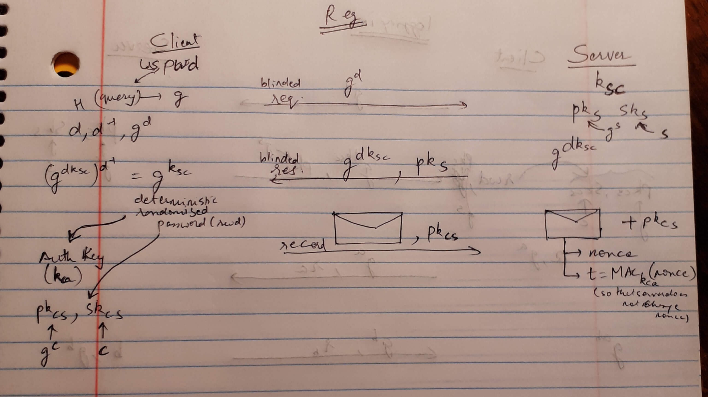
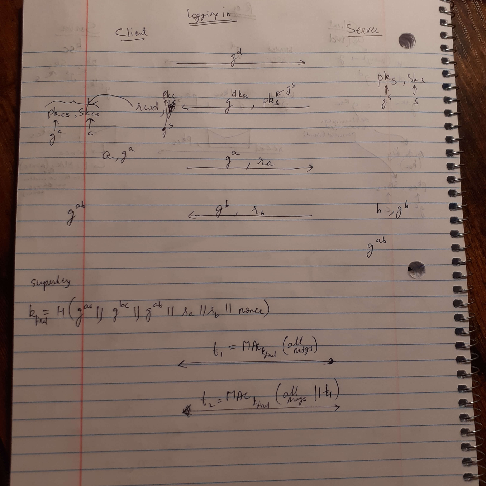

# OPAQUE

([Back to Home](README.md))

## Table of Contents

-   [Introduction](#introduction)
-   [Goals](#goals)
-   [Phases](#phases)
    -   [Registration Phase](#registration-phase)
    -   [Login Phase](#login-phase)
-   [Resources](#resources)

## Introduction

-   A protocol to provide authentication without servers having to see passwords.
-   OPAQUE can be used on top of TLS, to authenticate the client with a password, without the password ever leaving the client's machine.
    -   So instead of the usual 'Password-over-TLS' format that is the current de-facto authentication standard, 'OPAQUE-over-TLS' might become the more secure authentication format in the future, until obviously passwords are done away with altogether.
-   OPRF + PAKE = OPAQUE
    -   OPRF: Oblivious Pseudo-Random Function
    -   PAKE: Password-Authenticated Key Exchange
-   OPAQUE is a strong aPAKE (Asymmetric Password-Authenticated Key Exchange).

## Goals

OPAQUE's goals:

-   Authenticated client
-   The client only needs a username and password
-   Authenticated server
-   [Perfect Forward Secrecy](cryptography.md#perfect-forward-secrecy)
-   Pre-computation (Dictionary) attack resistance
-   No third parties or [Public Key Infrastructure (PKI)](cryptography.md#digital-certificates-and-certificate-revocation-ocsp-and-crl) required
-   Both, the client and the server, don't reveal sensitive materials (eg: password, sensitive key material, etc.) to each other

## Phases

OPAQUE protocol phases:

-   Registration phase
-   Login phase

> The following message sequence pictures don't represent the protocol accurately, but is a representation of what goes on. Credits to [Prof. Gabriel Kaptchuk](https://kaptchuk.com) for teaching this in [BU CAS CS 558](https://cs-people.bu.edu/kaptchuk/teaching/cs558/sp23-classpage.html).

### Registration Phase

    

-   This phase mainly uses an OPRF (Oblivious Pseudo-Random Function). (Hence the blinded request and response.)

### Login Phase

    

-   This phase consists of OPRF and then AKE (Authenticated Key Exchange).
-   The latter half of this phase (with the `g^a` and `g^b` messages) is the AKE that is done through the 3DH (Triple [Diffie-Hellman Key Exchange](cryptography.md#diffie-hellman)) Algorithm.

## Resources

-   [OPAQUE: The Best Passwords Never Leave your Device](https://blog.cloudflare.com/opaque-oblivious-passwords)
-   [RFC (Draft 10, March 2023): The OPAQUE Asymmetric PAKE Protocol](https://datatracker.ietf.org/doc/html/draft-irtf-cfrg-opaque-10)
