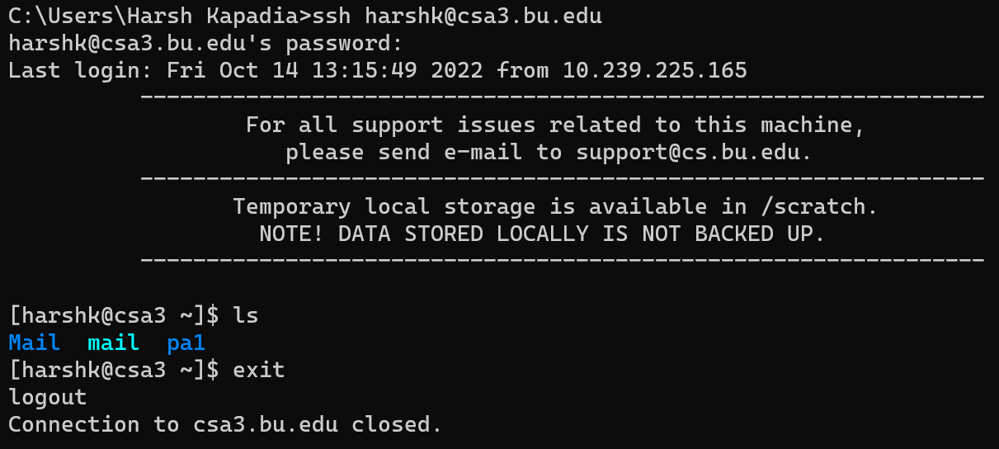
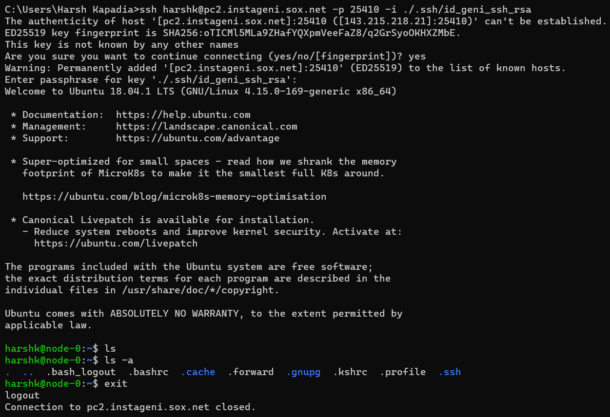
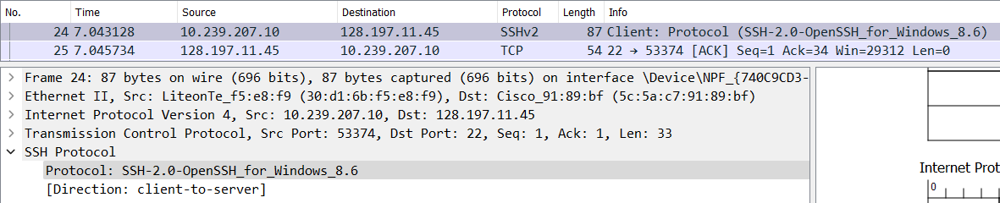
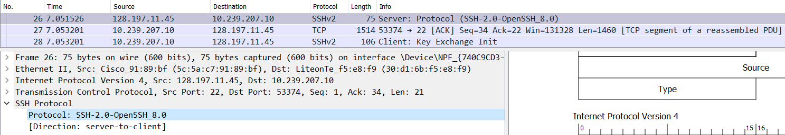
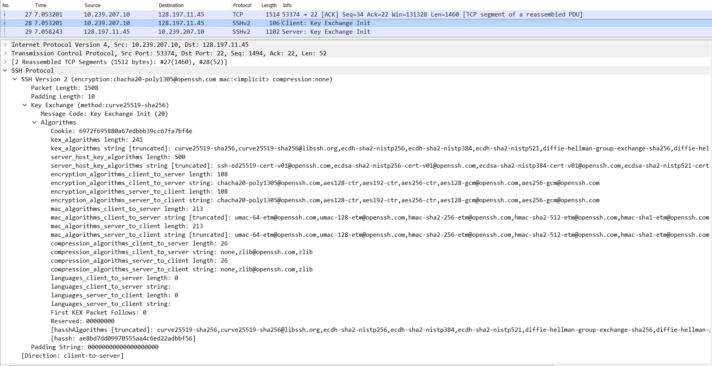
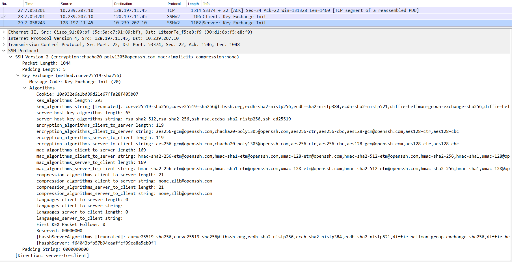
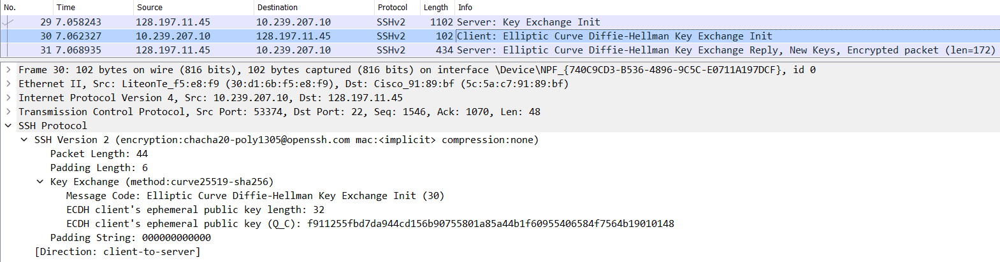
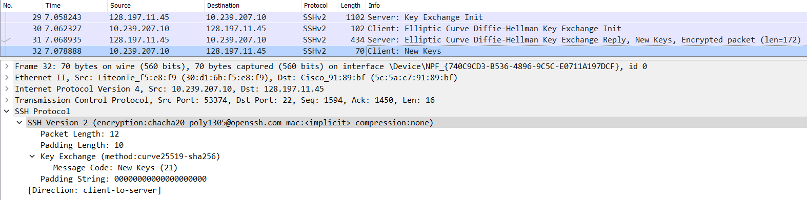
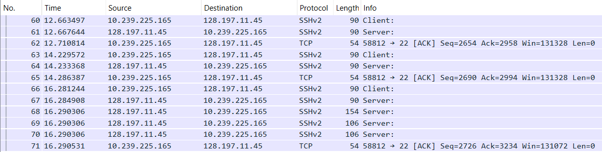
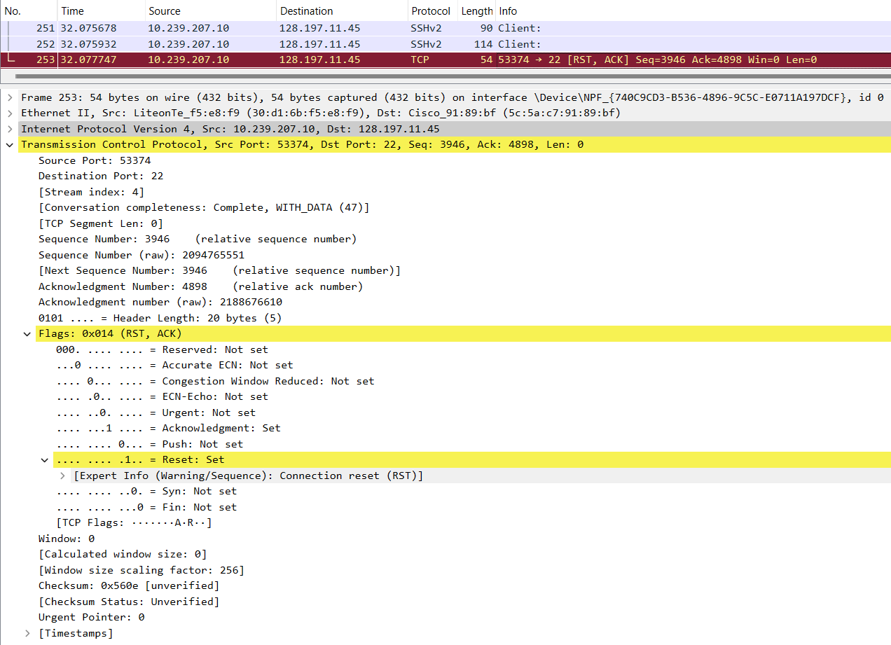

# Secure Shell (SSH)

Published on: 16th October 2022

Last updated: 7th July 2025

([Back to Home](README.md))

## Table of Contents

-   [Introduction](#introduction)
-   [Authentication Methods](#authentication-methods)
-   [The Need for SSH](#the-need-for-ssh)
-   [SSH Commands](#ssh-commands)
    -   [`ssh`](#ssh)
    -   [`ssh-keygen`](#ssh-keygen)
    -   [`ssh-copy-id`](#ssh-copy-id)
    -   [`ssh-import-id`](#ssh-import-id)
    -   [`ssh-agent`](#ssh-agent)
    -   [`ssh-add`](#ssh-add)
-   [Generating Keys](#generating-keys)
    -   [Sharing Keys with the Server](#sharing-keys-with-the-server)
-   [Building Blocks of SSH](#building-blocks-of-ssh)
-   [A SSH Connection](#a-ssh-connection)
    -   [Initialization](#initialization)
    -   [Algorithm Negotiation](#algorithm-negotiation)
    -   [Key Exchange Phase](#key-exchange-phase)
    -   [End of Key Exchange](#end-of-key-exchange)
    -   [Subsequent Encrypted Communication](#subsequent-encrypted-communication)
    -   [Connection Termination](#connection-termination)
-   [Resources](#resources)

## Introduction

-   Secure SHell (SSH) is a protocol used to securely connect with remote machines and establish secure tunnels to communicate with them.
-   SSH is a Layer 7 (Application Layer) protocol that operates on port no. 22 by default.
-   `ssh` (using applications like [OpenSSH](https://www.openssh.com) or [PuTTY](https://putty.org)) is the client and `sshd` (OpenSSH Daemon) is the server.
-   Basic syntax: `ssh <username>@<hostname_or_IP>`
    -   If the SSH port is not the default (22), then the `-p` flag can be used to specify the port number. Eg: `ssh username@0.0.0.0 -p 8000`
-   SSH is the secure connection and tunnel for protocols such as [SFTP (Secure/SSH File Transfer Protocol)](https://en.wikipedia.org/wiki/SSH_File_Transfer_Protocol) and [SCP (Secure Copy)](https://en.wikipedia.org/wiki/Secure_copy_protocol).

## Authentication Methods

-   Password

    <p align="center">
    
    </p>

-   Public-private key pair

    <p align="center">
    
    </p>

    -   The server usually sends the client a challenge ciphertext encrypted under the client's public key that the client has to decrypt using their secret key, do some processing and send back to the server to authenticate itself.
    -   Refer to the [Sharing Keys with the Server](#sharing-keys-with-the-server) section to figure out how the server knows the client's public key.

-   There are many more authentication methods, but the above are the most common ones.

## The Need for SSH

-   [Telnet](https://en.wikipedia.org/wiki/Telnet), which was an older way to connect to remote machines, exchanges data in plain text, which is easier for an attacker to snoop on a compromised connection and is vulnerable to MITM (Monkey-in-the-Middle) attacks. SSH is a secure replacement for Telnet, as it encrypts the connection.
-   As mentioned before SSH has the option to use public and private key pairs to communicate. These Cryptographically-generated keys are much more secure than passwords, which can turn out to be relatively simple. ([Rainbow Tables](http://project-rainbowcrack.com/table.htm))
    -   Also, once connections have been made using the public and private keys, the client automatically chooses the appropriate key for a particular connection and the user might not have to enter their password as well, which makes it convenient to connect to the machine, as they don't have to remember their password.
-   Over time SSH has been used for tunnelling, [forwarding TCP ports](https://www.youtube.com/watch?v=92b-jjBURkw), creating X11 connections, being used as the underlying security protocol for SFTP and SCP, etc.
-   [OpenSSH features](https://www.openbsd.org/openssh/features.html)
-   [A brief history of SSH and remote access](https://www.jeffgeerling.com/blog/brief-history-ssh-and-remote-access) (Telnet, rlogin, rsh, rcp, etc.)

## SSH Commands

### `ssh`

Connect to a remote machine and forward ports. For more on port forwarding and its types, look at the 'Tunneling and port forwarding' bullet point in the [Resources](#resources) section below.

Usually provided by the `openssh-client` package.

[`ssh` man(ual) page](https://www.man7.org/linux/man-pages/man1/ssh.1.html)

```shell
$ ssh username@hostname
$ ssh username@hostname -p 22
$ ssh username@hostname -i ~/.ssh/private_key_file
$ ssh username@hostname -o PasswordAuthentication=yes -o PubkeyAuthentication=no -o PreferredAuthentications=password

# Local port forwarding
$ ssh -L <local_ip_optional>:<local_port>:<remote_ip>:<remote_port> username@hostname

# Remote port forwarding
$ ssh -R <remote_ip_optional>:<remote_port>:<local_or_destination_ip>:<local_or_destination_port>
```

NOTE: When it comes to automatically trying keys on a user's system while connecting to a server, SSH only auto-tries keys of the format `id_<algorithm_name>` (E.g.: `id_rsa`, `id_ed25519`, etc.). It will not auto-try keys with names not in the format mentioned before. Such keys have to be manually specified to SSH using the `-i` flag as shown in the codeblock above.

### `ssh-keygen`

Generate keypairs (public and private keys) and get the fingerprint of keys.

[`ssh-keygen` man(ual) page](https://www.man7.org/linux/man-pages/man1/ssh-keygen.1.html)

```shell
$ ssh-keygen

# `-b` is the bit-length of the key (This is NOT the length of the generated text output of the key.)
$ ssh-keygen -t rsa -b 4096 -C "comment/e-mail"

# `-a` is the number of rounds
$ ssh-keygen -t ed25519 -a 32

# Get public key from private key
$ ssh-keygen -y -f /path/to/private/key

# Remove a key from the known_hosts file (which stores public keys of machines previously connected to)
$ ssh-keygen -R "<hostname_or_ip>:<optional_port>" -f /path/to/known_hosts/file

# Get the fingerprint of a key
# NOTE: In a keypair, both keys (the public and private keys) will produce the same fingerprint
$ ssh-keygen -l -E sha256 -f /path/to/public/key
$ ssh-keygen -l -E sha256 -f /path/to/private/key
```

### `ssh-copy-id`

Appends public keys to the `~/.ssh/authorized_keys` file on the server. The client can then log in without a password.

NOTE: Unless a public key was installed on the server during OS installation and that key pair is being used to add more public keys to the server using this command, a password (or some other form of authentication) will be required.

[`ssh-copy-id` man(ual) page](https://www.man7.org/linux/man-pages/man1/ssh-copy-id.1.html)

```shell
# Copying all local public keys to the server
$ ssh-copy-id username@hostname

# Copying only a specific local public key to the server
$ ssh-copy-id -i /path/to/public/key.pub username@hostname
```

### `ssh-import-id`

Import public keys from GitHub (`gh`) or Launchpad (`lp`) and append them to the `~/.ssh/authorized_keys` file on the server. The client can then log in without a password.

[Adding a new SSH key to your GitHub account](https://docs.github.com/en/authentication/connecting-to-github-with-ssh/adding-a-new-ssh-key-to-your-github-account)

[`ssh-import-id` man(ual) page](https://manpages.ubuntu.com/manpages/bionic/man1/ssh-import-id.1.html)

```shell
$ ssh-import-id gh:<github_username>
$ ssh-import-id lp:<launchpad_username>
```

### `ssh-agent`

Stores SSH private keys and if keys have a passphrase, i.e., are password-protected, it remembers that and doesn't prompt the user for it after the first time.

[`ssh-agent` man(ual) page](https://www.man7.org/linux/man-pages/man1/ssh-agent.1.html)

```shell
# To populate the SSH_AUTH_SOCK env var, so that ssh-add can communicate with ssh-agent
$ eval "$(ssh-agent)"
```

### `ssh-add`

Adds, lists and removes private keys from the `ssh-agent` utility. Removing/deleting a key does not delete the actual key file from the system.

[`ssh-add` man(ual) page](https://www.man7.org/linux/man-pages/man1/ssh-add.1.html)

```shell
# To populate the SSH_AUTH_SOCK env var, so that ssh-add can communicate with ssh-agent
$ eval "$(ssh-agent)"

# List private keys managed by ssh-agent
$ ssh-add -l

# Add a private key to ssh-agent
$ ssh-add /path/to/private/key

# Delete a private key from ssh-agent
# Does not delete private key file from `~/.ssh`
$ ssh-add -d /path/to/private/key
```

## Generating Keys

-   `ssh-keygen` is the utility that generates a public-private key pair.
-   Location of the generated key pair:
    -   Windows: `C:/Users/<username>/.ssh`
    -   Linux: `/users/<username>/.ssh`
-   `key_name` is the Private Key file and the `key_name.pub` is the Public Key file.
-   The Public Key should be put in the server in the `authorized_keys` file in the `.ssh` directory on the server.
-   On connection, if there is a `publickey` error, then use `ssh-add <path_to_private_key>` to add the keys to `ssh-agent` and try connecting again. ([More details](https://superuser.com/a/360706))
    -   The path to the appropriate private key file can be linked to during connection as well, using the `-i` flag. Eg: `ssh username@hostname.com -p 22 -i ./.ssh/private_key_file`
-   Further SSH config, like the `sshd_config` file can be found in `/etc/ssh`.
-   Keys can themselves be password protected as well.

### Sharing Keys with the Server

The `authorized_keys` file in the `.ssh` directory on the server usually holds all the public keys from clients that are allowed to connect with the server. How do those public keys get there, though?

There are usually two ways to do this:

-   Log in with a pre-configured username and password and manually add the public key (or copy it over directly using something like SCP).
    -   After the initial use of the password to transfer the public key to the remote server/instance, the password authentication method can be turned off in the remote server/instance settings to improve security and prevent brute force attacks, but if the user loses their private key, they permanently lose access to the remote server/instance.
-   A service pre-configures it for the user and just hands them the private key to directly connect with their remote instance.
    -   Eg: [AWS](https://aws.amazon.com), [GENI](https://www.geni.net), etc.
    -   The service obviously uses the first method to configure it for the user to reduce the hassle for them and to improve the service's security as well, so that their infrastructure is not vulnerable due to the user's miscalculations (if any).
    -   If these pre-configured keys are lost though, then it usually results in a permanent loss.

## Building Blocks of SSH

SSH uses an underlying reliable connection protocol or service over which it enables secure communication and other services. The underlying connection protocol is almost always TCP, but other protocols like [WebSocket](https://en.wikipedia.org/wiki/WebSocket) can theoretically be used as well.

On top of TCP, SSH has three parts, namely the SSH Transport Layer Protocol, the SSH User Authentication Protocol and the SSH Connection Protocol

-   SSH Transport Layer Protocol
    -   It provides server authentication (Authenticates the server to the client), and data confidentiality and integrity.
    -   It also provides [Perfect Forward Secrecy (FS or PFS)](https://en.wikipedia.org/wiki/Forward_secrecy) due to the use of the [Diffie-Hellman Key Exchange Algorithm](cryptography.md#diffie-hellman).
    -   It usually runs on top of TCP, but other reliable data streams can be used as well.
-   SSH User Authentication Protocol
    -   It provides user authentication (Authenticates the user/client to the server).
    -   It runs on top of the SSH Transport Layer Protocol.
    -   [Why is user/client authentication separate and after server authentication?](#subsequent-encrypted-communication)
-   SSH Connection Protocol
    -   It multiplexes a single SSH encrypted tunnel into multiple logical communication channels (session channel, [Port Forwarding](https://www.youtube.com/watch?v=92b-jjBURkw) channel, etc.).
    -   It runs on top of the SSH User Authentication Protocol.

## SSH Config Files

-   SSH client
    -   In order of overriding behaviour from top to bottom
        -   Command-line options
            -   Eg: `ssh -o PasswordAuthentication=yes -o PubkeyAuthentication=no -o PreferredAuthentications=password username@hostname`
        -   User-specific config: `~/.ssh/config`
        -   If present (and included above all config lines in the global config mentioned in the next point): `/etc/ssh/ssh_config.d/*.conf`
        -   Global config: `/etc/ssh/ssh_config`
-   SSH server
    -   The SSH server runs a daemon called `sshd`.
    -   In order of overriding behaviour from top to bottom
        -   If present (and included above all config lines in the global config mentioned in the next point): `/etc/ssh/sshd_config.d/*.conf`
        -   Global config: `/etc/ssh/sshd_config`
            -   Note the difference in the SSH client and server config files: `ssh_config` vs `sshd_config` (`d` = daemon)

NOTE: If any changes are made to any configuration files, please [restart the SSH and/or SSHD service](https://www.cyberciti.biz/faq/how-do-i-restart-sshd-daemon-on-linux-or-unix) or reboot the machine.

## A SSH Connection

> Legend:
>
> -   `C` = Client
> -   `S` = Server
> -   `->` = Arrow indicating the direction of communication
> -   `ACK` = TCP Acknowledgement flag
> -   `PSH` = TCP Push flag

-   A TCP handshake takes place between the client and the server to establish an underlying connection.

    <p align="center">
    
    </p>

### Initialization

-   `C -> S`: Identification String Exchange

    -   Eg: `SSH-2.0-OpenSSH_for_Windows_8.6` (Packet no. 24 in the image below.), `SSH-2.0-PuTTY_Release_0.73`, etc.
    -   Contents of packet
        -   The SSH Protocol version used by the client.
        -   The SSH initiating software name and version used by the client.
    -   The server sends a TCP `ACK` packet to acknowledge that. (Packet no. 25 in the image below.)

    <p align="center">
    <br />
    
    </p>

-   `S -> C`: Identification String Message

    -   Eg: `SSH-2.0-OpenSSH_8.0` (Packet no. 26 in the image below.), `SSH-2.0-OpenSSH_7.1p2 Debian-1`, etc.
    -   Contents of packet
        -   The SSH Protocol version used by the server.
        -   The SSH initiating software name and version used by the server.
    -   The client sends a TCP `ACK` packet to acknowledge that. (Packet no. 27 in the image below.)

    <p align="center">
    <br />
    
    </p>

### Algorithm Negotiation

-   Decisions for the following types of algorithms are made in this stage:
    -   Key Exchange (KEX) Algorithms
        -   To be able to establish a secure channel when the server and client have no pre-decided keys and to facilitate generation of other keys.
        -   Eg: [Diffie-Hellman](cryptography.md#diffie-hellman), [Elliptic Curve Diffie-Hellman (ECDH)](cryptography.md#diffie-hellman), etc.
    -   Server Host Key Algorithms
        -   Asymmetric/Public Key Cryptography
        -   For [Digital Signatures](cryptography.md#digital-signatures) or [Digital Certificates](cryptography.md#digital-certificates-and-certificate-revocation-ocsp-and-crl) to authenticate the server's identity to the client and later is [one of the ways for clients to authenticate](#authentication-methods) themselves to the server.
            -   Both `C -> S` and `S -> C` communications use different key pairs.
        -   Eg: RSA [SHA2 512](cryptography.md#sha), RSA SHA2 256, SSH RSA, Elliptic Curve Digital Signature Algorithm (ECDSA), etc.
    -   Encryption Algorithms
        -   Symmetric/Secret/Private Key Cryptography
        -   Eg: ChaCha20-Poly1305, [AES 256](cryptography.md#aes) GCM, AES 128 CTR, etc.
        -   Fastest for encryption, so arriving to this key through Key exchange and other processes is carried out.
    -   Message Authentication Code (MAC) Algorithms
        -   Proves integrity (and implicit authentication) of message.
        -   Also provides [protection against Replay Attacks](https://datatracker.ietf.org/doc/html/rfc4251#section-9.3.3), as the MAC will not be the same for repeated requests. (Every request will have a different sequence number.)
        -   Eg: [HMAC](cryptography.md#feistel) SHA2 256, UMAC 64 ETM, etc.
    -   Compression Algorithms
        -   Eg: Zlib, etc.
-   `C -> S`: Key Exchange Initialization (`SSH_MSG_KEXINIT`)

    -   The client sends the server all the algorithms it supports. (Packet nos. 27 and 28 in the image below.)
    -   The list is in order of preference. The ones at the start/top of the list are more preferred by the client than the ones below it.

    <p align="center">
    <br />
    
    </p>

-   `S -> C`: Key Exchange Initialization (`SSH_MSG_KEXINIT`)

    -   The server sends the client all the algorithms it supports. (Packet no. 29 in the image below.)
    -   The list is in order of preference. The ones at the start/top of the list are more preferred by the client than the ones below it.
    -   The server acknowledges the previous `C -> S` `SSH_MSG_KEXINIT` message (`ACK` flag set) along with sending its own `SSH_MSG_KEXINIT` message in the same TCP segment (`PSH` push flag set). (This can be verified using the Wireshark Trace files given in the ['Resources' section](#resources) below.)

    <p align="center">
    <br />
    
    </p>

-   If both, the client and the server, are able to find common grounds for each type of algorithm, the connection can move to the next phase or else it will fail.

### Key Exchange Phase

> Learn about [Elliptic Curve Diffie-Hellman (ECDH)](cryptography.md#diffie-hellman).

-   `C -> S`: Elliptic Curve Diffie-Hellman Key Exchange Initialization (`SSH_MSG_KEX_ECDH_INIT`)

    -   The client sends its ECDH ephemeral public key to the server. (Packet no. 30 in the image below.)
        -   The first half of the Key Exchange process.
    -   NOTE: This ECDH key exchange is carried out so that keys of an encryption algorithm can be generated/exchanged securely.
    -   Again, this same TCP segment acknowledges the `S -> C` `SSH_MSG_KEXINIT` message and sends the `SSH_MSG_KEX_ECDH_INIT` data of this message along with it. (`ACK` flag is set along with the `PSH` flag that indicates data being sent.)

    <p align="center">
    <br />
    
    </p>

-   `S -> C`: Elliptic Curve Diffie-Hellman Key Exchange Reply (`SSH_MSG_KEX_ECDH_REPLY`)

    -   The server sends multiple things to the client. (Packet no. 31 in the image below.)

        -   The server's Host (Digital Signature/Certificate) public key
            -   The authenticity of this public key has to be verified either manually (the fingerprint that SSH asks the user to verify when connecting to a host for the first time) or through some other certificates.
                -   This fingerprinting process to authenticate a server is a big security problem, as most users don't actually check the fingerprints that the SSH client prompts the user with, which opens up the MITM (Monkey-in-the-Middle) Attack vector. Having automated checks like maybe [DNSSEC DNS queries](dns.md#dnssec) to verify the public key belonging to the server or [Digital Certificates](cryptography.md#digital-certificates-and-certificate-revocation-ocsp-and-crl) to verify the public key belonging to the server would be nice to have.
        -   The server's ECDH ephemeral public key
            -   The second half of the Key Exchange process.
        -   A signature of a key exchange hash (The server signs it with its private host key)

            -   The public key that the server gave, if successfully verified, is used to verify this signature with the hash that the client also generates.

            Explanation:

            ```
            On server:
                -   Compute `server_hash`
                    -   Computation includes the final computed ECDH shared secret.
                -   `sign(server_hash, server_private_key)` = `signature`
                -   Send (signature, server_public_key, ecdh_ephemeral_key) to client

            On client:
                -   `verify(server_public_key)` = `valid` or `invalid`
                    -   If successfully verified, then the `server_public_key` actually belongs to the server that it initially claimed to be.
                -   Compute `client_hash`
                    -   Computation includes the final computed ECDH shared secret.
                -   `verify(client_hash, signature, server_public_key)` = `valid` or `invalid`
                    -   If successfully verified, then the `ecdh_ephemeral_key` can be trusted to be coming from the server and it can also be confirmed that both, the client and the server, have the same ECDH shared secret.
            ```

    -   This step also proves to the client that the server is actually who it claims to be and there isn't a MITM (Monkey-in-the-Middle) Attack going on. Thus, the server authenticates itself to the client.
        -   The client authenticates itself to the server in the [subsequent encrypted communication](#subsequent-encrypted-communication) phase.
    -   It is very interesting to [explore the generation of the hash and the consequence of the Diffie Hellman shared key](https://youtu.be/0Sffl7YO0aY?t=361).
    -   As before, this TCP segment has both `ACK` and `PSH` flags set. This is a common pattern across the entire communication, where there is an `ACK` for every packet from `C -> S` and `S -> C`, and instead of sending it separately, it is often combined with another data containing packet (which will have the `PSH` push flag set).

    <p align="center">
    <br />
    
    </p>

### End of Key Exchange

-   The end of the key exchange phase is signalled by `SSH_MSG_NEWKEYS` from `S -> C` and `C -> S`.
-   It also indicates that all communication after this will be encrypted.
-   `S -> C` (Packet no. 31 in the image below.)

    <p align="center">
    
    </p>

-   `C -> S` (Packet no. 32 in the image below.)

    <p align="center">
    
    </p>

### Subsequent Encrypted Communication

-   After this, all the communication between the client and server are encrypted. (Thus data payload is not visible in the encrypted packets that Wireshark captures.)
-   The server sends its fingerprint for the user to verify its identity.

    -   The SSH client will ask the user to manually verify the identity of the server by presenting the fingerprint of one of the server's public key located at `/etc/ssh/*.pub`.
        -   These are generally not manually-generated, but are initially set up by SSH itself.
    -   If the user approves of the fingerprint, then SSH will store the public key(s) of the server in the `~/.ssh/known_hosts` file.
    -   The advantage of storing the server's public key in the file is that the next time the user connects to the server, the SSH client will not ask the user to approve the server's fingerprint, but will automatically verify it with the server's public key stored in the `known_hosts` file.
    -   Fingerprinting demo: The server presents its fingerprint to the client.

        -   On the server

            -   The server's public key(s) for identifying itself can be found at `/etc/ssh`

                ```shell
                $ ssh-keygen -lf /etc/ssh/ssh_host_ed25519_key.pub
                256 SHA256:EPvxjioRUt/Non2BGcrwIgN5i19uvpuOQ7WbpU8HzPU root@Vostro-3525 (ED25519)
                ```

            -   The output of the above command is what is presented to the client. This is the fingerprint of the public key.

        -   On the client
            -   When connecting to the server for the first time, the above fingerprint is what is presented to the client.
            -   If the client wants to check the fingerprint, they can do so in a few ways (non-exhaustive list):
                -   Have physical access to the server they want to connect to via SSH and run the above fingerprinting command and manually compare the fingerprints.
                -   If the client does not have physical access to the server, some out-of-band system that is trusted by the user (e.g. the automation software that installed the OS on the serber) should provide the fingerprint to the client after recording it by running the above `ssh-keygen` command.

-   Now that the user knows that they are talking to the correct server, the SSH client authenticates itself to the server here. (`SSH_MSG_USERAUTH_REQUEST`)
    -   The client authenticates itself during this encrypted communication phase rather than before so that it is able to securely transmit passwords and other sensitive data to the server securely.
    -   The client has different [authentication methods](#authentication-methods) that it can choose from.
-   What can be interesting about packets of information that are encrypted? Well, SSH does something clever here and a similar behaviour is observed in Telnet as well.
-   After connection with the remote instance, one's intuition expects that SSH sends the user-typed command to the remote instance after the <kbd>Enter</kbd> key is hit, but SSH actually sends a request to the remote instance every time the user hits a key on their keyboard. The remote instance acknowledges the receipt of the keystroke, checks what happens when that keystroke is executed on the terminal and sends back the action to the client. The client then displays whatever the remote instance responds with, on the user-facing terminal.
    -   Why send every keystroke to the remote instance? This might not make sense for commands such as `ls` (because they can be communicated to the remote instance after the <kbd>Enter</kbd> key is hit), but imagine using something like the [Vim editor](https://www.vim.org) which requires the use of the <kbd>Esc</kbd> key to do certain actions. One does not hit the <kbd>Enter</kbd> key after the <kbd>Esc</kbd> key as that might mean something else to the program, so communicating every keystroke and getting back the reaction of that keystroke is necessary.
    -   Article: [SSH uses four TCP segments for each character you type](http://blog.hyfather.com/blog/2013/04/18/ssh-uses-four-tcp-segments-for-each-character)
        -   [Interesting sub-discussion on this on Hacker News](https://news.ycombinator.com/item?id=5792334)
-   In the image below, a connection with `csa3.bu.edu` is established, the `ls` command is run on the remote instance and then the `exit` command is run on the remote instance to gracefully end the connection.

    <p align="center">
    
    </p>

-   The above exchange was analysed using Wireshark.

    -   The 2nd Wireshark Trace file as linked in the ['Resources' section](#resources) below.
    -   Connection to the remote instance in `csa3.bu.edu` has already been established.

    <p align="center">
    <br />
    
    </p>

-   Breaking down the exchange for the `ls` command. (As shown in the two images above.)
    -   On hitting the <kbd>l</kbd> key on the client, the client sends a request to the server. (Packet no. 60 in the image above.)
    -   The server responds with a combined TCP segment containing the `ACK` flag for the receipt of the keystroke and the data with the reaction of the keystroke (`PSH` flag set) so that the client can draw it on the user-facing terminal. (Packet no. 61 in the image above.)
    -   The client acknowledges that with a TCP `ACK` segment. (Packet no. 62 in the image above.)
    -   The same goes for the <kbd>s</kbd> key. (Packet nos. 63 to 65 in the image above.)
    -   The user then hits the <kbd>Enter</kbd> key after typing the `ls` command (Packet no. 66 in the image above.) and the server acknowledges this key press and replies with the reaction of pressing the <kbd>Enter</kbd> key in subsequent TCP segments (Packet nos. 67 to 70 in the image above.).
    -   The client then acknowledges the receipt of the server's replies with a TCP `ACK` segment. (Packet no. 71 in the image above.)

### Connection Termination

-   Connection either times out if left idle for too long or can be gracefully terminated using the `exit` command.
-   A TCP `FIN` segment is exchanged to terminate the connection to the remote instance. (Packet no. 253 in the image below.)

    <p align="center">
    
    </p>

## Resources

-   [SSH Crash Course](https://www.youtube.com/watch?v=hQWRp-FdTpc)
-   [An Excruciatingly Detailed Guide To SSH (But Only The Things I Actually Find Useful)](https://web.archive.org/web/20231226210942/https://grahamhelton.com/blog/ssh-cheatsheet)
-   [How Secure Shell Works](https://www.youtube.com/watch?v=ORcvSkgdA58)
-   Tunneling and port forwarding
    -   [Visual guide to SSH tunneling and port forwarding](https://ittavern.com/visual-guide-to-ssh-tunneling-and-port-forwarding)
    -   [A Visual Guide to SSH Tunnels: Local and Remote Port Forwarding](https://iximiuz.com/en/posts/ssh-tunnels) ([bastion hosts](https://en.wikipedia.org/wiki/Bastion_host), etc.)
    -   [How to Set up SSH Tunneling (Port Forwarding)](https://linuxize.com/post/how-to-setup-ssh-tunneling)
-   Virtual Network Computing (VNC) over SSH
    -   [How To Install and Configure TigerVNC server on Ubuntu](https://www.cyberciti.biz/faq/install-and-configure-tigervnc-server-on-ubuntu-18-04)
    -   [Connecting using VNC from a Windows computer to a Linux system](https://cat.pdx.edu/platforms/windows/remote-access/vnc-to-linux)
-   [How SSH Password-less Key-based Authentication Works](https://www.youtube.com/watch?v=RfolgB-rVe8)
-   `known_hosts` and `authorized_keys`
    -   [What is the difference between authorized_keys and known_hosts file for SSH?](https://security.stackexchange.com/questions/20706/what-is-the-difference-between-authorized-keys-and-known-hosts-file-for-ssh/20710#20710)
    -   [What is actually in known_hosts?](https://stackoverflow.com/questions/33243393/what-is-actually-in-known-hosts)
    -   [SSH `known_hosts` file format](https://www.ibm.com/docs/en/zos/3.1.0?topic=SSLTBW_3.1.0/com.ibm.zos.v3r1.foto100/sshknow.html)
-   [Cryptography Basics - SSH Protocol Explained](https://www.youtube.com/watch?v=0Sffl7YO0aY&list=PL7d8iOq_0_CWAfs_z4oQnCuVc6yr7W5Fp&index=9)
-   [Understanding the SSH Encryption and Connection Process](https://www.digitalocean.com/community/tutorials/understanding-the-ssh-encryption-and-connection-process)
-   [A brief history of SSH and remote access](https://www.jeffgeerling.com/blog/brief-history-ssh-and-remote-access)
-   [Wiresharking Secure Shell](https://www.youtube.com/watch?v=HVWlMNTNcF4)
-   [How SSH port became 22](https://www.ssh.com/academy/ssh/port)
-   [RFC 4251: The Secure Shell (SSH) Protocol Architecture](https://datatracker.ietf.org/doc/html/rfc4251)
-   [SSH uses four TCP segments for each character you type](http://blog.hyfather.com/blog/2013/04/18/ssh-uses-four-tcp-segments-for-each-character)
    -   [Interesting sub-discussion on this on Hacker News](https://news.ycombinator.com/item?id=5792334)
-   [OpenSSH](https://www.openssh.com)
    -   [OpenSSH utilities](https://en.wikibooks.org/wiki/OpenSSH/Utilities)
-   Wireshark SSH Trace files
    -   These are the Wireshark Network Trace files used to analyse the SSH protocol packets.
    -   Please use the filter `ip.addr == 128.197.11.45` to view the entire SSH communication being talked about in this article.
    -   [The first Wireshark SSH Trace file (`.pcapng`)](./files/ssh/ssh-wireshark-trace-1.pcapng)
    -   [The second Wireshark SSH Trace file (`.pcapng`)](./files/ssh/ssh-wireshark-trace-2.pcapng)
-   [SSH Keys](https://www.youtube.com/watch?v=dPAw4opzN9g)
-   [GitHub SSH key is Leaked - How bad is this?](https://www.youtube.com/watch?v=WUNu24bM9sE)
-   [Running SSH service on a server](https://linuxize.com/post/how-to-enable-ssh-on-ubuntu-20-04)
-   [How To Set up SSH Keys on a Linux/Unix System](https://www.cyberciti.biz/faq/how-to-set-up-ssh-keys-on-linux-unix)
-   [How to Remotely Open a GUI Application With PuTTY](https://www.howtogeek.com/428266/how-to-remotely-open-a-gui-application-with-putty)
-   [Cryptography](cryptography.md)
-   [CLI commands & info](https://harshkapadia2.github.io/cli)
-   [Turning a Laptop into a Server](laptop-server.md)
-   [SSH file permissions: Why am I still getting a password prompt with ssh with public key authentication?](https://unix.stackexchange.com/questions/36540/why-am-i-still-getting-a-password-prompt-with-ssh-with-public-key-authentication)
-   Securing SSH service
    -   [How do I disable remote SSH login as root from a server?](https://askubuntu.com/questions/27559/how-do-i-disable-remote-ssh-login-as-root-from-a-server)
    -   [The Best Ways to Secure Your SSH Server](https://www.howtogeek.com/443156/the-best-ways-to-secure-your-ssh-server)
    -   [A good explanation of Port Forwarding and general SSH security practices](https://unix.stackexchange.com/a/19624)
    -   Fail2Ban
        -   [How To Protect SSH with Fail2Ban on Ubuntu 20.04](https://www.digitalocean.com/community/tutorials/how-to-protect-ssh-with-fail2ban-on-ubuntu-20-04)
        -   [How Fail2Ban Works to Protect Services on a Linux Server](https://www.digitalocean.com/community/tutorials/how-fail2ban-works-to-protect-services-on-a-linux-server)
-   SSH obfuscation
    -   Chaff
    -   [SSH Keystroke Obfuscation Bypass](https://crzphil.github.io/posts/ssh-obfuscation-bypass)
    -   [Random chaff insertion in ssh session](https://serverfault.com/questions/759138/random-chaff-insertion-in-ssh-session)
