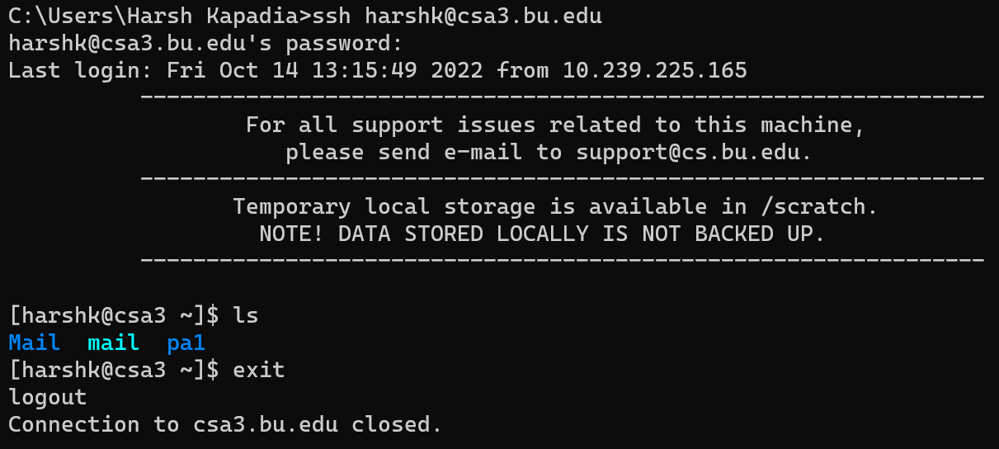
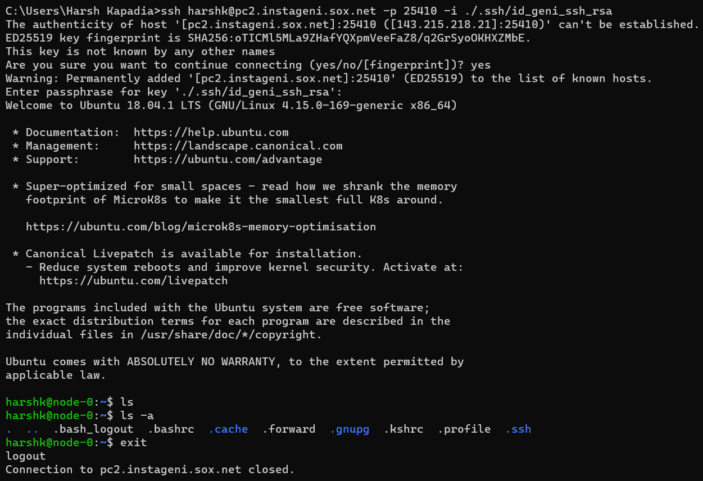
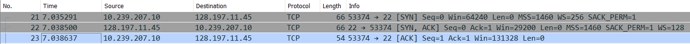
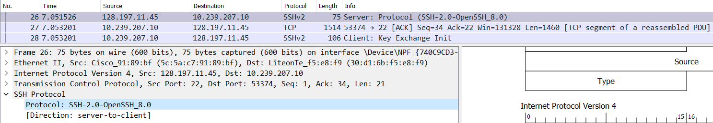
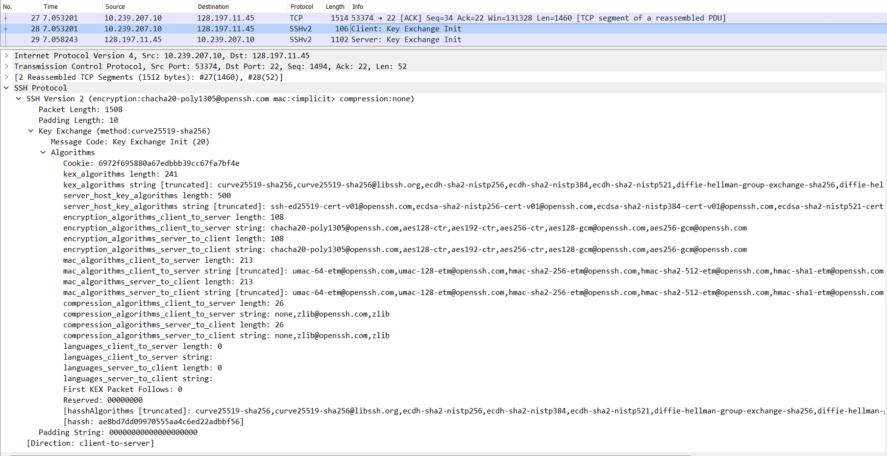
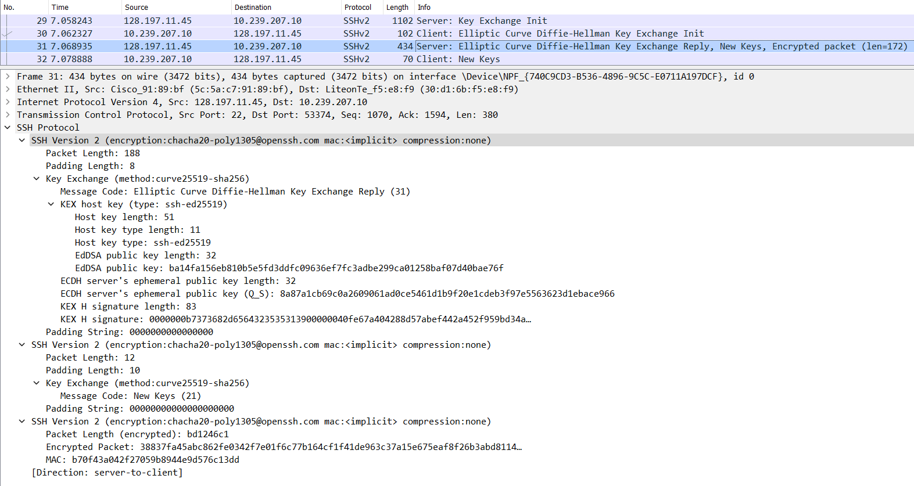
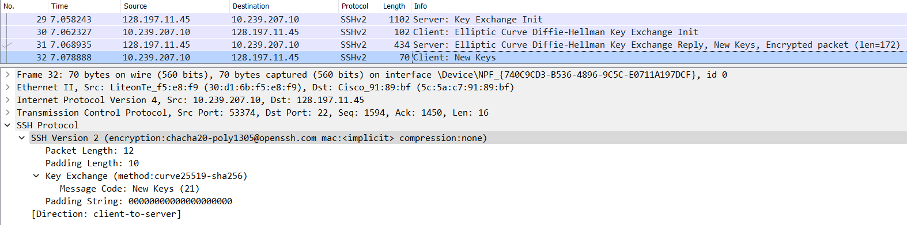
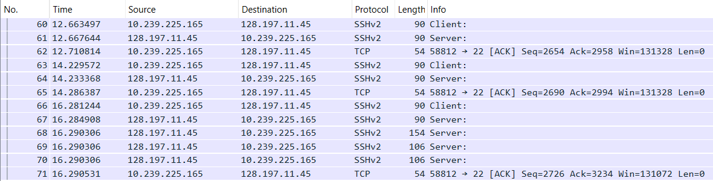
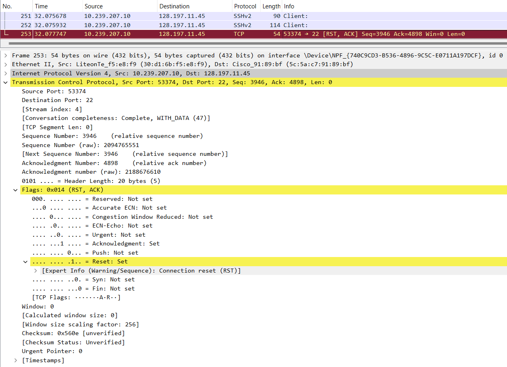

# Secure Shell (SSH)

([Back to Home](README.md))

## Table of Contents

-   [Introduction](#introduction)
-   [Authentication Methods](#authentication-methods)
-   [The Need for SSH](#the-need-for-ssh)
-   [Generating Keys](#generating-keys)
-   [Building Blocks of SSH](#building-blocks-of-ssh)
-   [A SSH Connection](#a-ssh-connection)
    -   [Initialization](#initialization)
    -   [Algorithm Negotiation](#algorithm-negotiation)
    -   [Key Exchange Phase](#key-exchange-phase)
    -   [End of Key Exchange](#end-of-key-exchange)
    -   [Subsequent Encrypted Communication](#subsequent-encrypted-communication)
    -   [Connection Termination](#connection-termination)
-   [Resources](#resources)

## Introduction

-   Secure SHell (SSH) is a protocol used to securely connect with remote machines and establish secure tunnels to communicate with them.
-   SSH is a Layer 7 (Application Layer) protocol that operates on port no. 22 by default.
-   `ssh` (using applications like [OpenSSH](https://www.openssh.com) or [PuTTY](https://putty.org)) is the client and `sshd` ([OpenSSH](https://www.openssh.com) Daemon) is the server.
-   Basic syntax: `ssh <username>@<hostname_or_IP>`
    -   If the SSH port is not the default (22), then the `-p` flag can be used to specify the port number. Eg: `ssh username@0.0.0.0 -p 8000`
-   SSH is the secure connection and tunnel for protocols such as [SFTP (Secure/SSH File Transfer Protocol)](https://en.wikipedia.org/wiki/SSH_File_Transfer_Protocol) and [SCP (Secure Copy)](https://en.wikipedia.org/wiki/Secure_copy_protocol).

## Authentication Methods

-   Password

    

    
    

-   Public-private key pair

    

    
    

-   Host-based (`known_host` file)

## The Need for SSH

-   [Telnet](https://rfcs.io/telnet), which was an older way to connect to remote machines, exchanges data in plain text, which is easier for an attacker to snoop on a compromised connection and is vulnerable to MITM (Man-in-the-Middle) attacks. SSH is a secure replacement for Telnet, as it encrypts the connection.
-   As mentioned before SSH has the option to use public and private key pairs to communicate. These Cryptographically-generated keys are much more secure than passwords, which can turn out to be relatively simple. ([Rainbow Tables](http://project-rainbowcrack.com/table.htm))
    -   Also, once connections have been made using the public and private keys, the client automatically chooses the appropriate key for a particular connection and the user might not have to enter their password as well, which makes it convenient to connect to the machine, as they don't have to remember their password.
-   Over time SSH has been used for tunnelling, [forwarding TCP ports](https://www.youtube.com/watch?v=92b-jjBURkw), creating X11 connections, being used as the underlying security protocol for SFTP and SCP, etc.

## Generating Keys

-   `ssh-keygen` is the utility that generates a public-private key pair.
-   Location of the generated key pair:
    -   Windows: `C:/Users/<username>/.ssh`
    -   Linux: `/users/<username>/.ssh`
-   `key_name` is the Private Key file and the `key_name.pub` is the Public Key file.
-   The Public Key should be put in the server in the `authorized_keys` file in the `.ssh` directory on the server.
-   On connection, if there is a `publickey` error, then use `ssh-add <path_to_private_key>` to add the keys to `ssh-agent` and try connecting again. ([More details](https://superuser.com/a/360706))
    -   The path to the appropriate private key file can be linked to during connection as well, using the `-i` flag. Eg: `ssh username@hostname.com -p 22 -i ./.ssh/private_key_file`
-   Further SSH config, like the `sshd_config` file can be found in `/etc/ssh`.
-   Keys can themselves be password protected as well.

> NOTE:
>
> Two ways in which generated SSH keys can be shared with the server:
>
> -   Log in with a per-configured username and password and manually add the public key (or copy it over directly using something like SCP).
>     -   After the initial use of the password to transfer the public key to the remote server/instance, the password authentication method can be turned off in the remote server/instance settings to improve security and prevent brute force attacks, but if the user loses their private key, they permanently lose access to the remote server/instance.
> -   A service pre-configures it for the user and just hands them the private key to directly connect with their remote instance.
>     -   Eg: [AWS](https://aws.amazon.com), [GENI](https://www.geni.net), etc.
>     -   The service obviously uses the first method to configure it for the user to reduce the hassle for them and to improve the service's security as well, so that their infrastructure is not vulnerable due to the user's miscalculations (if any).
>     -   If these pre-configured keys are lost though, then it usually results in a permanent loss.

## Building Blocks of SSH

SSH uses an underlying reliable connection protocol or service over which it enables the secure communication and other services. The underlying connection protocol is almost always TCP, but other protocols like [WebSocket](https://en.wikipedia.org/wiki/WebSocket) can theoretically be used as well.

On top of TCP, SSH has three parts, namely the SSH Transport Layer Protocol, the SSH User Authentication Protocol and the SSH Connection Protocol

-   SSH Transport Layer Protocol
    -   Provides server authentication, and data confidentiality and integrity
-   SSH User Authentication Protocol
    -   Authenticates the user to the server
-   SSH Connection Protocol
    -   Multiplexes multiple logical communication channels (session channel, [Port Forwarding](https://www.youtube.com/watch?v=92b-jjBURkw) channel, etc.) over a single SSH encrypted tunnel connection.

## A SSH Connection

> Legend:
>
> -   `C` = Client
> -   `S` = Server
> -   `->` = Arrow indicating the direction of communication
> -   `ACK` = TCP Acknowledgement flag
> -   `PSH` = TCP Push flag

-   A TCP handshake takes place between the client and the server to establish an underlying connection.

    

    
    

### Initialization

-   `C -> S`: Identification String Exchange

    -   Eg: `SSH-2.0-OpenSSH_for_Windows_8.6` (Packet no. 24 in the image below.), `SSH-2.0-PuTTY_Release_0.73`, etc.
    -   Contents of packet
        -   The SSH Protocol version used by the client.
        -   The SSH initiating software name and version used by the client.
    -   The server sends a TCP `ACK` packet to acknowledge that. (Packet no. 25 in the image below.)

    

     
    
    

-   `S -> C`: Identification String Message

    -   Eg: `SSH-2.0-OpenSSH_8.0` (Packet no. 26 in the image below.), `SSH-2.0-OpenSSH_7.1p2 Debian-1`, etc.
    -   Contents of packet
        -   The SSH Protocol version used by the server.
        -   The SSH initiating software name and version used by the server.
    -   The client sends a TCP `ACK` packet to acknowledge that. (Packet no. 27 in the image below.)

    

     
    
    

### Algorithm Negotiation

-   Decisions for the following types of algorithms are made in this stage:
    -   Key Exchange (KEX) Algorithms
        -   Eg: [Diffie-Hellman](./cryptography.md#diffie-hellman), [Elliptic Curve Diffie-Hellman (ECDH)](./cryptography.md#diffie-hellman), etc.
    -   Server Host Key Algorithms
        -   Asymmetric/Public Key Cryptography
        -   For Digital Signature or Digital Certificate
        -   Eg: RSA [SHA2 512](./cryptography.md#sha), RSA SHA2 256, SSH RSA, Elliptic Curve Digital Signature Algorithm (ECDSA), etc.
    -   Encryption Algorithms
        -   Symmetric/Secret/Private Key Cryptography
        -   Eg: ChaCha20-Poly1305, [AES 256](./cryptography.md#aes) GCM, AES 128 CTR, etc.
    -   Message Authentication Code (MAC) Algorithms
        -   Eg: [HMAC](./cryptography.md#feistel) SHA2 256, UMAC 64 ETM, etc.
    -   Compression Algorithms
        -   Eg: Zlib, etc.
-   `C -> S`: Key Exchange Initialization (`KEXINIT`)

    -   The client sends the server all the algorithms it supports. (Packet nos. 27and 28 in the image below.)
    -   The list is in order of preference. The ones at the start/top of the list are more preferred by the client than the ones below it.

    

     
    
    

-   `S -> C`: Key Exchange Initialization (`KEXINIT`)

    -   The client sends the server all the algorithms it supports. (Packet no. 29 in the image below.)
    -   The list is in order of preference. The ones at the start/top of the list are more preferred by the client than the ones below it.
    -   The server acknowledges the previous `C -> S` `KEXINIT` message (`ACK` flag set) along with sending its own `KEXINIT` message in the same TCP segment (`PSH` push flag set). (This can be verified using the Wireshark Trace files given in the ['Resources' section](#resources) below.)

    

     
    
    

-   If both, the client and the server, are able to find common grounds for each type of algorithm, the connection can move to the next phase or else it will fail.

### Key Exchange Phase

> Learn about [Elliptic Curve Diffie-Hellman (ECDH)](./cryptography.md#diffie-hellman).

-   `C -> S`: Elliptic Curve Diffie-Hellman Key Exchange Initialization (`SSH_MSG_KEX_ECDH_INIT`)

    -   The client sends its ECDH ephemeral public key to the server. (Packet no. 30 in the image below.)
    -   NOTE: This ECDH key exchange is only to later be securely able to exchange keys of an encryption algorithm.
    -   Again, this same TCP segment acknowledges the `S -> C` `KEXINIT` message and sends the `SSH_MSG_KEX_ECDH_INIT` data of this message along with it. (`ACK` flag is set along with the `PSH` flag that indicates data being sent.)

    

     
    
    

-   `S -> C`: Elliptic Curve Diffie-Hellman Key Exchange Reply (`SSH_MSG_KEX_ECDH_REPLY`)

    -   The server sends multiple things to the client. (Packet no. 31 in the image below.)
        -   The server's Host (Digital Signature/Certificate) public key
        -   The server's ECDH ephemeral public key
        -   A key exchange hash (that is signed with the server's Host private key)
    -   It is very interesting to [explore the generation of the hash and the consequence of the Diffie Hellman shared key](https://youtu.be/0Sffl7YO0aY?t=361).
    -   As before, this TCP segment has both `ACK` and `PSH` flags set. This is a common pattern across the entire communication, where there is an `ACK` for every packet from `C -> S` and `S -> C`, and instead of sending it separately, it is often combined with another data containing packet (which will have the `PSH` push flag set).

    

     
    
    

### End of Key Exchange

-   The end of the key exchange phase is signalled by `SSH_MSG_NEWKEYS` from `S -> C` and `C -> S`.
-   It also indicates that all communication after this will be encrypted.
-   `S -> C` (Packet no. 31 in the image below.)

    

    
    

-   `C -> S` (Packet no. 32 in the image below.)

    

    
    

### Subsequent Encrypted Communication

-   What can be interesting about packets of information that are encrypted? Well, SSH does something clever here.
-   After connection with the remote instance, one's intuition expects that SSH sends the user-typed command to the remote instance after the <kbd>Enter</kbd> key is hit, but SSH actually sends a request to the remote instance every time the user hits a key on their keyboard. The remote instance acknowledges the receipt of the keystroke, checks what happens when that keystroke is executed on the terminal and sends back the action to the client. The client then displays whatever the remote instance responds with, on the user-facing terminal.
    -   Why send every keystroke to the remote instance? This might not make sense for commands such as `ls` (because they can be communicated to the remote instance after the <kbd>Enter</kbd> key is hit), but imagine using something like the [Vim editor](https://www.vim.org) which requires the use of the <kbd>Esc</kbd> key to do certain actions. One does not hit the <kbd>Enter</kbd> key after the <kbd>Esc</kbd> key as that might mean something else to the program, so communicating every keystroke and getting back the reaction of that keystroke is necessary.
    -   Article: [SSH uses four TCP segments for each character you type](http://blog.hyfather.com/blog/2013/04/18/ssh-uses-four-tcp-segments-for-each-character)
        -   [Interesting sub-discussion on this on Hacker News](https://news.ycombinator.com/item?id=5792334)
-   In the image below, a connection with `csa3.bu.edu` is established, the `ls` command is run on the remote instance and then the `exit` command is run on the remote instance to gracefully end the connection.

    

    
    

-   The above exchange was analysed using Wireshark.

    -   The 2nd Wireshark Trace file as linked in the ['Resources' section](#resources) below.
    -   Connection to the remote instance in `csa3.bu.edu` has already been established.

    

     
    
    

-   Breaking down the exchange for the `ls` command. (As shown in the two images above.)
    -   On hitting the <kbd>l</kbd> key on the client, the client sends a request to the server. (Packet no. 60 in the image above.)
    -   The server responds with a combined TCP segment containing the `ACK` flag for the receipt of the keystroke and the data with the reaction of the keystroke (`PSH` flag set) so that the client can draw it on the user-facing terminal. (Packet no. 61 in the image above.)
    -   The client acknowledges that with a TCP `ACK` segment. (Packet no. 62 in the image above.)
    -   The same goes for the <kbd>s</kbd> key. (Packet nos. 63 to 65 in the image above.)
    -   The user then hits the <kbd>Enter</kbd> key after typing the `ls` command (Packet no. 66 in the image above.) and the server acknowledges this key press and replies with the reaction of pressing the <kbd>Enter</kbd> key in subsequent TCP segments (Packet nos. 67 to 70 in the image above.).
    -   The client then acknowledges the receipt of the server's replies with a TCP `ACK` segment. (Packet no. 71 in the image above.)

### Connection Termination

-   Connection either times out if left idle for too long or can be gracefully terminated using the `exit` command.
-   A TCP `FIN` segment is exchanged to terminate the connection to the remote instance. (Packet no. 253 in the image below.)

    

    
    

## Resources

-   [SSH Crash Course](https://www.youtube.com/watch?v=hQWRp-FdTpc)
-   [How Secure Shell Works](https://www.youtube.com/watch?v=ORcvSkgdA58)
-   [Wiresharking Secure Shell](https://www.youtube.com/watch?v=HVWlMNTNcF4)
-   [How SSH Password-less Key-based Authentication Works](https://www.youtube.com/watch?v=RfolgB-rVe8)
-   [Cryptography Basics - SSH Protocol Explained](https://www.youtube.com/watch?v=0Sffl7YO0aY&list=PL7d8iOq_0_CWAfs_z4oQnCuVc6yr7W5Fp&index=9)
-   [SSH uses four TCP segments for each character you type](http://blog.hyfather.com/blog/2013/04/18/ssh-uses-four-tcp-segments-for-each-character)
    -   [Interesting sub-discussion on this on Hacker News](https://news.ycombinator.com/item?id=5792334)
-   [OpenSSH](https://www.openssh.com)
-   Wireshark SSH Trace files
    -   These are the Wireshark Network Trace files used to analyse the SSH protocol packets.
    -   Use the filter `ip.addr == 128.197.11.45` to view the entire SSH communication being talked about in this article.
    -   [The first Wireshark SSH Trace file (`.pcapng`)](./files/ssh/ssh-wireshark-trace-1.pcapng)
    -   [The second Wireshark SSH Trace file (`.pcapng`)](./files/ssh/ssh-wireshark-trace-2.pcapng)
-   [SSH RFCs](https://rfcs.io/ssh)
-   [SSH Keys](https://www.youtube.com/watch?v=dPAw4opzN9g)
-   [Cryptography](./cryptography.md)

([Back to Home](README.md))
