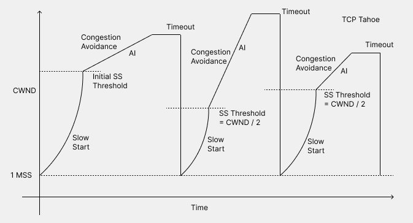
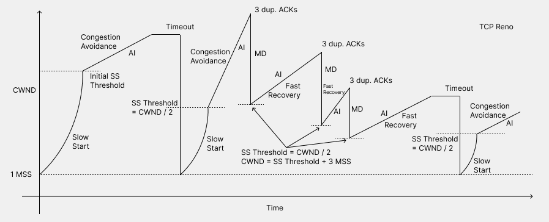

# Transmission Control Protocol (TCP)

([Back to Home](README.md))

## Table of Contents

-   [Introduction](#introduction)
-   [Reliable Communication Mechanisms](#reliable-communication-mechanisms)
-   [Important Terms](#important-terms)
-   [Congestion Control Algorithms of TCP](#congestion-control-algorithms-of-tcp)
    -   [Slow Start](#slow-start-ss)
    -   [Congestion Avoidance](#congestion-avoidance)
    -   [Fast Retransmit](#fast-retransmit)
    -   [Fast Recovery](#fast-recovery)
-   [Explicit Congestion Notification](#explicit-congestion-notification)
-   [Versions of TCP](#versions-of-tcp)
    -   [TCP Tahoe](#tcp-tahoe)
    -   [TCP Reno](#tcp-reno)
    -   [TCP CUBIC](#tcp-cubic)
    -   [TCP Vegas](#tcp-vegas)
    -   [TCP BBR](#tcp-bbr)
    -   [DCTCP](#dctcp)
-   [Enabling a TCP Congestion Control Algorithm](#enabling-a-tcp-congestion-control-algorithm)
-   [Resources](#resources)

## Introduction

-   [Building Blocks of TCP](https://hpbn.co/building-blocks-of-tcp)
-   Understanding the hardware Network stack architecture in Linux
    -   [Queueing in the Linux Network Stack](https://www.coverfire.com/articles/queueing-in-the-linux-network-stack)
    -   [SYN packet handling in the wild](https://blog.cloudflare.com/syn-packet-handling-in-the-wild)
-   [Threads and Connections](https://www.youtube.com/watch?v=CZw57SIwgiE)
-   [Socket Programming: Echo Server, and RTT and Throughput Measurement](./files/bu-grs-cs-655/assignments/socket-echo-rtt-tput-instructions.pdf)
    -   Exercise and good resources to get introduced to socket programming.
    -   [github.com/HarshKapadia2/socket-programming](https://github.com/HarshKapadia2/socket-programming) (Private repo)
-   [Slow Start vs Congestion Avoidance in TCP](https://www.youtube.com/watch?v=r9kbjAN2788)
-   [Implementing Reliable Transport Protocols](files/bu-grs-cs-655/assignments/reliable-transport-protocols-instructions.pdf)
    -   Implementing Stop-and-Wait (Alternating-Bit) Protocol, Selective-Repeat Protocol (with Cumulative Acknowledgements) and Go-Back-N Protocol (with Selective Acknowledgements).
    -   [Sample Output Trace](files/bu-grs-cs-655/assignments/reliable-transport-protocols-sample-output-trace.pdf)
    -   [github.com/HarshKapadia2/reliable-transport-protocol](https://github.com/HarshKapadia2/reliable-transport-protocol) (Private repo)
-   Performance Comparison of TCP Versions
    -   [Report comparing TCP Reno, TCP CUBIC, TCP Vegas and TCP BBR](https://github.com/HarshKapadia2/tcp-version-performance-comparison/blob/main/report.pdf)
    -   [github.com/HarshKapadia2/tcp-version-performance-comparison](https://github.com/HarshKapadia2/tcp-version-performance-comparison) (Public repo)

## Reliable Communication Mechanisms

-   Confirm delivery
    -   Sender gets Acknowledgement (ACK) Packets from the receiver
-   No loss at receiver
    -   Flow Control
    -   Sliding Window
-   Detect corrupted packets
    -   Checksum
-   Detect lost packets
    -   Set up a timer on the sender.
    -   Retransmission Timeout (RTO)
-   Recover from lost packets
    -   Re-transmit packets
    -   Automatic Repeat Request (ARQ)
-   Detect duplicates
    -   Add a Sequence Number to each packet.
-   In-order delivery
    -   Add a Sequence Number to each packet.
-   Multiplexing and De-multiplexing

## Important Terms

-   CWND
    -   Congestion Window
-   RAWND
    -   Receiver Advertised Window
    -   Available buffer space on receiver sent to client.
-   SWS
    -   Sender Window Size
    -   `SWS = min(CWND, RAWND)`
-   ACK
    -   Acknowledgement Packet/Datagram
    -   Packet that acknowledges the receipt of another packet.
-   MSS
    -   Maximum Segment Size
    -   Maximum **payload (data) size** per segment/datagram (Transport Layer).
-   MTU
    -   Maximum Transmission Unit
    -   Maximum **payload (data) size** per frame (Data Link Layer).
-   RTT
    -   Round Trip Time
    -   Time from the start of the first packet sent from the CWND to the receipt of the ACK of the last packet sent from e current CWND.
-   Capacity/Bandwidth > Throughput > Goodput
    -   Capacity/Bandwidth
        -   The total transmission/sending rate of the link.
        -   Measured in bps (Bits per Second)
    -   Throughput
        -   Actual transmission/sending rate available after losses.
        -   Includes new data and retransmitted data.
        -   Measured in bps (Bits per Second)
    -   Goodput
        -   The transmission/sending rate of new data.
        -   Measured in bps (Bits per Second)

## Congestion Control Algorithms of TCP

-   Slow Start (SS)
-   Congestion Avoidance
-   Fast Retransmit
-   Fast Recovery

> Read from [Section 3.6](https://networking.harshkapadia.me/files/books/computer-networking-a-top-down-approach-8th-edition.pdf#page=266) and [Section 3.7](https://networking.harshkapadia.me/files/books/computer-networking-a-top-down-approach-8th-edition.pdf#page=274) of the 'Computer Networking - A Top-Down Approach' book.

### Slow Start (SS)

-   Exponential growth (Doubling) to rapidly increase sending rate
-   'SS Threshold's
    -   CWND size at which SS stops.
-   CWND
    -   Initial
        -   CWND = 1 MSS
        -   SS threshold = Large value
    -   Incrementing CWND
        -   `CWND size = CWND size + 1 MSS` **per ACK**, which implies doubling the CWND size **every RTT**.
        -   Incrementing CWND stops when `CWND = min(SS Threshold, RAWND)`.
            -   New SS Threshold value?
        -   SS phase stop (**Whichever of the following occurs first.**)
            -   Packet loss occurs
                -   Implies congestion
                -   `SS Threshold = CWND size / 2`
                -   Packet loss indicators
                    -   RTO expiring (Timeout)
                        -   Heavy congestion
                    -   Duplicate ACKs
                        -   Low to moderate congestion
            -   SS Threshold is reached
            -   RAWND is reached
                -   Rate of sending becomes constant
-   Ramps up sending rate faster than [AIMD](#congestion-avoidance).

### Congestion Avoidance

-   Linear increase of sending rate rather than exponential increase (as in [Slow Start](#slow-start-ss)), as Congestion Avoidance is slowly probing for congestion point.
    -   Need to probe for congestion point to be able to operate at optimal throughput (just below link capacity).
-   Congestion Avoidance practices **AIMD** (Additive Increase, Multiplicative Decrease).
-   Starts after 'SS Threshold' is hit in Slow Start.
-   AIMD
    -   Additive Increase (AI)
        -   `CWND size = CWND size + (1 / MSS)` **per ACK**, which implies increasing the CWND size by one MSS **every RTT**.
        -   Linear increase
    -   Multiplicative Decrease (MD)
        -   `CWND size = CWND size / 2`
        -   This is a multiplicative decrease, as CWND decreases by a factor of `1 / 2`.

### Fast Retransmit

-   On receiving three consecutive duplicate ACKs, the sender immediately re-transmits the assumingly lost packet.
-   This is done to utilize the channel appropriately and not have wait times with no packet sending till the RTO expires to trigger a re-transmission.
-   There is a chance that the packet was not lost and will just reach late, but to hasten the transfer to use the link capacity optimally, Fast Retransmit is used.
    -   This is fair to do, as loss detection by duplicate ACKs implies that the network is not as congested as when a loss is detected by a RTO expiring (which implies that no packets can be sent or received), so it is okay to retransmit without maybe requiring to, to hasten up communication and increase communication efficiency.

### Fast Recovery

-   Fast Recovery works with [Fast Retransmit](#fast-retransmit).
    -   [If we have Fast Retransmit does it mean we have Fast Recovery?](https://networkengineering.stackexchange.com/a/35448)
-   It starts on the detection of three consecutive duplicate ACKs.
    -   Duplicate ACKs indicate low to moderate congestion.
-   On the detection of three consecutive duplicate ACKs
    -   [Fast Retransmit](#fast-retransmit) kicks in here and sends the missing packet.
    -   `SS Threshold = CWND size / 2`
    -   Now `CWND size = SS Threshold + 3 MSS` (1 MSS per duplicate ACK and there are three duplicate ACKs here), which implies that the CWND is artificially inflated.
    -   For every duplicate ACK received after the three duplicate ACKs, `CWND size = CWND size + 1 MSS`
    -   Once the ACK for the retransmitted packet is received, `CWND size = SS Threshold`, which implies that the CWND is deflated and returned back to its usual condition.
    -   Fast Recovery now goes to the [Congestion Avoidance](#congestion-avoidance) algorithm, but if a timeout (RTO expiry) occurs, then it goes to the [Slow Start](#slow-start-ss) algorithm.
-   [More info (RFC 5681, Section 3.2)](https://www.rfc-editor.org/rfc/rfc5681#section-3.2)
-   [Where is the Slow Start Threshold value set by TCP Reno Fast Recovery used?](https://stackoverflow.com/questions/48689788/where-is-the-slow-start-threshhold-value-set-by-tcp-reno-fast-recovery-used)

## Explicit Congestion Notification

-   ECN: Explicit Congestion Notification
-   [Section 3.7.2](https://networking.harshkapadia.me/files/books/computer-networking-a-top-down-approach-8th-edition.pdf#page=285) of the 'Computer Networking - A Top-Down Approach' book.
-   [What is the ECN (Explicit Congestion Notification) flag within a TCP header used for?](https://supportcenter.checkpoint.com/supportcenter/portal?eventSubmit_doGoviewsolutiondetails=&solutionid=sk40661)
-   [Explicit Congestion Notification (ECN) Explained](https://networkingharder.wordpress.com/2020/08/29/explicit-congestion-notification-ecn-explained)

## Versions of TCP

-   [TCP Tahoe](#tcp-tahoe)
-   [TCP Reno](#tcp-reno)
-   TCP NewReno
-   [TCP CUBIC](#tcp-cubic)
-   [TCP Vegas](#tcp-vegas)
-   [TCP BBR](#tcp-bbr) (TCP Bottleneck Bandwidth and RTT)
-   CTCP (Compound TCP)
-   FAST TCP (FAST Active Queue Management Scalable TCP)
-   TCP Veno
-   TCP Westwood
-   TCP Bic
-   H-TCP (TCP Hamilton)
-   HS-TCP (Highspeed TCP)
-   TCP Hybla
-   TCP Illinois
-   TCP SACK
-   [DCTCP](#dctcp) (Data Center TCP)

and more...

### TCP Tahoe

-   A Loss-based Congestion Control Algorithm.
-   Congestion Control algorithms used
    -   [Slow Start (SS)](#slow-start-ss)
    -   [Congestion Avoidance](#congestion-avoidance)
        -   Only Additive Increase (AI)
-   Only timeouts were used to detect packet loss, so `CWND size = 1 MSS` after every RTO expiry.

<p align="center">
    
</p>

### TCP Reno

-   A Loss-based Congestion Control Algorithm.
-   Congestion Control algorithms used
    -   [Slow Start (SS)](#slow-start-ss)
    -   [Congestion Avoidance (AIMD)](#congestion-avoidance)
    -   [Fast Recovery](#fast-recovery) with [Fast Retransmit](#fast-retransmit)
-   Packet loss detection
    -   Timeout (RTO expiry)
        -   `CWND size = 1 MSS`
    -   Three consecutive duplicate ACKs
        -   `CWND size = CWND size / 2` (MD)

<p align="center">
    
</p>

### TCP CUBIC

-   A Loss-based Congestion Control Algorithm.
-   Similar to TCP Reno, but has changes in the Congestion Avoidance phase.
-   [More info](http://intronetworks.cs.luc.edu/1/html/newtcps.html#tcp-cubic)

### TCP Vegas

-   A Delay-based Congestion Control Algorithm.
-   It compares the current Throughput with Throughput when the link was uncongested, and decides the current sending rate based on that.
-   [More info](http://intronetworks.cs.luc.edu/1/html/newtcps.html#tcp-vegas)

### TCP BBR

-   [BBR: Congestion-Based Congestion Control](https://queue.acm.org/detail.cfm?id=3022184) (Research paper)
-   [TCP BBR - Exploring TCP congestion control](https://toonk.io/tcp-bbr-exploring-tcp-congestion-control)

### DCTCP

-   DCTCP: Data Center TCP
-   Prerequisite: [Explicit Congestion Notification (ECN)](#explicit-congestion-notification)
-   DCTCP is a TCP Congestion Control scheme for Data Center traffic.
-   DCTCP extends ECN processing to estimate the fraction of bytes that encounter congestion rather than simply detecting that some congestion has occurred (as in ECN). DCTCP then scales the CWND based on this estimate.
-   DCTCP achieves high-burst tolerance, low latency and high throughput.
-   DCTCP modifies ECN for Congestion Control, but requires standard TCP Congestion Control practices ([Fast Retransmit](#fast-retransmit), [Fast Recovery](#fast-recovery), etc.) for packet losses and timeouts.
-   DCTCP reacts to congestion at most once per CWND.
-   The growth of the CWND is handled just like normal TCP, with [Slow Start](#slow-start-ss), [Congestion Avoidance](#congestion-avoidance), etc.
-   In the absence of ECN, variables like CWND and SS Threshold should be handled like conventional TCP.
-   RFC 8257: [Data Center TCP (DCTCP): TCP Congestion Control for Data Centers](https://datatracker.ietf.org/doc/html/rfc8257)
-   Research paper: [Data Center TCP (DCTCP)](files/tcp/research-papers/data-center-tcp-dctcp.pdf)
-   [Datacenter TCP explained](https://habr.com/en/post/474282)
-   Enabling DCTCP
    -   [The Linux Kernel docs on DCTCP](https://docs.kernel.org/networking/dctcp.html)
    -   [fernandodiacenco/Enabling_DCTCP](https://github.com/fernandodiacenco/Enabling_DCTCP)
    -   [Enabling a TCP Congestion Control Algorithm](#enabling-a-tcp-congestion-control-algorithm)

## Enabling a TCP Congestion Control Algorithm

> Instructions for Linux.

-   Check available TCP Congestion Control algorithms

    ```shell
    $ sysctl net.ipv4.tcp_available_congestion_control
    net.ipv4.tcp_available_congestion_control = reno cubic
    ```

-   Check the current TCP Congestion Control algorithm

    ```shell
    $ sysctl net.ipv4.tcp_congestion_control
    net.ipv4.tcp_congestion_control = cubic
    ```

-   List all available loadable TCP Congestion Control Linux kernel modules

    ```shell
    $ find /lib/modules/$(uname -r) -type f -name '*.ko*' | grep tcp
    /lib/modules/4.15.0-169-generic/kernel/net/netfilter/xt_tcpudp.ko
    /lib/modules/4.15.0-169-generic/kernel/net/netfilter/xt_tcpmss.ko
    /lib/modules/4.15.0-169-generic/kernel/net/rds/rds_tcp.ko
    /lib/modules/4.15.0-169-generic/kernel/net/ipv4/tcp_dctcp.ko
    /lib/modules/4.15.0-169-generic/kernel/net/ipv4/tcp_hybla.ko
    /lib/modules/4.15.0-169-generic/kernel/net/ipv4/tcp_vegas.ko
    /lib/modules/4.15.0-169-generic/kernel/net/ipv4/tcp_bic.ko
    /lib/modules/4.15.0-169-generic/kernel/net/ipv4/tcp_nv.ko
    /lib/modules/4.15.0-169-generic/kernel/net/ipv4/tcp_cdg.ko
    /lib/modules/4.15.0-169-generic/kernel/net/ipv4/tcp_veno.ko
    /lib/modules/4.15.0-169-generic/kernel/net/ipv4/tcp_diag.ko
    /lib/modules/4.15.0-169-generic/kernel/net/ipv4/tcp_bbr.ko
    /lib/modules/4.15.0-169-generic/kernel/net/ipv4/tcp_illinois.ko
    /lib/modules/4.15.0-169-generic/kernel/net/ipv4/tcp_westwood.ko
    /lib/modules/4.15.0-169-generic/kernel/net/ipv4/tcp_yeah.ko
    /lib/modules/4.15.0-169-generic/kernel/net/ipv4/tcp_probe.ko
    /lib/modules/4.15.0-169-generic/kernel/net/ipv4/tcp_highspeed.ko
    /lib/modules/4.15.0-169-generic/kernel/net/ipv4/tcp_scalable.ko
    /lib/modules/4.15.0-169-generic/kernel/net/ipv4/tcp_htcp.ko
    /lib/modules/4.15.0-169-generic/kernel/net/ipv4/tcp_lp.ko
    /lib/modules/4.15.0-169-generic/kernel/drivers/usb/typec/tcpm.ko
    /lib/modules/4.15.0-169-generic/kernel/drivers/atm/atmtcp.ko
    /lib/modules/4.15.0-169-generic/kernel/drivers/rapidio/switches/idtcps.ko
    /lib/modules/4.15.0-169-generic/kernel/drivers/scsi/libiscsi_tcp.ko
    /lib/modules/4.15.0-169-generic/kernel/drivers/scsi/iscsi_tcp.ko
    /lib/modules/4.15.0-169-generic/kernel/drivers/staging/typec/tcpci.ko
    ```

-   Load the DCTCP Linux kernel module

    ```shell
    $ sudo modprobe tcp_dctcp
    ```

-   Check available TCP Congestion Control algorithms again

    ```shell
    $ sysctl net.ipv4.tcp_available_congestion_control
    net.ipv4.tcp_available_congestion_control = reno cubic dctcp
    ```

-   The current TCP Congestion Control algorithm can be changed as well

    ```shell
    $ sudo vim /etc/sysctl.conf # Add `net.ipv4.tcp_congestion_control=dctcp` to the last line of the file.
    $ sudo sysctl -p # Load the configuration (from `/etc/sysctl.conf`) to apply the changes

    # OR

    $ sudo sysctl net.ipv4.tcp_congestion_control = dctcp
    ```

## Resources

-   [github.com/HarshKapadia2/tcp-version-performance-comparison](https://github.com/HarshKapadia2/tcp-version-performance-comparison)
-   [TCP Congestion Control](https://en.wikipedia.org/wiki/TCP_congestion_control)
-   [Newer TCP Implementations](http://intronetworks.cs.luc.edu/1/html/newtcps.html)
-   [Active Queue Management (AQM)](https://tcpcc.systemsapproach.org/aqm.html)
-   [github.com/AlimuddinKhan/TCP_Protocol_Comparison](https://github.com/AlimuddinKhan/TCP_Protocol_Comparison)
-   Research papers
    -   [Analysis of the Increase and Decrease Algorithms for Congestion Avoidance in Computer Networks](files/tcp/research-papers/analysis-of-the-increase-and-decrease-algorithms-for-congestion-avoidance-in-computer-networks.pdf)
    -   [Congestion Avoidance and Control](files/tcp/research-papers/congestion-avoidance-and-control.pdf)
        -   [Congestion Avoidance and Control (Slightly revised)](files/tcp/research-papers/congestion-avoidance-and-control-revised.pdf)
    -   [Data Center TCP (DCTCP)](files/tcp/research-papers/data-center-tcp-dctcp.pdf)
-   [Linux `sysctl` command](https://linuxize.com/post/sysctl-command-in-linux)
-   [InstaGeni Monitor](https://flsmonitor.fed4fire.eu/genitests)
