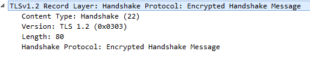
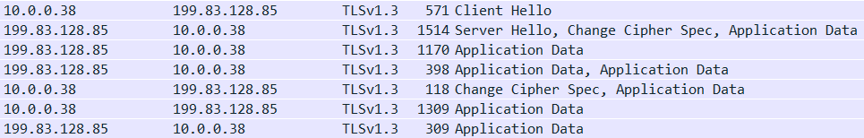
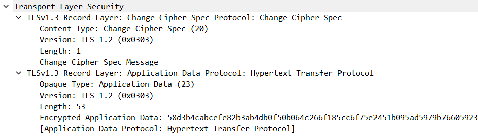

# TLS

([Back to Home](README.md))

Last updated: 20th March 2023

## Table of Contents

-   [Introduction](#introduction)
-   [Examples of TLS in the Wild](#examples-of-tls-in-the-wild)
-   [Common Cryptographic Algorithms in TLS](#common-cryptographic-algorithms-in-tls)
    -   [Diffie-Hellman (DH)](#diffie-hellman-dh)
    -   [RSA](#rsa)
    -   [AES](#aes)
    -   [SHA256](#sha256)
-   [Why Symmetric Key Encryption is Used](#why-symmetric-key-encryption-is-used)
-   [Conditions to be Fulfilled by a TLS Handshake](#conditions-to-be-fulfilled-by-a-tls-handshake)
-   [General TLS Protocol Structure](#general-tls-protocol-structure)
-   [TLS 1.2 Handshake](#tls-12-handshake)
-   [TLS 1.3 Handshake](#tls-13-handshake)
-   [Need for Two Sets of Keys](#need-for-two-sets-of-keys)
-   [Heartbleed](#heartbleed)
-   [mTLS](#mtls)
-   [Resources](#resources)

## Introduction

-   The Transport Layer Security (TLS) protocol is connection-oriented and stateful, and it helps in encrypting and authenticating the communication between two services, thus providing the CIA (Confidentiality, Integrity and Authentication) triad.
-   It is a Transport Layer protocol as per the [OSI Model](osi-layers.md) and TCP/IP Model.
-   It is the better version of the Secure Sockets Layer (SSL) protocol. (The last SSL version was 3.0.)
    -   TLS 1.0 was also called SSL 3.1.
-   The latest version of TLS at the time of writing is 1.3.
-   It is placed between TCP and [HTTP](http.md).
    -   HTTP runs over TCP (TCP -> HTTP), but with HTTPS, TCP -> TLS -> HTTP.
    -   Thus, HTTPS is also called 'HTTP over TLS (or SSL)'.
-   It is not just used in web sites. It is used for other communication as well, for eg, DB communication, browsing on TOR browser, etc.

## Examples of TLS in the Wild

> NOTE:
>
> -   This information can be found in the Security tab in the browser DevTools or on clicking the 'lock' (or 'unlock') symbol to the left of the URL in the browser search bar.
> -   The string of cipher information seen in the pictures below is called a 'cipher suite'. There are several of them for each protocol and they tell us which ciphers are being used by a particular protocol after both machines have agreed on the ciphers to be used.

-   [GitHub](https://github.com)

	

-   [Zulip](https://otc.zulipchat.com)

	

-   [Source video](https://youtu.be/86cQJ0MMses?t=65)

	

## Common Cryptographic Algorithms in TLS

Some common terms seen in the pictures above

-   [Diffie-Hellman](#diffie-hellman-dh) (DH, DHE, ECDHE, X25519, P-256, etc.)
-   [RSA](#rsa)
-   [AES](#aes) (128, 192, 256, etc.) (CBC, GCM, etc.)
-   [SHA256](#sha256)

### Diffie-Hellman (DH)

-   It is a part of Public/Asymmetric Key Cryptography.
-   It is a Key Exchange Protocol to establish a shared secret between two devices who want to start communication, but have never done so before and/or have no shared secret to generate keys for securing communication.
-   The established shared secret is then used to derive symmetric keys with Private/Symmetric/Secret Key Cryptography ciphers like AES. ([Why?](#why-symmetric-key-encryption-is-used))
-   Some types of DH
    -   DH (Diffie-Hellman)
        -   This is a Static Diffie-Hellman Key Exchange, where the key exchange parameters never change.
    -   DHE (Diffie-Hellman Ephemeral)
        -   Ephemeral means 'something that lasts for a short time' and here it implies that a new key is generated every time a conversation takes place, ie, very frequently.
    -   ECDHE (Elliptic Curve Diffie-Hellman Ephemeral)
        -   Uses Elliptic Curve Cryptography in DHE, making it stronger.
    -   X25519
        -   A type of Elliptic Curve Diffie-Hellman that uses Curve25519.
    -   P-256
        -   A type of curve used in Elliptic Curve Cryptography.
-   Communication in general is vulnerable to 'Monkey in the Middle' (MITM) attacks and here is where Public Key Cryptography ciphers like RSA, DSA, etc. help out by providing authentication.
    -   Perfect Forward Secrecy (PFS)
        -   Just RSA can be used in place of Diffie-Hellman, but is not, as it is slow, and its keys are established for many years and serve as a host's identity, so if private keys are leaked, it poses a big risk. Thus it is better to limit their use.
        -   Diffie-Hellman (DH) is used as a quicker method and safety blanket for key exchange, with RSA only providing initial authenticity. It acts as a safety blanket, as
            -   It generates keys independently of RSA.
            -   It generates a new secret after every session (if the ephemeral version of [DH](#diffie-hellman-dh) is used).
            -   The communication will not be compromised even if the RSA private key is leaked.
        -   [More on Perfect Forward Secrecy (PFS)](cryptography.md#perfect-forward-secrecy)
-   [More DH details](cryptography.md#diffie-hellman)

### RSA

-   Type of Public/Asymmetric Key Cryptography cipher.
-   The name 'RSA' is an acronym of the scientists involved in making the cipher.
    -   The scientists in order: Ron Rivest, Adi Shamir and Leonard Adleman.
-   Ensures authenticity of sender.
-   Prevents 'Monkey in the Middle' (MITM) attacks, as it authenticates the sender.
    -   [Digital Certificates](cryptography.md#digital-certificates-and-certificate-revocation-ocsp-and-crl) also help with this.

### AES

-   Advanced Encryption Standard (AES) is a type of a Private/Symmetric/Secret Key Cryptography cipher.
-   The shared secret from Diffie-Hellman is used to derive a key.
-   [Why is Symmetric key encryption used rather than just Asymmetric Key encryption?](#why-symmetric-key-encryption-is-used)
-   Provides encryption for the data being shared between the two communicating machines.
-   [More AES details](cryptography.md#aes)

### SHA256

-   Hashing algorithm which is a part of the Secure Hashing Algorithm (SHA) family. (SHA2 to be specific.)
-   Generates a unique\* 256 bit hexadecimal string output called a 'hash', for any length of input.
    -   `unique`\*: Hash collisions are extremely rare.
-   Used wherever needed, for eg, to derive a key from the shared secret, in digital signatures, MAC, etc.
-   [More SHA details](cryptography.md#sha)

## Why Symmetric Key Encryption is Used

Why is Symmetric Key Encryption (Eg: AES) used for actual data communication rather than just Asymmetric Key Encryption (Eg: RSA)?

-   Symmetric Key Encryption is ~200 times faster than Asymmetric Key Encryption.
-   A lot of processors now have dedicated hardware to perform AES encryption and decryption, which speeds up communication even more.
-   RSA keys are established for many years and serve as a host's identity, and so if private keys are leaked, it poses a big risk. Thus it is better to limit their use.

## Conditions to be Fulfilled by a TLS Handshake

-   What ciphers to be used for normal communication.
    -   Eg: AES
-   Key exchange cipher to generate a symmetric key.
    -   Eg: Diffie-Hellman
-   Authentication
    -   Public/Asymmetric Key Cryptography like RSA and verifying with digital signature with certificates.
-   Robustness
    -   Prevent 'Monkey in the Middle' (MITM) Attacks, Replay Attacks, Downgrade Attacks, etc during the handshake.

## General TLS Protocol Structure

-   Handshaking Protocol
    -   Cipher negotiation, server authentication, session key generation and other options.
    -   End product: Symmetric session keys generated at both ends
        -   The same two sets of two symmetric keys are generated on both ends from the master secret.
            -   Each set contains two symmetric keys, one for encryption and one for MAC.
            -   There are two such sets, one set for client to server communication and the other set for the opposite direction.
            -   The client and server are able to generate the exact same four keys from the master secret. (There are two keys per set and there are two sets, so there are four symmetric keys in total.)
            -   [Need for Two Sets of Keys](#need-for-two-sets-of-keys)
    -   Sub-protocols
        -   Handshake Protocol
            -   Negotiates TLS protocol version, cipher suites supported, compression methods, session identifier, server authentication and does a key exchange to form/generate the master (symmetric) secret at the client and server.
        -   Alert Protocol
            -   Informs problems through a Failure Alert or a Warning Alert.
        -   Change Cipher Specification Protocol
            -   Informing that a change to a new set of keys is requested and they are generated from the information exchanged during the Handshake Protocol.
-   Record Protocol
    -   Actual communication data that is encrypted and MACed using the key information exchanged during the Handshake Protocol.

## TLS 1.2 Handshake

> NOTE:
>
> -   `C` = Client and `S` = Server.
> -   TLS 1.2 takes two round trips (`C -> S`, `S -> C`, `C -> S` and `S -> C`) to complete the handshake. (TLS 1.3 takes just one round trip.)

### Overview

	The TLS 1.2 handshake as seen in Wireshark
	 
	

-   TLS works on top of [TCP](tcp.md) for [HTTP/2 or lower versions](http.md#http-versions), so a [TCP handshake](https://www.youtube.com/watch?v=bW_BILl7n0Y) is done first.
    -   This is not counted as a TLS Handshake round trip.

### First Round Trip

-   `C -> S` Client Hello
    -   States max version of TLS supported.
    -   Send a random number to prevent Replay Attacks.
    -   Sends a list of cipher suites that the client supports.

	'Client Hello' Message
	 
	
	 
	 
	Contents of <code>Random</code> in the 'Client Hello' Message
	 
	

-   `S -> C` Server Hello
    -   Choose TLS version and cipher suite.
    -   Send random number to present Replay Attacks.
        -   Even if the client sends the same random number, the server will always send a different random number in response and this new number is used in the handshake process ahead, so Replay Attacks won't work, as different values will be generated further along the handshake process every time.
    -   Send a [Digital Certificate](cryptography.md#digital-certificates-and-certificate-revocation-ocsp-and-crl) chain to authenticate the server.
        -   It proves the identity of the server.
        -   The leaf Certificate has the public key of the server in it.
    -   Server Key Exchange message (DH)
        -   It sends params for the Diffie-Hellman (DH) key exchange. (The generator and the huge prime number.)
        -   It sends it's generated public part of the key exchange process.
        -   Digital signature (a hashed value of some of the previous messages signed by the private key of the server). RSA is used here.
    -   Send 'Server Hello Done'.

	'Server Hello' Message
	 
	
	 
	 
	'Server Key Exchange' Message
	 
	
	 
	 
	'Server Key Exchange' Message (contd.) and 'Server Hello Done' Message
	 
	

### Second Round Trip

-   `C -> S` Client Key Exchange message (DH)
    -   It sends it's generated public part of the key exchange process.
    -   Side note: Both the server and client can now form the pre-master secret by completing the Diffie-Hellman process and then combine them with the random numbers sent in the above messages to make the master secret.
    -   Change Cipher Spec message. (Says that it is ready to use the keys generated from the master secret to begin encryption.)
    -   Finished message (Contains an encrypted summary of all the messages so far, just for the server to check if everything matches.)

	'Client Key Exchange' Message
	 
	
	 
	 
	Client 'Change Cipher Spec' Message
	 
	
	 
	 
	Client 'Finished' Message
	 
	

-   `S -> C` Change Cipher Spec message
    -   Finished message (Contains an encrypted summary of all the messages so far, for the client to check if everything matches.)
    -   Only if the two finished messages match, will the handshake succeed. This prevents any 'Monkey in the Middle' (MITM) attacks or misconfigurations.

	Server 'Change Cipher Spec' Message
	 
	
	 
	 
	Server 'Finished' Message
	 
	

-   The handshake is complete, with the [generation of two sets of symmetric keys](#need-for-two-sets-of-keys) from the Diffie-Hellman master secret. The application data is encrypted and MACed, and both machines can now communicate securely.

### Overview

 

	An overview of the TLS 1.2 Handshake as in <a href="https://datatracker.ietf.org/doc/html/rfc5246#section-7.3" target="_blank" rel="noreferrer">RFC 5246</a>
	 
	

## TLS 1.3 Handshake

> NOTE:
>
> -   `C` = Client and `S` = Server.
> -   TLS 1.3 takes just one round trip (`C -> S` and `S -> C`) to complete the handshake. (TLS 1.2 takes two round trips.)

### Overview

	The TLS 1.3 handshake as seen in Wireshark
	 
	

-   TLS works on top of [TCP](tcp.md) for [HTTP/2 or lower versions](http.md#http-versions), so a [TCP handshake](https://www.youtube.com/watch?v=bW_BILl7n0Y) is done first.
    -   This is not counted as a TLS Handshake round trip.

### Round Trip

-   `C -> S` Client Hello
    -   Send list of supported TLS versions.
    -   Send random number to prevent Reply Attacks.
    -   Send list of supported Cipher Suites.
    -   Send Client Key Exchange.
        -   The client's Diffie-Hellman Key Exchange pre-master secret is sent.
    -   Send TLS Extensions
        -   [(Encrypted) Server Name Indication (SNI or ESNI)](https://www.youtube.com/watch?v=t0zlO5-NWFU)
        -   [Application Layer Protocol Negotiation (ALPN)](https://www.youtube.com/watch?v=lR1uHVS7I-8)

> NOTE: The images below are from Wireshark and are for a TLS 1.3 handshake. There are lots of mentions of protocol versions being `TLS 1.0` or `TLS 1.2`, but that is done on purpose by the TLS 1.3 standard for backward compatibility due to possible version negotiation issues which might cause 'version intolerance'. The actual version for TLS 1.3 is mentioned in the `supported_versions` extension as seen in the Client Hello and Server Hello images below. ([All the places in the TLS 1.3 handshake where old TLS versions can be seen](https://networkengineering.stackexchange.com/a/55756) and [the reason for using old TLS version numbers in a TLS 1.3 handshake](https://networkengineering.stackexchange.com/a/55753).)

	'Client Hello' Message
	 
	

-   `S -> C` Server Hello
    -   Agree on a cipher suite.
    -   Agree on TLS protocol version.
    -   Send random number to prevent Replay Attacks.
    -   Send Server Key Exchange.
        -   The server's Diffie-Hellman Key Exchange pre-master secret is sent.
    -   Start encrypting and MACing (authenticating).
        -   The server has the client's pre-master secret and it has its own [Diffie-Hellman](#diffie-hellman-dh) parameters created to send its pre-master secret to the client as well, so the server can already compute the final master Diffie-Hellman secret.
        -   So for additional security, the server encrypts and signs some part of the data that it sends in this Server Hello message.
        -   [This prevents attacks on TLS.](https://blog.cloudflare.com/rfc-8446-aka-tls-1-3)
        -   Just like TLS 1.2, [two sets of symmetric keys (four symmetric keys in total) are generated](#need-for-two-sets-of-keys) from the Diffie-Hellman master secret.
    -   Send [Digital Certificate](cryptography.md#digital-certificates-and-certificate-revocation-ocsp-and-crl) chain.
    -   Send TLS Extensions.
        -   [Online Certificate Status Protocol (OCSP)](cryptography.md#digital-certificates-and-certificate-revocation-ocsp-and-crl) Stapling (Certificate Verify)
    -   Send Finished message.

> NOTE: Please read the note above the TLS 1.3 handshake Client Hello image in case there is a confusion as to why the TLS version is `TLS 1.2` for a TLS 1.3 handshake at a lot of places in the image below. Hint: The actual TLS version used (`TLS 1.3`) is mentioned in the `supported_versions` extension as seen in the image below.

	'Server Hello' Message
	 
	

-   `C -> S` Client sends a Finished message and Change Cipher Specification message, and then the handshake is complete, with the [generation of two sets of symmetric keys](#need-for-two-sets-of-keys) from the Diffie-Hellman master secret. Partial data encryption and authentication that had started from the Server Hello message (for increased security), can now continue with fully encrypted and authenticated data communication.
    -   Yes, this is an extra message from the claimed one round trip that TLS 1.3 is supposed to have, but application data can be piggybacked onto this message, so we can approximate TLS 1.3 to have a one round trip handshake.

	Client 'Change Cipher Spec' Message
	 
	

### Overview

	An overview of the TLS 1.3 Handshake as in <a href="https://datatracker.ietf.org/doc/html/rfc8446#section-2" target="_blank" rel="noreferrer">RFC 8446</a>
	 
	
	 
	 
	An overview of the TLS 1.3 Handshake as a cURL request
	 
	
	 
	
	 
	

## Need for Two Sets of Keys

> Credits to [Gabriel Kaptchuk](https://kaptchuk.com) for this explanation.

-   At the end of [the Handshaking Protocol](#general-tls-protocol-structure), the same two sets of two symmetric keys are generated on both ends from the [Diffie-Hellman](#diffie-hellman-dh) master secret.
-   Each set contains two symmetric keys, one for encryption and one for MAC (authentication).
-   There are two such sets, one set for client to server communication and the other set for the opposite direction.
-   The client and server are able to generate the exact same four keys from the master secret. (There are two keys per set and there are two sets, so there are four symmetric keys in total.)
-   This is required, because an attacker could reflect messages back to the client, without them ever reaching the server.
-   Eg: After processing a request from a client, if a server using a protocol running on top of TLS responds with the exact same data as in the request from the client, then the attacker could just simply capture the message and send it/reflect it back to client and the client would not know that the server did not receive its message. So the server would not carry out the action that the client wanted it to carry out, which is obviously bad.
-   With having different sets of keys for each direction of communication, such reflection attacks would fail, because each direction would have different looking encrypted data even if the actual content would be the same, as the keys used to encrypt the same data would be different.
    -   Eg:

    Encrypt key_1 ("unchanged_data") = "1234567890"
     
    Encrypt key_2 ("unchanged_data") = "abcdefghij"

## Heartbleed

-   The Heartbleed Bug is a Buffer Overflow bug in the extremely critical and widely used OpenSSL library that affected hundred thousands of machines.
-   It was not a protocol/standard bug, but an implementation (code) bug in [the Heartbeat Extension](https://datatracker.ietf.org/doc/rfc6520), where certain checks were not put in place.
    -   [The vulnerability was patched.](https://github.com/openssl/openssl/commit/96db9023b881d7cd9f379b0c154650d6c108e9a3) ([Source](https://stackoverflow.com/a/27950540/11958552))
-   [heartbleed.com](https://heartbleed.com)
-   [Heartbleed, Running the Code - Computerphile](https://www.youtube.com/watch?v=1dOCHwf8zVQ)
-   [From Missingno to Heartbleed: Buffer Exploits and Buffer Overflows](https://www.youtube.com/watch?v=rE5dW3BTpn4)
-   [Smashing the Stack for Fun and Profit](files/tls/smashing-the-stack-for-fun-and-profit.pdf) ([UCB hosted](https://inst.eecs.berkeley.edu/~cs161/fa08/papers/stack_smashing.pdf))
-   [Heartbleed assignment](files/bu-cas-cs-558/assignments/dns-heartbleed/dns-heartbleed.html)
-   [More about Perfect Forward Secrecy](cryptography.md#perfect-forward-secrecy)

## mTLS

-   mTLS: Mutual Transport Layer Security
-   mTLS is used when the client sends its certificates to the server in addition to the server sending its certificates (as in the basic TLS process) to prove identity.
-   [Mutual TLS](https://www.youtube.com/watch?v=KwpV-ICpkc4)
-   [The Cloudflare mTLS vulnerability](https://www.youtube.com/watch?v=xsLqf1Qomn0)

## Resources

-   TLS
    -   [TLS Intro](https://www.youtube.com/watch?v=0TLDTodL7Lc)
    -   [TLS Handshake](https://www.youtube.com/watch?v=86cQJ0MMses)
    -   [Illustrated TLS 1.2 Handshake](https://tls.ulfheim.net/)
    -   [Illustrated TLS 1.3 Handshake](https://tls13.ulfheim.net/)
    -   [Wiresharking TLS](https://www.youtube.com/watch?v=06Kq50P01sI)
    -   [A Detailed Look at RFC 8446 (a.k.a. TLS 1.3)](https://blog.cloudflare.com/rfc-8446-aka-tls-1-3)
    -   [cURL Verbose Mode Explained](https://www.youtube.com/watch?v=PVm0YEEuS8s)
    -   [TLS playlist by Hussein Nasser](https://www.youtube.com/playlist?list=PLQnljOFTspQW4yHuqp_Opv853-G_wAiH-)
    -   [TLS](files/tls/tls-ieee.pdf) ([IEEE Xplore](https://ieeexplore.ieee.org/document/6938667))
    -   [https://badssl.com](https://badssl.com)
    -   [http://neverssl.com](http://neverssl.com)
-   [Application Layer Protocol Negotiation (ALPN)](https://www.youtube.com/watch?v=lR1uHVS7I-8)
-   [Server Name Indication (SNI and ESNI)](https://www.youtube.com/watch?v=t0zlO5-NWFU)
-   [`cryptography.md`](cryptography.md) (for Diffie-Hellman, RSA, AES, Hashing, Digital Signatures, Digital Certificates, CRL, OCSP, etc resources)
-   [Perfect Forward Secrecy (PFS) in TLS](https://www.youtube.com/watch?v=zSQtyW_ywZc)
    -   [The Heartbleed Bug](#heartbleed)
    -   The Logjam TLS attack: [Imperfect Forward Secrecy: How Diffie-Hellman Fails in Practice](https://weakdh.org/imperfect-forward-secrecy-ccs15.pdf) ([weakdh.org](https://weakdh.org))
-   [Datagram TLS (DTLS)](https://www.rfc-editor.org/rfc/rfc9147.html)
    -   TLS for applications running on top of UDP.
-   [Automatic Cipher Suite Ordering in `crypto/tls`](https://go.dev/blog/tls-cipher-suites) (The Go Blog)
-   Picture sources
    -   [Dissecting TLS Using Wireshark](https://blog.catchpoint.com/2017/05/12/dissecting-tls-using-wireshark/)
    -   [SSL/TLS Handshake Explained With Wireshark Screenshot](https://www.linuxbabe.com/security/ssltls-handshake-process-explained-with-wireshark-screenshot)
