# TLS

([Back to Home](README.md))

Last updated: 20th March 2023

## Table of Contents

-   [Introduction](#introduction)
-   [Examples of TLS in the Wild](#examples-of-tls-in-the-wild)
-   [Common Cryptographic Algorithms in TLS](#common-cryptographic-algorithms-in-tls)
    -   [Diffie-Hellman (DH)](#diffie-hellman-dh)
    -   [RSA](#rsa)
    -   [AES](#aes)
    -   [SHA256](#sha256)
-   [Why Symmetric Key Encryption is Used](#why-symmetric-key-encryption-is-used)
-   [Conditions to be Fulfilled by a TLS Handshake](#conditions-to-be-fulfilled-by-a-tls-handshake)
-   [General TLS Protocol Structure](#general-tls-protocol-structure)
-   [TLS 1.2 Handshake](#tls-12-handshake)
-   [TLS 1.3 Handshake](#tls-13-handshake)
-   [Resources](#resources)

## Introduction

-   The Transport Layer Security (TLS) protocol is connection-oriented and stateful, and it helps in encrypting and authenticating the communication between two services, thus providing the CIA (Confidentiality, Integrity and Authentication) triad.
-   It is a Transport Layer protocol as per the [OSI Model](osi-layers.md) and TCP/IP Model.
-   It is the better version of the Secure Sockets Layer (SSL) protocol. (The last SSL version was 3.0.)
    -   TLS 1.0 was also called SSL 3.1.
-   The latest version of TLS at the time of writing is 1.3.
-   It is placed between TCP and [HTTP](http.md).
    -   HTTP runs over TCP (TCP -> HTTP), but with HTTPS, TCP -> TLS -> HTTP.
    -   Thus, HTTPS is also called 'HTTP over TLS (or SSL)'.
-   It is not just used in web sites. It is used for other communication as well, for eg, DB communication, browsing on TOR browser, etc.

## Examples of TLS in the Wild

> NOTE:
>
> -   This information can be found in the Security tab in the browser DevTools or on clicking the 'lock' (or 'unlock') symbol to the left of the URL in the browser search bar.
> -   The string of cipher information seen in the pictures below is called a 'cipher suite'. There are several of them for each protocol and they tell us which ciphers are being used by a particular protocol after both machines have agreed on the ciphers to be used.

-   [GitHub](https://github.com)

	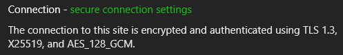

-   [Zulip](https://otc.zulipchat.com)

	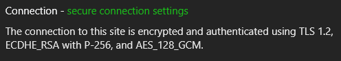

-   [Source video](https://youtu.be/86cQJ0MMses?t=65)

	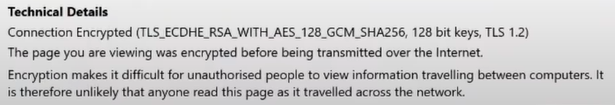

## Common Cryptographic Algorithms in TLS

Some common terms seen in the pictures above

-   [Diffie-Hellman](#diffie-hellman-dh) (DH, DHE, ECDHE, X25519, P-256, etc.)
-   [RSA](#rsa)
-   [AES](#aes) (128, 192, 256, etc.) (CBC, GCM, etc.)
-   [SHA256](#sha256)

### Diffie-Hellman (DH)

-   It is a part of Public/Asymmetric Key Cryptography.
-   It is a Key Exchange Protocol to establish a shared secret between two devices who want to start communication, but have never done so before and/or have no shared secret to generate keys for securing communication.
-   The established shared secret is then used to derive symmetric keys with Private/Symmetric/Secret Key Cryptography ciphers like AES. ([Why?](#why-symmetric-key-encryption-is-used))
-   Some types of DH
    -   DH (Diffie-Hellman)
        -   This is a Static Diffie-Hellman Key Exchange, where the key exchange parameters never change.
    -   DHE (Diffie-Hellman Ephemeral)
        -   Ephemeral means 'something that lasts for a short time' and here it implies that a new key is generated every time a conversation takes place, ie, very frequently.
    -   ECDHE (Elliptic Curve Diffie-Hellman Ephemeral)
        -   Uses Elliptic Curve Cryptography in DHE, making it stronger.
    -   X25519
        -   A type of Elliptic Curve Diffie-Hellman that uses Curve25519.
    -   P-256
        -   A type of curve used in Elliptic Curve Cryptography.
-   Communication in general is vulnerable to 'Monkey in the Middle' (MITM) attacks and here is where Public Key Cryptography ciphers like RSA, DSA, etc. help out by providing authentication.
    -   Perfect Forward Secrecy (PFS)
        -   Just RSA can be used in place of Diffie-Hellman, but is not, as it is slow, and its keys are established for many years and serve as a host's identity, so if private keys are leaked, it poses a big risk. Thus it is better to limit their use.
        -   Diffie-Hellman (DH) is used as a quicker method and safety blanket for key exchange, with RSA only providing initial authenticity. It acts as a safety blanket, as
            -   It generates keys independently of RSA.
            -   It generates a new secret after every session (if the ephemeral version of [DH](#diffie-hellman-dh) is used).
            -   The communication will not be compromised even if the RSA private key is leaked.
        -   [More on Perfect Forward Secrecy (PFS)](cryptography.md#perfect-forward-secrecy)
-   [More DH details](cryptography.md#diffie-hellman)

### RSA

-   Type of Public/Asymmetric Key Cryptography cipher.
-   The name 'RSA' is an acronym of the scientists involved in making the cipher.
    -   The scientists in order: Ron Rivest, Adi Shamir and Leonard Adleman.
-   Ensures authenticity of sender.
-   Prevents 'Monkey in the Middle' (MITM) attacks, as it authenticates the sender.
    -   [Digital Certificates](cryptography.md#digital-certificates-and-certificate-revocation-ocsp-and-crl) also help with this.

### AES

-   Advanced Encryption Standard (AES) is a type of a Private/Symmetric/Secret Key Cryptography cipher.
-   The shared secret from Diffie-Hellman is used to derive a key.
-   [Why is Symmetric key encryption used rather than just Asymmetric Key encryption?](#why-symmetric-key-encryption-is-used)
-   Provides encryption for the data being shared between the two communicating machines.
-   [More AES details](cryptography.md#aes)

### SHA256

-   Hashing algorithm which is a part of the Secure Hashing Algorithm (SHA) family. (SHA2 to be specific.)
-   Generates a unique\* 256 bit hexadecimal string output called a 'hash', for any length of input.
    -   `unique`\*: Hash collisions are extremely rare.
-   Used wherever needed, for eg, to derive a key from the shared secret, in digital signatures, MAC, etc.
-   [More SHA details](cryptography.md#sha)

## Why Symmetric Key Encryption is Used

Why is Symmetric Key Encryption (Eg: AES) used for actual data communication rather than just Asymmetric Key Encryption (Eg: RSA)?

-   Symmetric Key Encryption is ~200 times faster than Asymmetric Key Encryption.
-   A lot of processors now have dedicated hardware to perform AES encryption and decryption, which speeds up communication even more.
-   RSA keys are established for many years and serve as a host's identity, and so if private keys are leaked, it poses a big risk. Thus it is better to limit their use.

## Conditions to be Fulfilled by a TLS Handshake

-   What ciphers to be used for normal communication.
    -   Eg: AES
-   Key exchange cipher to generate a symmetric key.
    -   Eg: Diffie-Hellman
-   Authentication
    -   Public/Asymmetric Key Cryptography like RSA and verifying with digital signature with certificates.
-   Robustness
    -   Prevent 'Monkey in the Middle' (MITM) Attacks, Replay Attacks, Downgrade Attacks, etc during the handshake.

## General TLS Protocol Structure

-   Handshaking Protocol
    -   Cipher negotiation, server authentication, session key generation and other options.
    -   End product: Symmetric session keys generated at both ends (two sets, one for encryption and one for MAC)
    -   Sub-protocols
        -   Handshake Protocol
            -   Negotiates TLS protocol version, cipher suites supported, compression methods, session identifier, server authentication and does a key exchange to form/generate the master (symmetric) secret at the client and server.
        -   Alert Protocol
            -   Informs problems through a Failure Alert or a Warning Alert.
        -   Change Cipher Specification Protocol
            -   Informing that a change to a new set of keys is requested and they are generated from the information exchanged during the Handshake Protocol.
-   Record Protocol
    -   Actual communication data that is encrypted and MACed using the key information exchanged during the Handshake Protocol.

## TLS 1.2 Handshake

> NOTE:
>
> -   `C` = Client and `S` = Server.
> -   TLS 1.2 takes two round trips (`C -> S`, `S -> C`, `C -> S` and `S -> C`) to complete the handshake. (TLS 1.3 takes just one round trip.)

### Overview

	The TLS 1.2 handshake as seen in Wireshark
	 
	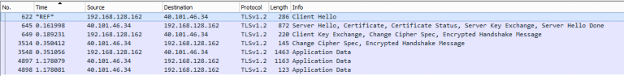

-   TLS works on top of [TCP](tcp.md) for [HTTP/2 or lower versions](http.md#http-versions), so a [TCP handshake](https://www.youtube.com/watch?v=bW_BILl7n0Y) is done first.
    -   This is not counted as a TLS Handshake round trip.

### First Round Trip

-   `C -> S` Client Hello
    -   States max version of TLS supported.
    -   Send a random number to prevent Replay Attacks.
    -   Sends a list of cipher suites that the client supports.

	Client Hello
	 
	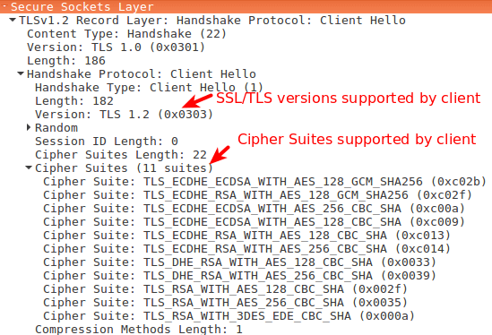
	 
	 
	Contents of <code>Random</code>
	 
	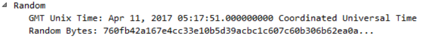

-   `S -> C` Server Hello
    -   Choose TLS version and cipher suite.
    -   Send random number to present Replay Attacks.
        -   Even if the client sends the same random number, the server will always send a different random number in response and this new number is used in the handshake process ahead, so Replay Attacks won't work, as different values will be generated further along the handshake process every time.
    -   Send a [Digital Certificate](cryptography.md#digital-certificates-and-certificate-revocation-ocsp-and-crl) chain to authenticate the server.
        -   It proves the identity of the server.
        -   The leaf Certificate has the public key of the server in it.
    -   Server Key Exchange message (DH)
        -   It sends params for the Diffie-Hellman (DH) key exchange. (The generator and the huge prime number.)
        -   It sends it's generated public part of the key exchange process.
        -   Digital signature (a hashed value of some of the previous messages signed by the private key of the server). RSA is used here.
    -   Send 'Server Hello Done'.

	Server Hello
	 
	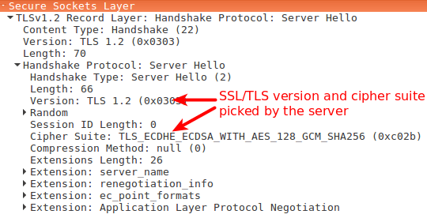
	 
	 
	Server Key Exchange
	 
	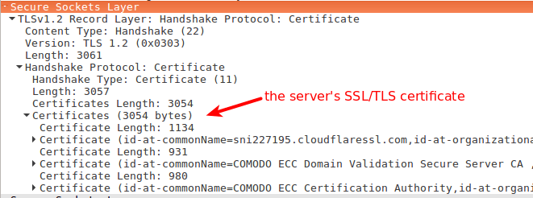
	 
	 
	Server Key Exchange (contd) and Server Hello Done
	 
	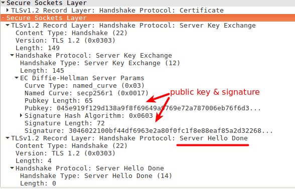

### Second Round Trip

-   `C -> S` Client Key Exchange message (DH)
    -   It sends it's generated public part of the key exchange process.
    -   Side note: Both the server and client can now form the pre-master secret by completing the Diffie-Hellman process and then combine them with the random numbers sent in the above messages to make the master secret.
    -   Change Cipher Spec message. (Says that it is ready to use the keys generated from the master secret to begin encryption.)
    -   Finished message (Contains an encrypted summary of all the messages so far, just for the server to check if everything matches.)

	Client Key Exchange
	 
	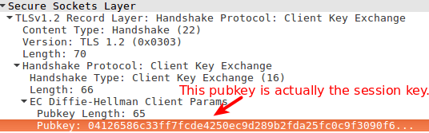
	 
	 
	Change Cipher Spec
	 
	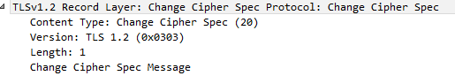
	 
	 
	Finished
	 
	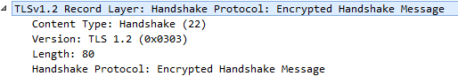

-   `S -> C` Change Cipher Spec message
    -   Finished message (Contains an encrypted summary of all the messages so far, for the client to check if everything matches.)
    -   Only if the two finished messages match, will the handshake succeed. This prevents any 'Monkey in the Middle' (MITM) attacks or misconfigurations.

	Change Cipher Spec
	 
	
	 
	 
	Finished
	 
	

-   The handshake is complete. The application data is encrypted using the Private/Symmetric/Secret Key Cryptography cipher mentioned in the chosen cipher suite (Eg: AES) and both machines can now communicate with Confidentiality, Integrity and Authentication.

### Overview

 

	An overview of the TLS 1.2 Handshake as in <a href="https://datatracker.ietf.org/doc/html/rfc5246#section-7.3" target="_blank" rel="noreferrer">RFC 5246</a>
	 
	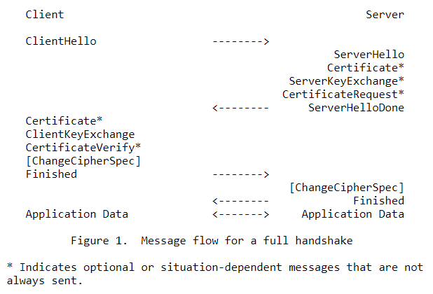

## TLS 1.3 Handshake

> NOTE:
>
> -   `C` = Client and `S` = Server.
> -   TLS 1.3 takes just one round trip (`C -> S` and `S -> C`) to complete the handshake. (TLS 1.2 takes two round trips.)

-   TLS works on top of [TCP](tcp.md) for [HTTP/2 or lower versions](http.md#http-versions), so a [TCP handshake](https://www.youtube.com/watch?v=bW_BILl7n0Y) is done first.
    -   This is not counted as a TLS Handshake round trip.
-   `C -> S` Client Hello
    -   Send list of supported TLS versions.
    -   Send random number to prevent Reply Attacks.
    -   Send list of supported Cipher Suites.
    -   Send Client Key Exchange.
    -   Send TLS Extensions
        -   [(Encrypted) Server Name Indication (SNI or ESNI)](https://www.youtube.com/watch?v=t0zlO5-NWFU)
        -   [Application Layer Protocol Negotiation (ALPN)](https://www.youtube.com/watch?v=lR1uHVS7I-8)

	Client Hello
	 
	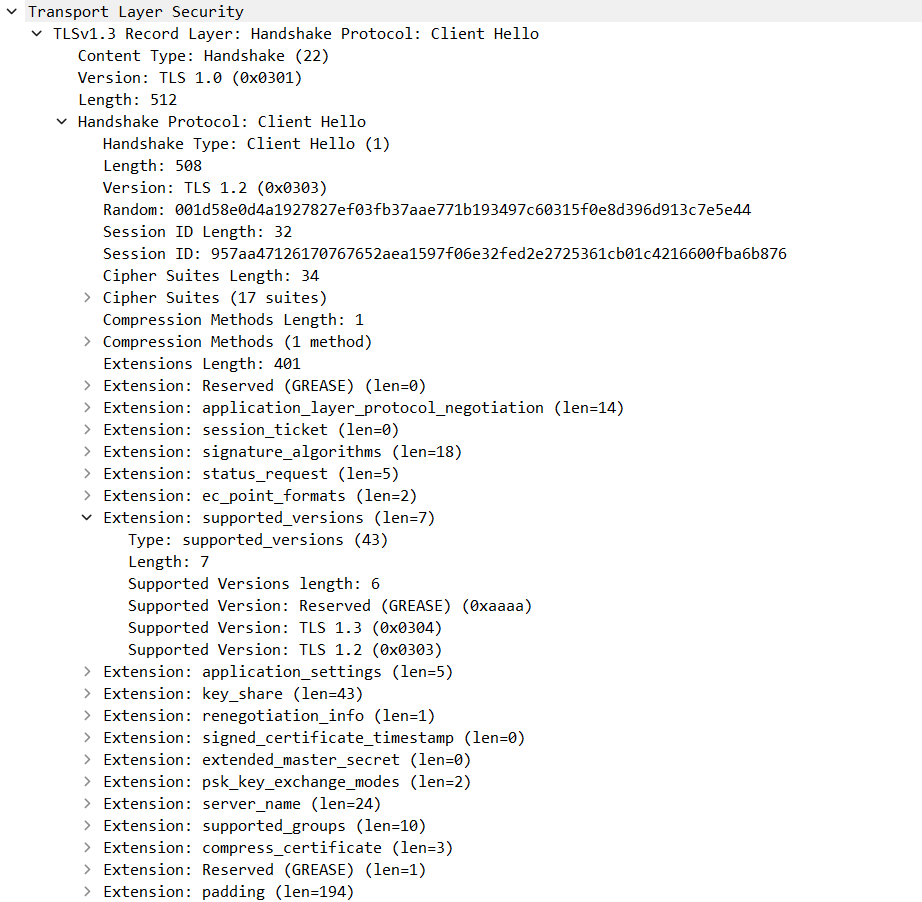

-   `S -> C` Server Hello
    -   Agree on a cipher suite.
    -   Agree on TLS protocol version.
    -   Send random number to prevent Replay Attacks.
    -   Send Server Key Exchange.
    -   Send [Digital Certificate](cryptography.md#digital-certificates-and-certificate-revocation-ocsp-and-crl) chain.
    -   Send TLS Extensions.
        -   [Online Certificate Status Protocol (OCSP)](cryptography.md#digital-certificates-and-certificate-revocation-ocsp-and-crl) Stapling (Certificate Verify)
    -   Send Finished message.

	Server Hello
	 
	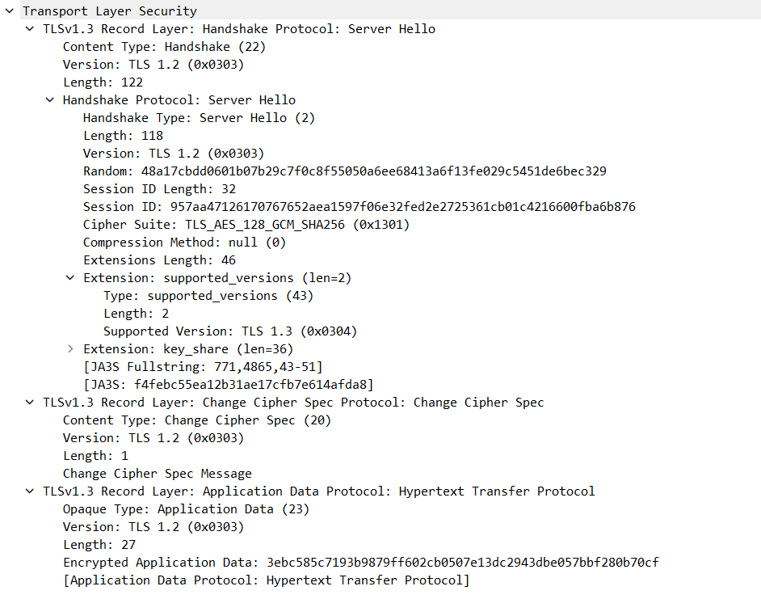

-   `C -> S` Client sends a Finished message and then encrypted and authenticated communication starts.

### Overview

	An overview of the TLS 1.3 Handshake as in <a href="https://datatracker.ietf.org/doc/html/rfc8446#section-2" target="_blank" rel="noreferrer">RFC 8446</a>
	 
	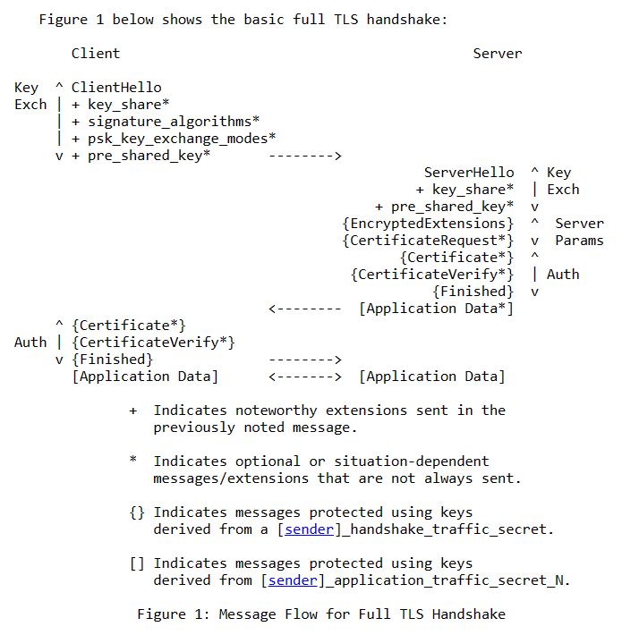
	 
	An overview of the TLS 1.3 Handshake as a cURL request
	 
	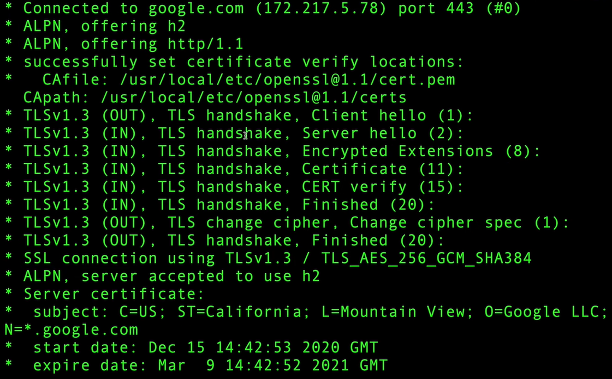
	 
	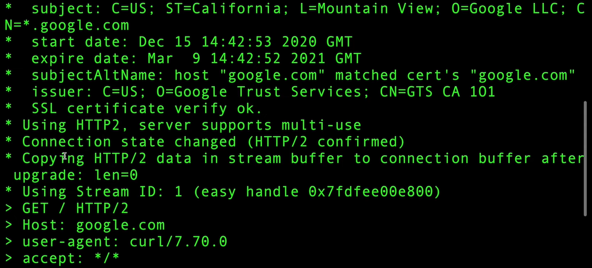
	 
	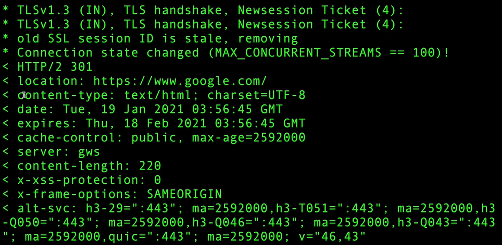

## Resources

-   TLS
    -   [TLS Intro](https://www.youtube.com/watch?v=0TLDTodL7Lc)
    -   [TLS Handshake](https://www.youtube.com/watch?v=86cQJ0MMses)
    -   [Illustrated TLS 1.2 Handshake](https://tls.ulfheim.net/)
    -   [Illustrated TLS 1.3 Handshake](https://tls13.ulfheim.net/)
    -   [Wiresharking TLS](https://www.youtube.com/watch?v=06Kq50P01sI)
    -   [cURL Verbose Mode Explained](https://www.youtube.com/watch?v=PVm0YEEuS8s)
    -   [TLS playlist by Hussein Nasser](https://www.youtube.com/playlist?list=PLQnljOFTspQW4yHuqp_Opv853-G_wAiH-)
    -   [TLS](files/tls/tls-ieee.pdf) ([IEEE Xplore](https://ieeexplore.ieee.org/document/6938667))
    -   [https://badssl.com](https://badssl.com)
    -   [http://neverssl.com](http://neverssl.com)
-   [Application Layer Protocol Negotiation (ALPN)](https://www.youtube.com/watch?v=lR1uHVS7I-8)
-   [Server Name Indication (SNI and ESNI)](https://www.youtube.com/watch?v=t0zlO5-NWFU)
-   [`cryptography.md`](cryptography.md) (for Diffie-Hellman, RSA, AES, Hashing, Digital Signatures, Digital Certificates, CRL, OCSP, etc resources)
-   [Perfect Forward Secrecy (PFS) in TLS](https://www.youtube.com/watch?v=zSQtyW_ywZc)
    -   [Heartbleed problem](https://www.youtube.com/watch?v=1dOCHwf8zVQ)
        -   [Smashing the Stack for Fun and Profit](files/tls/smashing-the-stack-for-fun-and-profit.pdf) ([UCB hosted](https://inst.eecs.berkeley.edu/~cs161/fa08/papers/stack_smashing.pdf))
    -   [More about PFS](cryptography.md#perfect-forward-secrecy)
-   [Mutual TLS (mTLS)](https://www.youtube.com/watch?v=KwpV-ICpkc4)
-   [Automatic Cipher Suite Ordering in `crypto/tls`](https://go.dev/blog/tls-cipher-suites) (The Go Blog)
-   Picture sources
    -   [Dissecting TLS Using Wireshark](https://blog.catchpoint.com/2017/05/12/dissecting-tls-using-wireshark/)
    -   [SSL/TLS Handshake Explained With Wireshark Screenshot](https://www.linuxbabe.com/security/ssltls-handshake-process-explained-with-wireshark-screenshot)
